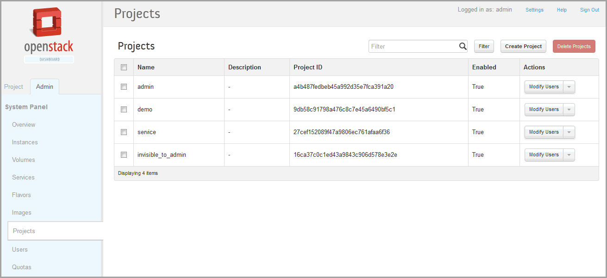
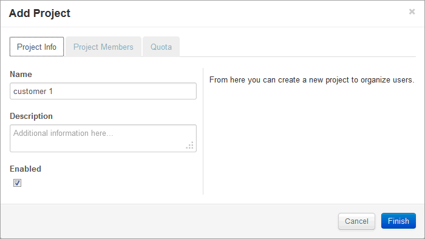

# Creating Projects in OpenStack for Configuring Tenants in Contrail

 

In Contrail, a tenant configuration is called a project. A project is
created for each set of virtual machines (VMs) and virtual networks
(VNs) that are configured as a discrete entity for the tenant.

Projects are created, managed, and edited at the OpenStack **Projects**
page.

1.  Click the **Admin** tab on the OpenStack
    dashboard, then click the **Projects** link to access the
    **Projects** page; see
    [Figure 1](creating-projects-vnc.html#projects).

    

2.  In the upper right, click the **Create Project**
    button to access the **Add Project** window; see
    [Figure 2](creating-projects-vnc.html#add-project).

    

3.  In the **Add Project** window, on the **Project
    Info** tab, enter a **Name** and a **Description** for the new
    project, and select the **Enabled** check box to activate this
    project.

4.  In the **Add Project** window, select the
    **Project Members** tab, and assign users to this project. Designate
    each user as **admin** or as **Member**.

    As a general rule, one person should be a super user in the
    **admin** role for all projects and a user with a **Member** role
    should be used for general configuration purposes.

5.  Click **Finish** to create the project.

Refer to OpenStack documentation for more information about creating and
managing projects.

 
