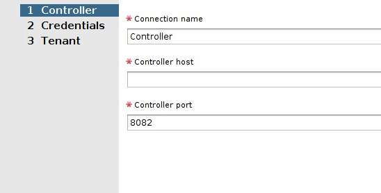

# Installing and Provisioning Contrail VMware vRealize Orchestrator Plugin

 

A dedicated Contrail plugin is used to connect to VMware vRealize
Orchestrator (vRO). Contrail Release 5.0 supported a Beta version of the
plugin. Starting with Contrail Release 5.1, a fully supported version of
the plugin is available.

You must install the Contrail VMware vRealize Orchestrator (vRO) plugin
to connect to the vRO server.

Before you begin installation, ensure the following:

-   You have administrator-level access to the Control Center of a
    deployed vRO appliance.

-   You know the host name (*{vRO}*) of the deployed vRO Appliance.

-   You have the login credentials of the vCenter SSO service.

-   You have downloaded the vRO plugin package file to your local
    system.

    You can download the plugin from
    <https://www.juniper.net/support/downloads/?p=contrail>.

You can deploy the Contrail plugin in any Java Virtual Machine (JVM)
compatible environment and load it on an active vRO instance.

The following topics describe how to install and provision the Contrail
vRO plugin.

## Accessing vRO Control Center

Follow the steps given below to access and log in to vRO Control Center:

1.  To access vRO Control Center through a Web browser, navigate to the
    <https://%7BvRO%7D:8283/vco-controlcenter> URL.

    **Note**

    Replace *{vRO}* given in the URL with the *host name* of the
    deployed vRO Appliance.

    The *host name* is the IP address or the FQDN of the vRO node.

    The **vCenter SSO** service page is displayed.

    

2.  On the vCenter SSO service page, enter the **User name** and
    **Password** in the respective fields and click **Login**. See
    [Figure 1](install-contrail-vRO-plugin.html#vCenter-sso).

    The **Orchestrator Control Center** home page is displayed.

    

## Installing vRO Plugin

Perform the following steps to install the vRO plugin:

1.  Upload vRO plugin package.

    To upload vRO plugin package:

    -   From the Orchestrator Control Center home page, click **Manage
        Plug-Ins** under the **Plug-Ins** section.

        The **Manage Plug-Ins** page is displayed.

        

        **Note**

        You can install a new plugin or manage an already installed
        plugin from the Manage Plug-Ins page.

        **Note**

        `*.vmoapp` or `*.dar` file format can be used. Also, the version
        in this example may be different from the version you have
        downloaded.

    -   Click **Browse** in the **Install plug-in** pane and select the
        downloaded vRO plugin package file on your local system.

    -   After you select vRO plugin package file, click **Install** to
        upload the vRO plugin package to the vRO server.

        The **EULA** page is displayed.

        

2.  Install vRO plugin.

    After you upload the vRO plugin package, select **Accept EULA** on
    the **EULA** page and then click **Install**.

    **Note**

    If you use `*.vmoapp` file format, you are directed to the Accept
    EULA page before you proceed with the installation.

    If you use `*.dar` file format, you can directly proceed with
    installation.

    The vRO plugin is installed.

## Accessing vRO Desktop Client

After you install the VMware vRealize Orchestrator (vRO) plugin,
download vRealize Orchestrator Client version 7.3.0 to access the vRO
server.

To download and install the vRO desktop client application, click
<https://%7BvRO%7D:8281/vco/>.

**Note**

Replace *{vRO}* given in the URL with the *host name* of the deployed
vRO Appliance.

You can download vRO desktop client applications for Windows, Mac OS X,
and Linux operating systems.

## Connecting to vRO using the Desktop Client

You connect to the vRO server by using the vRO desktop client.

1.  Start the vRO desktop client.

    The **VMware vRealize Orchestrator Login** page is displayed.

    

2.  In the VMware vRealize Orchestrator Login page, enter **Host name**,
    **User name**, and **Password**.

    **Note**

    The **Host name** also includes the port number and must be in the
    ****{vRO}:8281**** format.

3.  Click **Login** to connect to the vRO server. See
    [Figure 6](install-contrail-vRO-plugin.html#vRO-login-page).

## Connecting to Contrail Controller

To connect Contrail vRO to the Contrail Controller:

1.  Navigate to the **Contrail &gt; Configuration** folder in the
    workflow library. See
    [Figure 7](install-contrail-vRO-plugin.html#workflow-library).

2.  Select **Create Contrail controller connection**.

    

3.  Click the **Controller** tab and enter the following information:

    -   **Connection name**—a unique name to identify the connection

    -   **Controller host**—host name of the Contrail Connector

    -   **Controller port**—port used to access the Contrail Controller

    

4.  Click the **Credentials** tab and enter the following credentials to
    manage the Contrail Controller:

    -   **User name**—user name to access the Contrail Controller

    -   **User password**—password to access the Contrail Controller

    -   **Authentication server**—URL of the authentication server

    

5.  Click the **Tenant** tab to define tenant information.

    In the **Tenant** field, enter the name of the Contrail tenant.

    

6.  Click **Submit** to establish connection.

    Once you connect Contrail vRO to the Contrail Controller, you use
    Contrail workflows to make configuration changes to Contrail.

## Deploying Contrail vRO Plugin

You can deploy the Contrail plugin in any Java Virtual Machine (JVM)
compatible environment and load it on an active vRO instance.

 
