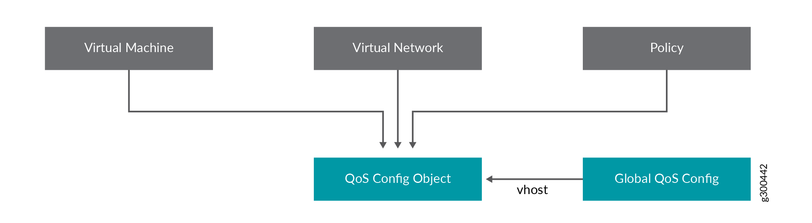

Quality of Service in Contrail
==============================

 

Overview: Quality of Service
----------------------------

Quality of service (QoS) in networking provides the ability to control
reliability, bandwidth, latency, and other traffic management features.
Network traffic can be marked with QoS bits (DSCP, 802.1p, and MPLS EXP)
that intermediate network switches and routers can use to provide
service guarantees.

Contrail QoS Model
------------------

The QoS model in Contrail Networking has the following features:

-  All packet forwarding devices, such as vRouter and the gateway,
   combine to form a system.

-  Interfaces to the system are the ports from which the system sends
   and receives packets, such as tap interfaces and physical ports.

-  Fabric interfaces are where the overlay traffic is tunneled.

-  QoS is applied at the ingress to the system, for example, upon
   traffic from the interfaces to the fabric.

-  At egress, packets are stripped of their tunnel headers and sent to
   interface queues, based on the forwarding class. No marking from the
   outer packet to the inner packet is considered at this time.

Features of Fabric Interfaces
-----------------------------

Fabric interfaces, unlike other interfaces, are always shared.
Therefore, fabric interfaces are common property. Consequently, traffic
classes and QoS marking on the fabric must be controlled by the system
administrator. The administrator might choose to provision different
classes of service on the fabric.

In Contrail, classes of service are determined by both of the following:

-  Queueing on the fabric interface, including queues, scheduling of
   queues, and drop policies, and

-  forwarding class, a method of marking that controls how packets are
   sent to the fabric, including marking and identifying which queue to
   use.

Tenants can define which forwarding class their traffic can use,
deciding which packets use which forwarding class. The Contrail QoS
configuration object has a mapping table, mapping the incoming DSCP or
802.1p value to the forwarding class mapping.

The QoS configuration can also be applied to a virtual network, an
interface, or a network policy.

QoS Configuration Parameters for Provisioning
---------------------------------------------

.. _configuring-qos-in-contrail-networking-release-50-and-later:

Configuring QoS in Contrail Networking Release 5.0 and Later
------------------------------------------------------------

This section describes how to provision QoS in Contrail Networking
release 5.0 and later.

1. Define the hardware queues and priority group in the
   ``instances.yaml`` file under the vrouter role as shown below.

   .. raw:: html

      

   .. raw:: html

      

   ::

      nodeh5:
          ip: 10.xxx.xxx.109
          provider: bms
          roles:
            vrouter:
              VROUTER_GATEWAY: 192.168.1.45
              PRIORITY_ID: 0,1,2,3,4,5,6,7
              PRIORITY_BANDWIDTH: 0,10,0,20,0,30,0,40
              PRIORITY_SCHEDULING: strict,rr,strict,rr,strict,rr,strict,rr
              QOS_QUEUE_ID: 3,11,18,28,36,43,61,53
              QOS_LOGICAL_QUEUES: "[ 1, 6-10, 12-15];[40-46];[70-74, 75, 80-95];[115];[140-143, 145];[175];[245];[215]"
              QOS_DEF_HW_QUEUE: True
            openstack_compute:

   .. raw:: html

      

   .. raw:: html

      

2. In the already provisioned setup, define the QoS configuration in the
   ``/etc/contrail/common_vrouter.env`` file as shown in the following
   sample.

   .. raw:: html

      

   .. raw:: html

      

   ::

      PRIORITY_ID=0,1,2,3,4,5,6,7
      PRIORITY_BANDWIDTH=0,10,0,20,0,30,0,40
      PRIORITY_SCHEDULING=strict,rr,strict,rr,strict,rr,strict,rr
      QOS_QUEUE_ID=3,11,18,28,36,43,61,53
      QOS_LOGICAL_QUEUES="[ 1, 6-10, 12-15];[40-46];[70-74, 75, 80-95];[115];[140-143, 145];[175];[245];[215]"
      QOS_DEF_HW_QUEUE=True

   .. raw:: html

      

   .. raw:: html

      

3. Execute the execute docker-compose up -d under /etc/contrail/vrouter/
   command.

Queuing Implementation
----------------------

The vRouter provides the infrastructure to use queues supplied by the
network interface, a method that is also called hardware queueing.
Network interface cards (NICs) that implement hardware queueing have
their own set of scheduling algorithms associated with the queues. The
Contrail implementation is designed to work with most NICs, however, the
method is tested only on an Intel-based 10G NIC, also called Niantic.

Contrail QoS Configuration Objects
----------------------------------

Contrail QoS configuration objects include the:

-  forwarding class

-  QoS configuration object (``qos-config``)

The forwarding class object specifies parameters for marking and
queuing, including:

-  The DSCP, 802.1p, and MPLS EXP values to be written on packets.

-  The queue index to be used for the packet.

The QoS configuration object specifies a mapping from DSCP, 802.1p, and
MPLS EXP values to the corresponding forwarding class.

The QoS configuration has an option to specify the default forwarding
class ID to use to select the forwarding class for all unspecified DSCP,
802.1p, and MPLS EXP values.

If the default forwarding class ID is not specified by the user, it
defaults to the forwarding class with ID 0.

Processing of QoS marked packets to look up the corresponding forwarding
class to be applied works as follows:

-  For an IP packet, the DSCP map is used .

-  For a Layer 2 packet, the 802.1p map is used.

-  For an MPLS-tunneled packet with MPLS EXP values specified, the EXP
   bit value is used with the MPLS EXP map.

-  If the QoS configuration is untrusted, only the default forwarding
   class is specified, and all incoming values of the DSCP, 802.1p, and
   EXP bits in the packet are mapped to the same default forwarding
   class.

`Figure 1 <network-qos-vnc-3.1.html#qos1>`__ shows the processing of QoS
packets.

|Figure 1: Processing of QoS Packets|

A virtual machine interface, virtual network, and network policy can
refer to the QoS configuration object. The QoS configuration object can
be specified on the vhost so that underlay traffic can also be subjected
to marking and queuing. See
`Figure 2 <network-qos-vnc-3.1.html#qos2>`__.

|Figure 2: Referring to the QoS Object|

Example: Mapping Traffic to Forwarding Classes
----------------------------------------------

This example shows how traffic forwarding classes are defined and how
the QoS configuration object is defined to map the QoS bits to
forwarding classes.

`Table 1 <network-qos-vnc-3.1.html#forward1>`__ shows two forwarding
class objects defined. FC1 marks the traffic with high priority values
and queues it to Queue 0. FC2 marks the traffic as best effort and
queues the traffic to Queue 1.

Table 1: Forwarding Class Mapping

==== == ==== ====== ======== =====
Name ID DSCP 802.1p MPLS EXP Queue
==== == ==== ====== ======== =====
FC1  1  10   7      7        0
FC2  2  38   0      0        1
==== == ==== ====== ======== =====

In `Table 2 <network-qos-vnc-3.1.html#forward2>`__, the QoS
configuration object DSCP values of 10, 18, and 26 are mapped to a
forwarding class with ID 1, which is forwarding class FC1. All other IP
packets are mapped to the forwarding class with ID 2, which is FC2. All
traffic with an 802.1p value of 6 or 7 are mapped to forwarding class
FC1, and the remaining traffic is mapped to FC2.

Table 2: QoS Configuration Object Mapping

+------+-----------+--------+-----------+----------+-----------+
| DSCP | F         | 802.1p | F         | MPLS EXP | F         |
|      | orwarding |        | orwarding |          | orwarding |
|      | Class ID  |        | Class ID  |          | Class ID  |
+======+===========+========+===========+==========+===========+
| 10   | 1         | 6      | 1         | 5        | 1         |
+------+-----------+--------+-----------+----------+-----------+
| 18   | 1         | 7      | 1         | 7        | 1         |
+------+-----------+--------+-----------+----------+-----------+
| 26   | 1         | \*     | 2         | \*       | 1         |
+------+-----------+--------+-----------+----------+-----------+
| \*   | 2         |        |           |          |           |
+------+-----------+--------+-----------+----------+-----------+

QoS Configuration Object Marking on the Packet
----------------------------------------------

The following sections describes how QoS configuration object marking is
handled in various circumstances.

-  `Traffic Originated by a Virtual Machine
   Interface <network-qos-vnc-3.1.html#jd0e352>`__

-  `Traffic Destined to a Virtual Machine
   Interface <network-qos-vnc-3.1.html#jd0e365>`__

-  `Traffic from a vhost Interface <network-qos-vnc-3.1.html#jd0e370>`__

-  `Traffic from fabric interface <network-qos-vnc-3.1.html#jd0e375>`__

-  `QoS Configuration Priority by
   Level <network-qos-vnc-3.1.html#jd0e380>`__

Traffic Originated by a Virtual Machine Interface
~~~~~~~~~~~~~~~~~~~~~~~~~~~~~~~~~~~~~~~~~~~~~~~~~

-  If a VM interface sends an IP packet to another VM in a remote
   compute node, the DSCP value in the IP header is used to look into
   the qos-config table, and the tunnel header is marked with DSCP,
   802.1p, and MPLS EXP bits as specified by the forwarding class.

-  If a VM sends a Layer 2 non-IP packet with an 802.1p value, the
   802.1p value is used to look into the qos-config table, and the
   corresponding forwarding class DSCP, 802.1p, and MPLS EXP value is
   written to the tunnel header.

-  If a VM sends an IP packet to a VM in same compute node, the packet
   headers are not changed while forwarding. The original packet remains
   unchanged.

Traffic Destined to a Virtual Machine Interface
~~~~~~~~~~~~~~~~~~~~~~~~~~~~~~~~~~~~~~~~~~~~~~~

For traffic destined to a VMI, if a tunneled packet is received, the
tunnel headers are stripped off and the packet is sent to the interface.
No marking is done from the outer packet to inner packet.

Traffic from a vhost Interface
~~~~~~~~~~~~~~~~~~~~~~~~~~~~~~

The QoS configuration can be applied on IP traffic coming from a vhost
interface. The DSCP value in the packet is used to look into the
qos-config object specified on the vhost, and the corresponding
forwarding class DSCP and 802.1p values are overwritten on the packet.

Traffic from fabric interface
~~~~~~~~~~~~~~~~~~~~~~~~~~~~~

The QoS configuration can be applied while receiving the packet on an
Ethernet interface of a compute node, and the corresponding forwarding
class DSCP and 802.1p values are overwritten on the packet.

QoS Configuration Priority by Level
~~~~~~~~~~~~~~~~~~~~~~~~~~~~~~~~~~~

The QoS configuration can be specified at different levels.

The levels that can be configured with QoS and their order of priority:

1. in policy

2. on ``virtual-network``

3. on ``virtual-machine-interface``

Queuing
-------

Contrail Networking supports QoS. These sections provide an overview of
the queuing features available in Contrail Networking.

The queue to which a packet is sent is specified by the forwarding
class.

-  `Queue Selection in Datapath <network-qos-vnc-3.1.html#jd0e411>`__

-  `Hardware Queueing in Linux kernel based
   vRouter <network-qos-vnc-3.1.html#jd0e416>`__

-  `Parameters for QoS Scheduling
   Configuration <network-qos-vnc-3.1.html#jd0e436>`__

Queue Selection in Datapath
~~~~~~~~~~~~~~~~~~~~~~~~~~~

In vRouter, in the data path, the forwarding class number specifies the
actual physical hardware queue to which the packet needs to be sent, not
to a logical selection as in other parts of Contrail. There is a mapping
table in the vRouter configuration file, to translate the physical queue
number from the logical queue number.

Hardware Queueing in Linux kernel based vRouter
~~~~~~~~~~~~~~~~~~~~~~~~~~~~~~~~~~~~~~~~~~~~~~~

If Xmit-Packet-Steering (XPS) is enabled, the kernel chooses the queue,
from those available in a list of queues. If the kernel selects the
queue, packets will not be sent to the vRouter-specified queue.

To disable this mapping:

-  have a kernel without CONFIG_XPS option

-  write zeros to the mapping file in
   /sys/class/net//queues/tx-X/xps_cpus .

When this mapping is disabled, the kernel will send packets to the
specific hardware queue.

To verify:

See individual queue statistics in the output of 'ethtool -S ' command.

Parameters for QoS Scheduling Configuration
~~~~~~~~~~~~~~~~~~~~~~~~~~~~~~~~~~~~~~~~~~~

The following shows sample scheduling configuration for hardware queues
on the compute node.

The priority group ID and the corresponding scheduling algorithm and
bandwidth to be used by the priority group can be configured.

Possible values for the scheduling algorithm include:

-  strict

-  rr (round-robin)

When round-robin scheduling is used, the percentage of total hardware
queue bandwidth that can be used by the priority group is specified in
the bandwidth parameter.

The following configuration and provisioning is applicable only for
compute nodes running Niantic NICs and running kernel based vrouter.

.. raw:: html

   

::

   qos_niantic =  {
          ‘compute1': [ 
                            { 'priority_id': '1', 'scheduling': 'strict', 'bandwidth': '0'},
                            { 'priority_id': '2', 'scheduling': 'rr', 'bandwidth': '20'},
                            { 'priority_id': '3', 'scheduling': 'rr', 'bandwidth': '10’}
          ],
          ‘compute2' :[ 
                            { 'priority_id': '1', 'scheduling': 'strict', 'bandwidth': '0'},
                            { 'priority_id': '1', 'scheduling': 'rr', 'bandwidth': '30’}
           ]
   }

.. raw:: html

   

 

.. |Figure 1: Processing of QoS Packets| image:: documentation/images/g300445.png

