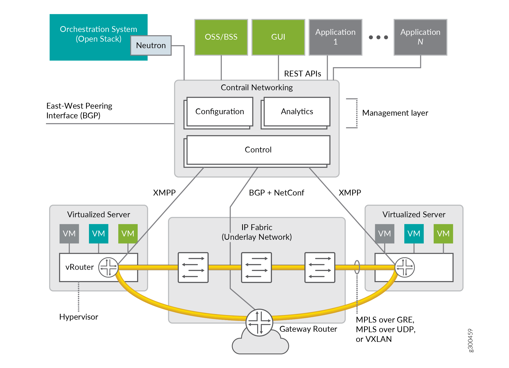

Understanding Contrail Networking Components
============================================

 

Contrail Networking is comprised of the following key components:

-  *Contrail Networking management Web GUI and plug-ins* integrate with
   orchestration platforms such as Kubernetes, OpenShift, Mesos,
   OpenStack, VMware vSphere, and with service provider operations
   support systems/business support systems (OSS/BSS). Many of these
   integrations are built, certified, and tested with technology
   alliances like Red Hat, Mirantis, Canonical, NEC, and more. Contrail
   Networking sits under such orchestration systems and integrates
   northbound via published REST APIs. It can be automatically driven
   through the APIs and integrations, or managed directly using the Web
   GUI, called Contrail Command GUI.

-  *Contrail Networking control and management systems*, commonly called
   the controller, have several functions. Few of the major functions
   are:

   -  *Configuration Nodes*—This function accepts requests from the API
      to provision workflows like adding new virtual networks, new
      endpoints, and much more. It converts these abstract high-level
      requests, with optional detail, into low-level directions that map
      to the internal data model.

   -  *Control Nodes*—This function maintains a scalable, highly
      available network model and state by federating with other peer
      instances of itself. It directs network provisioning for the
      Contrail Networking vRouters using Extensible Messaging and
      Presence Protocol (XMPP). It can also exchange network
      connectivity and state with peer physical routers using open
      industry-standard MP-BGP which is useful for routing the overlay
      networks and north-south traffic through a high-performance cloud
      gateway router.

   -  *Analytics Nodes*—This function collects, stores, correlates, and
      analyzes data across network elements. This information, which
      includes statistics, logs, events, and errors, can be consumed by
      end-user or network applications through the northbound REST API
      or Apache Kafka. Through the Web GUI, the data can be analyzed
      with SQL style queries.

-  *Contrail Networking vRouter* runs on the compute nodes of the cloud
   or NFV infrastructure. It gets network tenancy, VPN, and reachability
   information from the control function nodes and ensures native Layer
   3 services for the Linux host on which it runs or for the containers
   or virtual machines of that host. Each vRouter is connected to at
   least two control nodes to optimize system resiliency. The vRouters
   run in one of two high performance implementations: as a Linux kernel
   module or as an Intel Data Plane Development Kit (DPDK)-based
   process.

|Figure 1: Contrail Networking Overview|

 

