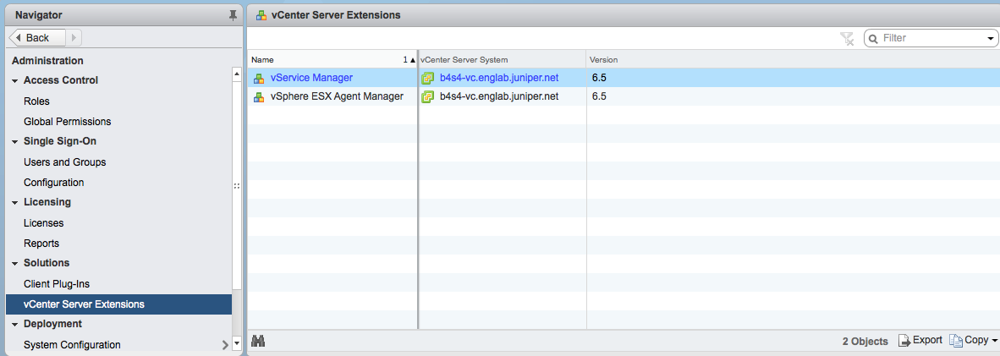

Integrating vCenter for Contrail
================================

 

.. raw:: html

   

.. raw:: html

   

These topics provide instructions for integrating Contrail Release 5.1.x
and microservices with VMware vCenter.

.. raw:: html

   

.. raw:: html

   

Prerequisites
-------------

Before you start the integration, ensure that the contrail controller
meets the prerequisites given in `Server Requirements and Supported
Platforms <../installation/hardware-reqs-vnc.html>`__.

Follow these steps to prepare Contrail controller(s):

.. raw:: html

   

.. raw:: html

   

::

   yum update -y

   yum install -y yum-plugin-priorities https://dl.fedoraproject.org/pub/epel/epel-release-latest-7.noarch.rpm

   yum install -y python-pip git gcc python-devel sshpass

   yum install -y git

   pip install “ansible==2.5.0” pyvmomi

.. raw:: html

   

.. raw:: html

   

ESX Agent Manager
-----------------

VMware provides a standard vCenter solution called vSphere ESX Agent
Manager (EAM), that allows you to deploy, monitor, and manage
ContrailVMs on ESXi hosts.

The ContrailVM is deployed as an Agent VM that is monitored by EAM. With
this integration, ContrailVMs are marked as more critical and privileged
than other tenant VMs on the host.

The following are the benefits of running ContrailVM as an AgentVM from
EAM:

-  Auto-deploy ContrailVMs on ESXi hosts in scope (clusters).

-  Manage and Monitor ContrailVMs through EAM in the vSphere web client.

-  Integrate with other vCenter features like AddHos, Maintenance Mode,
   vSphere DRS, vSphere DPM, and VMWare HA.

These topics provide instructions for integrating Contrail Release 5.1.x
and microservices with VMware vCenter.

Set Up vCenter Server
---------------------

Follow these steps to set up the vCenter server.

1. Download the Contrail Ansible Deployer
   (``contrail-ansible-deployer-< >.tgz``) onto your provisioning host.
   You can download the deployer from
   https://www.juniper.net/support/downloads/?p=contrail#sw.

2. Untar the ``tgz``.

   .. raw:: html

      

   .. raw:: html

      

   ``- tar xvf contrail-ansible-deployer-< >.tgz``

   .. raw:: html

      

   .. raw:: html

      

3. Prepare a ``vcenter_vars.yml`` file populated with vCenter server and
   ESXI hosts parameters. You can download the CentOS 7.5 and ESXi VM
   Host from
   https://www.juniper.net/support/downloads/?p=contrail#sw.\ **Note**\ 

   You can see a sample of the vcenter_vars.yml file in the
   ``contrail-ansible-deployer/playbooks/roles/vcenter/vars/vcenter_vars.yml``
   after you extract the image files.

   **Note**

   The ContrailVM’s Open Virtualization Format (OVF) image must be
   hosted on an http or https server which runs on and is reachable from
   the vCenter server. The location of the OVF is provided as a URL path
   for ``vmdk:`` as shown in the example given below.

   .. raw:: html

      

   **Example: Enabling HA and DRS in the cluster**

   .. raw:: html

      

   ::

      vcenter_servers:
        - SRV1:
            hostname: 
            username:
            password:
            # Optional: defaults to False
            #validate_certs: False
            datacentername: 
            clusternames:
            #path to the ovf, is needed for ESX Agent Manager to deploy ContrailVMs
            vmdk: http://<ip-address>/centos-7.5/LATEST/ContrailVM.ovf
            # Optional: If not specified HA and DRS are turned off on the clusters.
            enable_ha: yes
            enable_drs: yes

   .. raw:: html

      

   For definition examples, refer
   ``contrail-ansible-deployer/playbooks/roles/vcenter/vars/vcenter_vars.yml.sample``.

   To enable HA and DRS in the cluster, set ``enable_ha`` and
   ``enable_drs`` to ``yes`` in the ``vcenter_vars.yml`` file. If these
   flags are not enabled, HA and DRS is turned off by default for newly
   created and existing clusters.

   .. raw:: html

      

   .. raw:: html

      

   **Example instances.yaml File**

   .. raw:: html

      

   ::

      provider_config:
        bms:
          ssh_pwd: password
          ssh_user: root
          ntpserver: 8.8.8.8
          domainsuffix: blah.net

      instances:
        bms1:
          provider: bms
          ip: <ip-address>
          roles:
            config_database:
            config:
            control:
            analytics_database:
            analytics:
            webui:
            vcenter_plugin:
        bms2:
          provider: bms
          esxi_host: <ip-address>
          ip: <ip-address>
          roles:
            vrouter:
            vcenter_manager:
              ESXI_USERNAME: root
              ESXI_PASSWORD: password
        bms3:
          provider: bms
          esxi_host: <ip-address>
          ip: <ip-address>
          roles:
            vrouter:
            vcenter_manager:
              ESXI_USERNAME: root
              ESXI_PASSWORD: password
        bms4:
          provider: bms
          esxi_host: <ip-address>
          ip: <ip-address>
          roles:
            vrouter:
            vcenter_manager:
              ESXI_USERNAME: root
              ESXI_PASSWORD: password

      global_configuration:
        CONTAINER_REGISTRY: hub.juniper.net
        CONTAINER_REGISTRY_USERNAME: username
        CONTAINER_REGISTRY_PASSWORD: password
        REGISTRY_PRIVATE_INSECURE: False

      contrail_configuration:
        CLOUD_ORCHESTRATOR: vcenter
        CONTROLLER_NODES: <ip-address>
        CONTRAIL_VERSION: 5.1.0-0.360
        RABBITMQ_NODE_PORT: 5673
        VCENTER_SERVER: <ip-address>
        VCENTER_USERNAME: administrator@vsphere.net
        VCENTER_PASSWORD: password
        VCENTER_DATACENTER: <DC name here>
        VCENTER_DVSWITCH: overlay
        VCENTER_WSDL_PATH: /usr/src/contrail/contrail-web-core/webroot/js/vim.wsdl
        VCENTER_AUTH_PROTOCOL: https

   .. raw:: html

      

   .. raw:: html

      

   **Note**

   The default login credentials for Contrail OVF:

   -  Username: ``root``

   -  Password: ``c0ntrail123``

   We suggest using unique usernames and passwords in accordance with
   your organization’s security guidelines.

   .. raw:: html

      

   **Example vcenter_vars.yml File**

   .. raw:: html

      

   ::

      ---
      vcenter_servers:
        - SRV1:
            hostname: <host-ip-address>
            username: administrator@vsphere.net
            password: password
            # Optional: defaults to False
            #validate_certs: False
            datacentername: "<your DC name here>"
            clusternames:
              - "<your cluster name here>"
            vmdk: http://<ip-address>/contrail/images/ContrailVM.ovf
            dv_switch:
              dv_switch_name: overlay
            dv_port_group:
              dv_portgroup_name: VM_pg
              number_of_ports: 1800

      esxihosts:
        - name: <ip-address>
          username: root
          password: password
          datastore: <your local datastore here>
          datacenter: "<your DC name here>"
          cluster: "<your cluster name here>"
          contrail_vm:
            networks:
              - mac: 00:77:56:aa:bb:01
          vcenter_server: SRV1 #leave this
        - name: <ip-address>
          username: root
          password: password
          datastore: <your local datastore here>
          datacenter: "<your DC name here>"
          cluster: "<your cluster name here>"
          contrail_vm:
            networks:
              - mac: 00:77:56:aa:bb:02
          vcenter_server: SRV1 #leave this
        - name: <ip-address>
          username: root
          password: password
          datastore: <your local datastore here>
          datacenter: "<your DC name here>"
          cluster: "<your cluster name here>"
          contrail_vm:
            networks:
              - mac: 00:77:56:aa:bb:77
          vcenter_server: SRV1 #leave this

   .. raw:: html

      

   .. raw:: html

      

4. Run the Contrail vCenter playbook.

   .. raw:: html

      

   .. raw:: html

      

   ``ansible-playbook playbooks/vcenter.yml``

   .. raw:: html

      

   .. raw:: html

      

   **Note**

   Verify that the hostnames for the contrail controller(s) and the
   ContrailVMs (vRouters) are unique in ``/etc/hostname`` file.

   You can verify hostname from either the DHCP options (if the
   management network uses DHCP) or manually (if the management network
   uses static IP allocation).

Configure Contrail Parameters
-----------------------------

Populate the file ``config/instances.yaml`` with Contrail roles.

For an example file, see
``contrail-ansible-deployer/confing/instances.yaml.vcenter_example``.

Install Contrail
----------------

Install Contrail by running the following Contrail playbooks:

.. raw:: html

   

.. raw:: html

   

``ansible-playbook -i inventory/ -e orchestrator=vcenter playbooks/configure_instances.yml``

.. raw:: html

   

.. raw:: html

   

``ansible-playbook -i inventory/ -e orchestrator=vcenter playbooks/install_contrail.yml``

.. raw:: html

   

.. raw:: html

   

Monitor and Manage ContrailVM from ESX Agent Manager
----------------------------------------------------

ContrailVMs can be monitored from EAM by using ContrailVM-Agency.

Follow these steps to monitor and manage Contrail VM from EAM:

1. Resolve issues from the ContrailVM-Agency.

   The ContrailVM-Agency is in an alert state when the ContrailVM in any
   host is powered off or is deleted.

   Click **Resolve All Issues** from the ContrailVM-Agency to correct
   the issue. The ContrailVM-Agency will attempt to correct the issue by
   bringing the ContrailVM back online or by spawning a ContrailVM from
   the OVF on the ESXi host.

   |Figure 1: vCenter Server Extensions|

   |Figure 2: ESX Agencies|

2. Add host.

   1. Add ESXi host to the cluster.

   2. Configure **Agent VM Settings** for the ESXI host.

      |Figure 3: Configure Agent VM Settings|

      For more information on configuring Agent VM, network, and
      datastore settings, see `Configure Agent VM
      Settings <https://docs.vmware.com/en/VMware-vSphere/6.5/com.vmware.vsphere.vcenterhost.doc/GUID-6BEC5198-5273-4592-ABD2-2E6E85873C16.html>`__.

      EAM deploys a ContrailVM (from the base OVF) on the ESXi host.

   3. Add ESXi host details to ``vcenter_vars.yml`` and repeat step
      `4 <vcenter-contrail.html#run-vcenter-playbook>`__ to add
      appropriate interfaces to the ContrailVM and to configure
      necessary settings in the vCenter server.

   4. Add ContrailVM details to ``instances.yaml`` and provision
      Contrail on the newly added ContrailVm (router). For more
      information on provisioning Contrail, see `Install
      Contrail <vcenter-contrail.html#id-install-contrail>`__.

3. Clean up the ContrailVM-Agency.

   Delete **ContrailVM-Agency** from the EAM user interface to delete
   ContrailVM and the agency.

 

.. |Figure 2: ESX Agencies| image:: documentation/images/s051767.png
.. |Figure 3: Configure Agent VM Settings| image:: documentation/images/s051768.png
