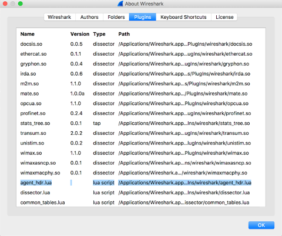
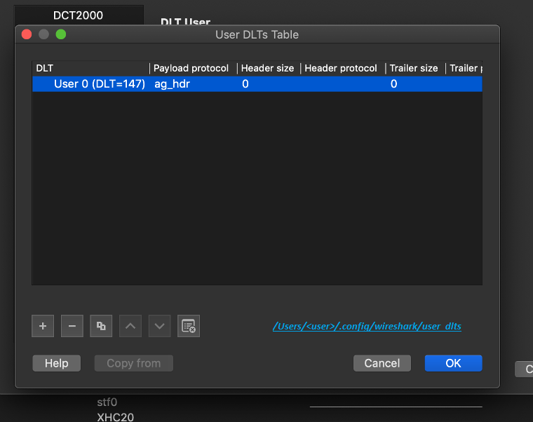

# Using the Wireshark Plugin to Analyze Packets Between vRouter and vRouter Agent on pkt0 Interface

 

Wireshark is a an application that analyzes packets from a network and
displays the packet information in detail.

Contrail Networking Release 2008 and later supports
the Wireshark `agent_header.lua` plugin, which enables you to capture
and analyze the packets exchanged between a vRouter data plane and
vRouter agent. You can capture the packets by executing the vifdump -i 2 and the tcpdump -i pkt0 commands in DPDK mode and kernel mode
respectively. In release 2008, the Wireshark agent\_header.lua plugin is
supported on Macintosh OS computers only. .Starting
from release 2011, the Wireshark `agent_header.lua` plugin is supported
on Macintosh OS as well as Windows OS computers. Wireshark also
enables you to add agent header information to the captured packets.

Before you begin

You must ensure that the Wireshark application is installed on your
computer. You can download Wireshark from the [Download
Wireshark](https://www.wireshark.org/#download) page.

Configuration

Follow these steps to configure the Wireshark plugin and dissect agent
header information in a packet:

1.  Download the Wireshark plugin from GitHub:
    <https://github.com/tungstenfabric/tf-vrouter/tree/master/utils/agent_hdr_plugin>.

2.  Copy the plugin in to the following Wireshark
    directory on your Macintosh OS computer:
    `/Applications/Wireshark.app/Contents/PlugIns/wireshark/`.

3.  Verify that the `agent_hdr.lua` plugin is loaded
    successfully in Wireshark. Relaunch Wireshark and navigate to
    **Wireshark** &gt; **About Wireshark** &gt; **Plugins** to verify
    that the plugin is loaded in the **Plugins** section. See
    [Figure 1](adding-agent-header-using-wireshark-plugin.html#agent-hdr-plugin-loaded).

    

4.  Pass the pcap file through editcap to add a
    custom encapsulation type for a packet:

    `editcap -T user0 <pcap-file-to-be-read> <output.pcap>`

5.  In Wireshark, navigate to **Wireshark** &gt;
    **Preferences** &gt; **Protocols** &gt; **DLT\_USER** &gt; **Edit
    Encapsulation Table**. See
    [Figure 2](adding-agent-header-using-wireshark-plugin.html#encapsulation-table).

    

6.  In the **Edit Encapsulation Table**, add the
    `agent_hdr` as a payload protocol for the packet. See
    [Figure 3](adding-agent-header-using-wireshark-plugin.html#add-agent-hdr).

    

7.  Using Wireshark, open the modified pcap file you
    generated in step
    [4](adding-agent-header-using-wireshark-plugin.html#step-four).
    Wireshark displays the parsed packets. See
    [Figure 4](adding-agent-header-using-wireshark-plugin.html#modified-parsed-packets).

    

Follow these steps to configure the Wireshark plugin in a Windows OS
computer and dissect agent header information in a packet:

1.  Download the Wireshark plugin from GitHub:
    <https://github.com/tungstenfabric/tf-vrouter/tree/master/utils/agent_hdr_plugin>.

2.  If you are using Windows 32-bit OS, copy the
    plugin in to the following Wireshark directory on your computer:
    `C:\Program Files (x86)\Wireshark\`.

    If you are using Windows 64-bit OS, copy the plugin in to the
    following Wireshark directory on your computer:
    `C:\Program Files\Wireshark\plugins\`.

3.  Verify that the `agent_hdr.lua` plugin is loaded
    successfully in Wireshark. Relaunch Wireshark and navigate to
    **Help** &gt; **About Wireshark** &gt; **Plugins** to verify that
    the plugin is loaded in the **Plugins** section.

4.  Open command prompt in Run as administrator mode
    and navigate to `C:\Program Files\Wireshark` to use editcap. Pass
    the pcap file through editcap to add a custom encapsulation type for
    a packet:

    `editcap -T user0 <pcap-file-to-be-read> <output.pcap>`

5.  In Wireshark, navigate to **Edit** &gt;
    **Preferences** &gt; **Protocols** &gt; **DLT\_USER** &gt; **Edit
    Encapsulation Table**.

6.  In the **Edit Encapsulation Table**, add the
    `agent_hdr` as a payload protocol for the packet. See .

7.  Using Wireshark, open the modified pcap file you
    generated in step
    [4](adding-agent-header-using-wireshark-plugin.html#step-four-ms).
    Wireshark displays the parsed packets.

The `agent_header.lua` plugin is also available in contrail-tools
container. You must perform the following steps to use the plugin from
the contrail-tools container:

1.  Log in to vRouter as a root user.

2.  Use the following command to view the summary of
    eachpacket in the pcap file:

    tshark3\_2 -nr &lt;pcap file&gt; -o
    "uat:user\_dlts:\\"User
    0(DLT=147)\\",\\"ag\_hdr\\",\\"0\\",\\"\\",\\"0\\",\\"\\"" -t
    ad

3.  Use the following command to view detailed
    informationof the packets in the pcap file:

     tshark3\_2 -nr &lt;pcap file&gt; -o
    "uat:user\_dlts:\\"User0
    (DLT=147)\\",\\"ag\_hdr\\",\\"0\\",\\"\\",\\"0\\",\\"\\"" -T
    pdml

Release History Table

Release

Description

[2011](#jd0e24)

Starting from release 2011, the Wireshark `agent_header.lua` plugin is
supported on Macintosh OS as well as Windows OS computers.

[2008](#jd0e12)

Contrail Networking Release 2008 and later supports the Wireshark
`agent_header.lua` plugin, which enables you to capture and analyze the
packets exchanged between a vRouter data plane and vRouter agent.

 
