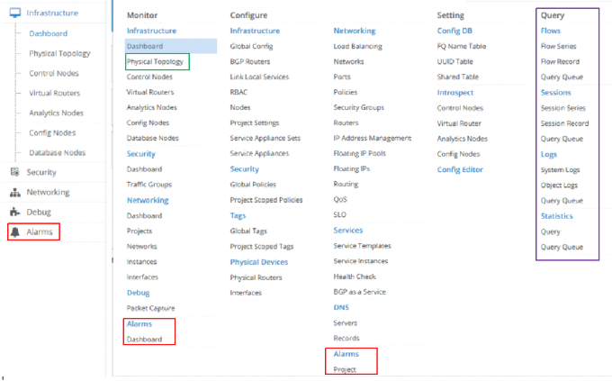
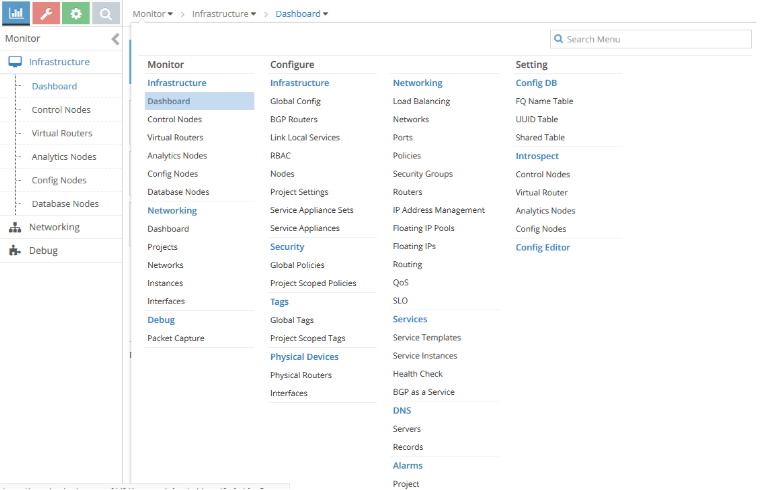
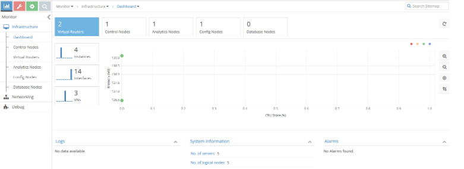
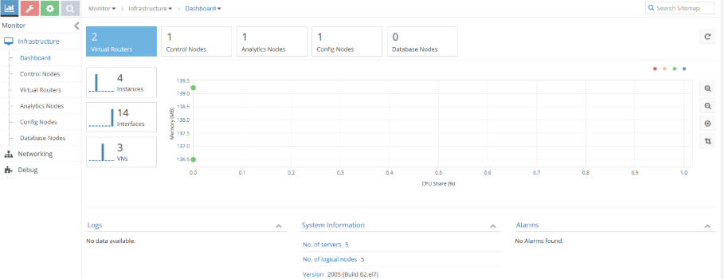
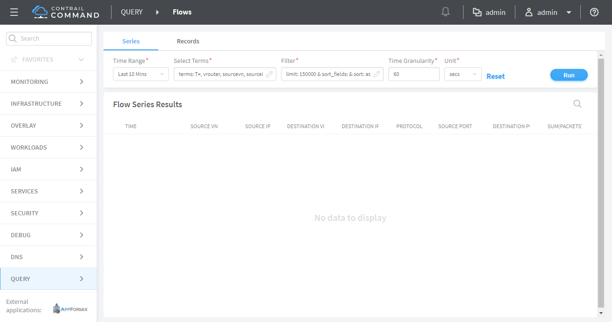

Contrail Analytics Optional Modules
===================================

 

Analytics Optional Components
-----------------------------

Contrail analytics is comprised of four building blocks. The last three
listed are optional components.

-  Analytics collector

-  Analytics alarm

-  Analytics SNMP

-  Analytics database

|Figure 1: Contrail Analytics Components|

Regardless that the alarm, SNMP, and database analytics roles have not
been installed and if installed are disabled, these components show as
active when you run the Linux $sudo commands or view in Contrail
Command. For more information, see the section “TripleO Provisioning”
below.

Contrail Infrastructure Installed without Optional Analytics Components
~~~~~~~~~~~~~~~~~~~~~~~~~~~~~~~~~~~~~~~~~~~~~~~~~~~~~~~~~~~~~~~~~~~~~~~

Two topologies are considered in this example: multi-nodes or single
node.

.. raw:: html

   

.. raw:: html

   

Multi-nodes—Contrail controller components are split onto three servers
(Contrail controller, Contrail analytics, and Contrail analytics
database). Only the first two servers are mandatory since Contrail
analytics database is an optional component. This type of topology is
used in production deployments.

.. raw:: html

   

.. raw:: html

   

Single node—This type of topology is used in test deployments.

.. raw:: html

   

.. raw:: html

   

Multi-Nodes Contrail Controller
~~~~~~~~~~~~~~~~~~~~~~~~~~~~~~~

Contrail Controller Node
^^^^^^^^^^^^^^^^^^^^^^^^

Following is an example of the Contrail status on the Contrail
controller node:

.. raw:: html

   

::

   $ sudo contrail-status
   == Contrail control ==
   control: active
   nodemgr: active
   named: active
   dns: active

   == Contrail config-database ==
   nodemgr: active
   zookeeper: active
   rabbitmq: active
   cassandra: active

   == Contrail config ==
   svc-monitor: active
   nodemgr: active
   device-manager: active
   api: active
   schema: active

   == Contrail webui ==
   web: active
   job: active

.. raw:: html

   

Contrail Analytics Node (with All Optional Components)
^^^^^^^^^^^^^^^^^^^^^^^^^^^^^^^^^^^^^^^^^^^^^^^^^^^^^^

Following is the Contrail status on Contrail analytics node when
Contrail analytics SNMP and Contrail analytics alarm have both been
deployed:

.. raw:: html

   

::

   $ sudo contrail-status
   Pod Service Original Name
   Original Version State Id Status
   analytics api contrail-analytics-api rhel-
   queens-1910-23 running 62980f3e6479 Up 2 weeks
   analytics collector contrail-analytics-collector rhel-
   queens-1910-23 running b777437946c2 Up 2 weeks
   analytics nodemgr contrail-nodemgr rhel-
   queens-1910-23 running aeeb744a5b5e Up 2 weeks
   analytics redis contrail-external-redis rhel-
   queens-1910-23 running 150b6225bd93 Up 2 weeks
   analytics-alarm alarm-gen contrail-analytics-alarm-gen rhel-
   queens-1910-23 running d655146cb8d0 Up 2 weeks
   analytics-alarm kafka contrail-external-kafka rhel-
   queens-1910-23 running 8cfa8c7da4bd Up 2 weeks
   analytics-alarm nodemgr contrail-nodemgr rhel-
   queens-1910-23 running 685a5f817f0b Up 2 weeks
   analytics-alarm zookeeper contrail-external-zookeeper rhel-
   queens-1910-23 running a41dc5658c72 Up 2 weeks
   analytics-snmp nodemgr contrail-nodemgr rhel-
   queens-1910-23 running 0afd301ccbd8 Up 2 weeks
   analytics-snmp snmp-collector contrail-analytics-snmp-collector rhel-
   queens-1910-23 running 2bde6aa39250 Up 2 weeks
   analytics-snmp topology contrail-analytics-snmp-topology rhel-
   queens-1910-23 running a16f983ed162 Up 2 weeks

   == Contrail analytics ==
   nodemgr: active
   api: active
   collector: active

   == Contrail analytics-alarm ==
   nodemgr: active
   kafka: active
   alarm-gen: active

   == Contrail analytics-snmp ==
   snmp-collector: active
   nodemgr: active
   topology: active

.. raw:: html

   

Contrail analytics alarm and SNMP are deployed and active.

Contrail Analytics Node (without Analytics Optional Components)
^^^^^^^^^^^^^^^^^^^^^^^^^^^^^^^^^^^^^^^^^^^^^^^^^^^^^^^^^^^^^^^

Following is an example of the Contrail status on Contrail analytics
node when Contrail analytics SNMP and Contrail analytics alarm have not
been deployed:

.. raw:: html

   

::

   $ sudo contrail-status
   Pod Service Original Name Original Version
   State Id Status
   analytics api contrail-analytics-api rhel-queens-2005-62
   running 489b07cbbbef Up 18 hours
   analytics collector contrail-analytics-collector rhel-queens-2005-62
   running 5da4f99b045f Up 18 hours
   analytics nodemgr contrail-nodemgr rhel-queens-2005-62
   running 28053f64f1bc Up 18 hours
   analytics provisioner contrail-provisioner rhel-queens-2005-62
   running faa8de6d17e4 Up 18 hours
   analytics redis contrail-external-redis rhel-queens-2005-62
   running 3e29dcc475d1 Up 18 hours
   analytics stunnel contrail-external-stunnel rhel-queens-2005-62
   running 11a30f0f5e3b Up 18 hours

   == Contrail analytics ==
   nodemgr: active
   api: active
   collector: active

.. raw:: html

   

Only Contrail analytics collector is deployed and active.

Contrail Analytics Database Node
^^^^^^^^^^^^^^^^^^^^^^^^^^^^^^^^

Contrail analytics database is only deployed when the analytics database
component is enabled. The following example shows the Contrail status on
the Contrail analytics database node:

.. raw:: html

   

::

   $ sudo contrail-status
   Pod Service Original Name Original Version
   State Id Status
   database cassandra contrail-external-cassandra rhel-queens-1910-
   23 running ec05bd8c34c4 Up 2 weeks
   database nodemgr contrail-nodemgr rhel-queens-1910-
   23 running 25a6c58d5144 Up 2 weeks
   database query-engine contrail-analytics-query-engine rhel-queens-1910-
   23 running f90f7ae16b48 Up 2 weeks

   == Contrail database ==
   nodemgr: active
   query-engine: active
   cassandra: active

.. raw:: html

   

Single Node Contrail Controller
~~~~~~~~~~~~~~~~~~~~~~~~~~~~~~~

Contrail Controller Node (with All Analytics Optional Components)
^^^^^^^^^^^^^^^^^^^^^^^^^^^^^^^^^^^^^^^^^^^^^^^^^^^^^^^^^^^^^^^^^

Following is the Contrail status on Contrail controller node when
Contrail analytics SNMP, Contrail analytics alarm, and Contrail
analytics database have been deployed:

.. raw:: html

   

::

   $ sudo contrail-status
   Pod Service Original Name
   Original Version State Id Status
   analytics api contrail-analytics-api
   rhel-queens-1912-46 running bf87cc51fb36 Up 8 weeks
   analytics collector contrail-analytics-collector
   rhel-queens-1912-46 running 0ae1ca0fb1f2 Up 8 weeks
   analytics nodemgr contrail-nodemgr
   rhel-queens-1912-46 running 24e9174056d0 Up 8 weeks
   analytics redis contrail-external-redis
   rhel-queens-1912-46 running 9d7135b6b9d8 Up 8 weeks
   analytics stunnel contrail-external-stunnel
   rhel-queens-1912-46 running 30d413bad4f1 Up 8 weeks
   analytics-alarm alarm-gen contrail-analytics-alarm-gen
   rhel-queens-1912-46 running 2f40aeb42154 Up 8 weeks
   analytics-alarm kafka contrail-external-kafka
   rhel-queens-1912-46 running 8cd54b9520af Up 8 weeks
   analytics-alarm nodemgr contrail-nodemgr
   rhel-queens-1912-46 running afeadd231273 Up 8 weeks
   analytics-alarm zookeeper contrail-external-zookeeper
   rhel-queens-1912-46 running 118b116b2721 Up 8 weeks
   analytics-snmp nodemgr contrail-nodemgr
   rhel-queens-1912-46 running f623346fff53 Up 8 weeks
   analytics-snmp snmp-collector contrail-analytics-snmp-collector
   rhel-queens-1912-46 running 152b037af72d Up 8 weeks
   analytics-snmp topology contrail-analytics-snmp-topology
   rhel-queens-1912-46 running 5226847e74f3 Up 8 weeks
   config api contrail-controller-config-api
   rhel-queens-1912-46 running b8ba22697cfe Up 8 weeks
   config device-manager contrail-controller-config-devicemgr
   rhel-queens-1912-46 running 29f9b248f850 Up 8 weeks
   config nodemgr contrail-nodemgr
   rhel-queens-1912-46 running 2f3f84d5d2b4 Up 8 weeks
   config schema contrail-controller-config-schema
   rhel-queens-1912-46 running 334906b962fb Up 8 weeks
   config svc-monitor contrail-controller-config-svcmonitor
   rhel-queens-1912-46 running a8581c37f9ab Up 8 weeks
   config-database cassandra contrail-external-cassandra
   rhel-queens-1912-46 running e47a3e430fe6 Up 8 weeks
   config-database nodemgr contrail-nodemgr
   rhel-queens-1912-46 running 4798399f0ec5 Up 8 weeks
   config-database rabbitmq contrail-external-rabbitmq
   rhel-queens-1912-46 running d80a5e8e8801 Up 8 weeks
   config-database zookeeper contrail-external-zookeeper
   rhel-queens-1912-46 running b1c430201497 Up 8 weeks
   control control contrail-controller-control-control
   rhel-queens-1912-46 running e478128385f7 Up 8 weeks
   control dns contrail-controller-control-dns
   rhel-queens-1912-46 running f9752a324d71 Up 8 weeks
   control named contrail-controller-control-named
   rhel-queens-1912-46 running 66c992adced5 Up 8 weeks
   control nodemgr contrail-nodemgr
   rhel-queens-1912-46 running 3c9a0270ab1a Up 8 weeks
   database cassandra contrail-external-cassandra
   rhel-queens-1912-46 running f85ead18fb26 Up 8 weeks
   database nodemgr contrail-nodemgr
   rhel-queens-1912-46 running 0d9f471003ea Up 8 weeks
   database query-engine contrail-analytics-query-engine
   rhel-queens-1912-46 running 40a092abbccf Up 8 weeks
   webui job contrail-controller-webui-job
   rhel-queens-1912-46 running 432f686a8abf Up 8 weeks
   webui web contrail-controller-webui-web
   rhel-queens-1912-46 running 4341432ce9a4 Up 8 weeks

   == Contrail control ==
   control: active
   nodemgr: active
   named: active
   dns: active

   == Contrail analytics-alarm ==
   nodemgr: active
   kafka: active
   alarm-gen: active

   == Contrail database ==
   nodemgr: active
   query-engine: active
   cassandra: active

   == Contrail analytics ==
   nodemgr: active
   api: active
   collector: active

   == Contrail config-database ==
   nodemgr: active
   zookeeper: active
   rabbitmq: active
   cassandra: active

   == Contrail webui ==
   web: active
   job: active

   == Contrail analytics-snmp ==
   snmp-collector: active
   nodemgr: active
   topology: active

   == Contrail config ==
   svc-monitor: active
   nodemgr: active
   device-manager: active
   api: active
   schema: active

.. raw:: html

   

Contrail database (query), analytics alarm, and SNMP are deployed and
active.

Contrail Controller Node (without Analytics Optional Components)
^^^^^^^^^^^^^^^^^^^^^^^^^^^^^^^^^^^^^^^^^^^^^^^^^^^^^^^^^^^^^^^^

Following is an example of the Contrail status on Contrail controller
node when Contrail analytics SNMP, Contrail analytics alarm, and
Contrail analytics database have not been deployed:

.. raw:: html

   

::

   $ sudo contrail-status
   Pod Service Original Name
   Original Version State Id Status
   analytics api contrail-analytics-api
   rhel-queens-2005-62 running b1ddca562595 Up 10 hours
   analytics collector contrail-analytics-collector
   rhel-queens-2005-62 running f6860911ee16 Up 10 hours
   analytics nodemgr contrail-nodemgr
   rhel-queens-2005-62 running 37a0d8744e31 Up 10 hours
   analytics provisioner contrail-provisioner
   rhel-queens-2005-62 running e2f9a4605d63 Up 10 hours
   analytics redis contrail-external-redis
   rhel-queens-2005-62 running 1d0a193983b0 Up 10 hours
   analytics stunnel contrail-external-stunnel
   rhel-queens-2005-62 running 695d61045e63 Up 10 hours
   config api contrail-controller-config-api
   rhel-queens-2005-62 running 41eb0caef12d Up 10 hours
   config device-manager contrail-controller-config-devicemgr
   rhel-queens-2005-62 running f3158c67d792 Up 10 hours
   config nodemgr contrail-nodemgr
   rhel-queens-2005-62 running 4138cc386e69 Up 10 hours
   config provisioner contrail-provisioner
   rhel-queens-2005-62 running 45aae86bb41a Up 10 hours
   config schema contrail-controller-config-schema
   rhel-queens-2005-62 running 2497392980d0 Up 10 hours
   config svc-monitor contrail-controller-config-svcmonitor
   rhel-queens-2005-62 running b2ed20209aa7 Up 10 hours
   config-database cassandra contrail-external-cassandra
   rhel-queens-2005-62 running abd3efad8075 Up 10 hours
   config-database nodemgr contrail-nodemgr
   rhel-queens-2005-62 running bcc74ecb37cc Up 10 hours
   config-database provisioner contrail-provisioner
   rhel-queens-2005-62 running 9de114119be5 Up 10 hours
   config-database rabbitmq contrail-external-rabbitmq
   rhel-queens-2005-62 running d623f5d3da79 Up 10 hours
   config-database zookeeper contrail-external-zookeeper
   rhel-queens-2005-62 running 2c4f47c2fdc1 Up 10 hours
   control control contrail-controller-control-control
   rhel-queens-2005-62 running 56e238791c60 Up 10 hours
   control dns contrail-controller-control-dns
   rhel-queens-2005-62 running 6cfc801451f9 Up 10 hours
   control named contrail-controller-control-named
   rhel-queens-2005-62 running f033a8bf5b88 Up 10 hours
   control nodemgr contrail-nodemgr
   rhel-queens-2005-62 running 7381053ff80f Up 10 hours
   control provisioner contrail-provisioner
   rhel-queens-2005-62 running a3851c25f427 Up 10 hours
   webui job contrail-controller-webui-job
   rhel-queens-2005-62 running 80cd5c06ff39 Up 10 hours
   webui web contrail-controller-webui-web
   rhel-queens-2005-62 running 51a2f164a259 Up 10 hours

   == Contrail control ==
   control: active
   nodemgr: active
   named: active
   dns: active

   == Contrail analytics ==
   nodemgr: active
   api: active
   collector: active

   == Contrail config-database ==
   nodemgr: active
   zookeeper: active
   rabbitmq: active
   cassandra: active

   == Contrail config ==
   svc-monitor: active
   nodemgr: active
   device-manager: active
   api: active
   schema: active

   == Contrail webui ==
   web: active
   job: active

.. raw:: html

   

Contrail database (query), analytics alarm, and SNMP are not deployed.

Contrail Web UI
---------------

Web UI with Optional Components
~~~~~~~~~~~~~~~~~~~~~~~~~~~~~~~

`Figure 2 <analytics-optional-modules.html#all-analytics-deployed>`__
displays the Contrail Web UI dashboard with all optional analytics
components deployed.

|Figure 2: Web UI - All Optional Analytics Components Deployed|

A database node is visible in the infrastructure dashboard.

|Figure 3: Web UI - Database Node in Dashboard|

Web UI without Optional Components
~~~~~~~~~~~~~~~~~~~~~~~~~~~~~~~~~~

`Figure 4 <analytics-optional-modules.html#analytics-not-deployed>`__
displays the Contrail Web UI dashboard without optional analytics
components deployed.

|Figure 4: Web UI - Optional Analytics Components Not Deployed|

No database node is visible in the infrastructure dashboard:

|Figure 5: Web UI - Database Node Not Visible in Dashboard|

Analytics Alarm Feature Enabled
~~~~~~~~~~~~~~~~~~~~~~~~~~~~~~~

`Figure 6 <analytics-optional-modules.html#monitor-alarm-menu>`__
displays the **Monitor > Alarms** menu.

|Figure 6: Web UI - Monitor > Alarms Menu|

`Figure 7 <analytics-optional-modules.html#configure-alarm-menu>`__
displays the **Configure > Alarms** menu.

|Figure 7: Web UI - Configure > Alarms Menu|

`Figure 8 <analytics-optional-modules.html#global-alarm-settings>`__
displays the dialog box which appears when **Global Alarm**, next to
Logged in User in the upper right, is selected.

|Figure 8: Web UI - Global Alarm Settings|

Analytics Alarm Feature Disabled
~~~~~~~~~~~~~~~~~~~~~~~~~~~~~~~~

If the alarm analytics component is not deployed, then Contrail Web UI
should not display the following alarm references:

-  Global Alarm (Next to Logged in User)

-  Monitor > Alarms

-  Configure > Alarms

There is not an appearance of Global Alarm or **Alarms** entry in the
Monitor menu:

|Figure 9: Analytics Alarm Disabled - Global Alarm and Alarm Not
Available|

Alarms menu still available in Configure menu.

|Figure 10: Analytics Alarm Disabled - Configure > Alarms|

Analytics SNMP Feature Enabled
~~~~~~~~~~~~~~~~~~~~~~~~~~~~~~

`Figure 11 <analytics-optional-modules.html#analytics-snmp-enabled>`__
displays the Physical Topology option in the Monitor menu.

|Figure 11: Analytics SNMP Feature Enabled - Physical Topology Menu
Available|

Analytics SNMP Feature Disabled
~~~~~~~~~~~~~~~~~~~~~~~~~~~~~~~

If the alarm analytics component is not provisioned, then Contrail Web
UI does not display the Physical Topology menu option.

|Figure 12: Analytics SNMP Feature Disabled - Physical Topology Menu Not
Available|

Analytics Database Enabled
~~~~~~~~~~~~~~~~~~~~~~~~~~

If analytics database is provisioned, then Contrail Web UI displays the
Query page.

|Figure 13: Analytics Database Enabled - Query Page Available|

Analytics Database Disabled
~~~~~~~~~~~~~~~~~~~~~~~~~~~

If analytics database is not provisioned, then Contrail Web UI should
not display the Query page. Query page logo is unavailable to launch
Query page.

|Figure 14: Analytics Database Disabled - Query Page Logo Not Available|

Tripleo Provisioning
--------------------

Multi-Nodes Contrail Controller Topology
~~~~~~~~~~~~~~~~~~~~~~~~~~~~~~~~~~~~~~~~

In order to enable or disable the Contrail analytics optional
components, TripleO templates have to be modified.

-  In ContrailAnalytics role, **ContrailAnalyticsSnmp**, and
   **ContrailAnalyticsAlarm** resources can be removed:

   .. raw:: html

      

   ::

       - OS::TripleO::Services::ContrailAnalytics
       - OS::TripleO::Services::ContrailAnalyticsSnmp
       - OS::TripleO::Services::ContrailAnalyticsAlarm

   .. raw:: html

      

-  ContrailAnalyticsDatabase role can also be removed (not selected
   using ContrailAnalyticsDatabaseCount = 0) into a rollout as this role
   is deploying only **ContrailAnalyticsDatabase** resource:

   .. raw:: html

      

   ::

      - OS::TripleO::Services::ContrailAnalyticsDatabase

   .. raw:: html

      

-  ContrailController role is kept unchanged.

Single Node Contrail Controller Topology
~~~~~~~~~~~~~~~~~~~~~~~~~~~~~~~~~~~~~~~~

In order to enable or disable the Contrail analytics optional
components, TripleO templates have to be modified. In ContrailController
role, **ContrailAnalyticsSnmp**, **ContrailAnalyticsAlarm**, and
**ContrailAnalyticsDatabase** resources can be removed, other contrail
resources are kept:

.. raw:: html

   

::

   - name: ContrailController
       - OS::TripleO::Services::ContrailAnalytics
       - OS::TripleO::Services::ContrailAnalyticsAlarm
       - OS::TripleO::Services::ContrailAnalyticsDatabase
       - OS::TripleO::Services::ContrailAnalyticsSnmp
       - OS::TripleO::Services::ContrailCertmongerUser
       - OS::TripleO::Services::ContrailConfig
       - OS::TripleO::Services::ContrailConfigDatabase
       - OS::TripleO::Services::ContrailControl
       - OS::TripleO::Services::ContrailWebui

.. raw:: html

   

TripleO Template Update
~~~~~~~~~~~~~~~~~~~~~~~

TripleO templates were updated in June 2020 to allow disabling the
provisioning of Contrail analytics components.

Earlier Contrail TripleO templates have to be patched in order to
replace ``docker/services/contrail/contrail-base.yaml`` file in which
optional analytics component provision is hardcoded:

.. raw:: html

   

::

   ...
                   ANALYTICS_ALARM_ENABLE: 'False'
                   ANALYTICS_SNMP_ENABLE: 'True'
                   ANALYTICSDB_ENABLE: 'True'
   ...

.. raw:: html

   

Appendix
--------

Contrail Command UI
~~~~~~~~~~~~~~~~~~~

The disabled roles and charts are visible on the Query page but they are
not operational.

|Figure 15: Query Page Visible in Dashboard|

Regardless that the alarm, SNMP, and database analytics roles have been
disabled, they are still reported by Contrail Command.

|Figure 16: Disabled Roles Still Visible in Contrail Command|

The following five charts will always display empty.

|Figure 17: Empty Charts in Compute Nodes|

|Figure 18: Empty Charts in Config Nodes|

|Figure 19: Empty Charts in Analytics Nodes|

|Figure 20: Empty Charts in Control Nodes|

|Figure 21: Empty Charts in Database Nodes|

The Alarms page displays alarms pulled from the Contrail
``analytics_alarm`` component. When the ``analytics_alarm`` component is
disabled, the Alarms page will always display no data.

|Figure 22: Empty Alarms Page|

.. raw:: html

   

.. raw:: html

   

Release History Table

.. raw:: html

   

.. raw:: html

   

.. raw:: html

   

Release

.. raw:: html

   

.. raw:: html

   

Description

.. raw:: html

   

.. raw:: html

   

.. raw:: html

   

.. raw:: html

   

`2008 <#jd0e319>`__

.. raw:: html

   

.. raw:: html

   

TripleO templates were updated in June 2020 to allow disabling the
provisioning of Contrail analytics components.

.. raw:: html

   

.. raw:: html

   

.. raw:: html

   

 

.. |Figure 1: Contrail Analytics Components| image:: documentation/images/g301071.png

.. |Figure 3: Web UI - Database Node in Dashboard| image:: documentation/images/s008310.PNG

.. |Figure 6: Web UI - Monitor > Alarms Menu| image:: documentation/images/s008313.PNG
.. |Figure 7: Web UI - Configure > Alarms Menu| image:: documentation/images/s008314.PNG
.. |Figure 8: Web UI - Global Alarm Settings| image:: documentation/images/s008315.PNG

.. |Figure 10: Analytics Alarm Disabled - Configure > Alarms| image:: documentation/images/s008317.PNG
.. |Figure 11: Analytics SNMP Feature Enabled - Physical Topology Menu Available| image:: documentation/images/s008318.PNG
.. |Figure 12: Analytics SNMP Feature Disabled - Physical Topology Menu Not Available| image:: documentation/images/s008319.PNG
.. |Figure 13: Analytics Database Enabled - Query Page Available| image:: documentation/images/s008320.PNG
.. |Figure 14: Analytics Database Disabled - Query Page Logo Not Available| image:: documentation/images/s008329.PNG

.. |Figure 16: Disabled Roles Still Visible in Contrail Command| image:: documentation/images/s008322.PNG
.. |Figure 17: Empty Charts in Compute Nodes| image:: documentation/images/s008323.PNG
.. |Figure 18: Empty Charts in Config Nodes| image:: documentation/images/s008324.PNG
.. |Figure 19: Empty Charts in Analytics Nodes| image:: documentation/images/s008325.PNG
.. |Figure 20: Empty Charts in Control Nodes| image:: documentation/images/s008326.PNG
.. |Figure 21: Empty Charts in Database Nodes| image:: documentation/images/s008327.PNG
.. |Figure 22: Empty Alarms Page| image:: documentation/images/s008328.PNG
