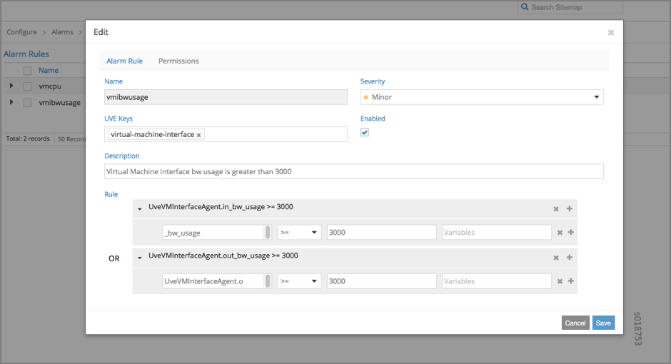
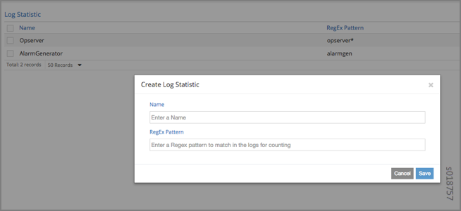
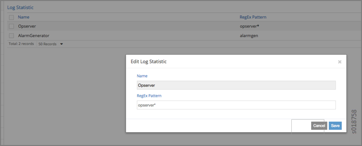

# User Configuration for Analytics Alarms and Log Statistics

 

## Configuring Alarms Based on User-Visible Entities Data

Contrail allows you to dynamically configure alarms based on the
user-visible entities (UVE) data. An alarm configuration object is
created based on the alarm configuration XSD schema. The alarm
configuration object is added to the Contrail configuration database,
using the Contrail API server REST API interface.

An alarm configuration object can be anchored in the configuration data
model under `global-system-config` or project, depending on the alarm
type. Under `global-system-config`, you should configure virtual network
system-wide alarms, such as those for the analytics node, the config
node, and so on. Under `project`, you should configure alarms related to
project objects, such as virtual networks and similar objects.

To configure and monitor alarms using the Contrail UI:

1.  Navigate to **Configure &gt; Alarms&gt; Project**,
    and select the desired project to access the **Alarm Rules**
    page.

    

2.  Click the Gear icon to add a new alarm
    configuration or to edit an existing alarm configuration. Use the
    **Edit** screen to define descriptions and to set up alarm rules.
    See [Table 1](analytics-user-alarms-log-statistics.html#table1) for
    field descriptions.

    

    Table 1: Alarm Rules Fields

    | Field       | Description                                                                                                                                                                                                                                                                                                                                               |
    |:------------|:----------------------------------------------------------------------------------------------------------------------------------------------------------------------------------------------------------------------------------------------------------------------------------------------------------------------------------------------------------|
    | Name        | Enter a name for the alarm.                                                                                                                                                                                                                                                                                                                               |
    | Severity    | Select the severity level of the alarm from the list.                                                                                                                                                                                                                                                                                                     |
    | UVE Keys    | Select the list of UVE types to apply to this alarm.                                                                                                                                                                                                                                                                                                      |
    | Description | Enter a description of the alarm.                                                                                                                                                                                                                                                                                                                         |
    | Rule        | Set up the alarm rules. Alarm rules are expressed as OR of AND terms. Each term has operand1, operand2, and the operation. Operand1 is the UVE attribute. Operand2 can be either another UVE attribute or a JSON value. The rules are evaluated in the `contrail-alarm-gen` service and an alarm is raised or cleared as needed on respective conditions. |

3.  To monitor alarms, navigate to **Monitor &gt;
    Alarms&gt; Dashboard**. The **Dashboard** screen lists the active
    alarms in the system.

    

## Examples: Detecting Anomalies

The purpose of anomaly detection in Contrail is to identify a condition
in which a metric deviates from its expected value, within given
parameters.

Contrail uses a statistical process control model for time-series
anomaly detection that can be computed online, in real-time. Raw metrics
are sent as statistics by Sandesh generators embedded inside the UVEs.
The model uses the running average and running standard deviation for a
given raw metric. The model does not account for seasonality and linear
trends in the metric.

The following example represents part of the UVE sent by the vRouter to
the collector. The raw metrics are `phy_band_in_bps` and
`phy_band_out_bps`.

The derived statistics are in `in_bps_ewm `and `out_bps_ewm`, which are
generated when the model’s EWM algorithm is applied to the raw metrics.
The raw metrics and the derived statistics are part of the UVE and are
sent to the collector.

    struct EWMResult {
        3: u64 samples
        6: double mean
        7: double stddev
    }

    struct VrouterStatsAgent { // Agent stats

    1: string name (key="ObjectVRouter")

    2: optional bool deleted    …
        
    /** @display_name:Vrouter Physical Interface Input bandwidth Statistics*/

    50: optional map<string,u64> phy_band_in_bps (tags="name:.__key")

    /** @display_name:Vrouter Physical Interface Output bandwidth Statistics*/

    51: optional map<string,u64> phy_band_out_bps (tags="name:.__key")

    52: optional map<string,derived_stats_results.EWMResult> in_bps_ewm (mstats="phy_band_in_bps:DSEWM:0.2")

    53: optional map<string,derived_stats_results.EWMResult> out_bps_ewm (mstats="phy_band_out_bps:DSEWM:0.2")
    }

The following shows part of the UVE that lists the raw metric
`phy_band_out_bps` and the derived statistic `out_bps_ewm`. The user can
define an alarm based on the values in `sigma` or in `stddev`.

## Configuring the User-Defined Log Statistic

Any deployment of Contrail cloud over an orchestration system requires
tools for monitoring and troubleshooting the entire cloud deployment.
Cloud data centers are built with a large collection of interconnected
servers that provide computing and storage capacity for a variety of
applications. The monitoring of the cloud and its infrastructure
requires monitoring logs and messages sent to a variety of servers from
many micro services.

Contrail analytics stores all of the monitored messages in the Contrail
database node, and the analytics generates a large amount of useful
information that aids in monitoring and troubleshooting the network.

With Contrail, the user-defined log statistic feature provides
additional abilities for monitoring and troubleshooting by enabling the
user to set a counter on any regular Perl-type expression. Each time the
pattern is found in any system logs, UVEs, or object logs, the counter
is incremented.

The user-defined log statistic can be configured from the Contrail UI or
from the command line, using `vnc_api`.

To configure the user-defined log statistic from the Contrail UI:

1.  Navigate to **Configure &gt; Infrastructure &gt;
    Global Config** and select **Log Statistic**.

    

2.  To create a log statistic, click the plus (+)
    icon to access the **Create Log Statistic** screen. Enter a name for
    the user-defined log statistic, and in the **RegExp Pattern** field,
    enter the Perl-type expression to look for and count.

    

3.  To edit an existing log statistic, select the
    name of the statistic and click the Gear icon, then select **Edit**
    to access the **Edit Log Statistic** screen.

    

4.  To delete a log statistic, select the name of the
    statistic and click the gear icon, then select the **Delete**
    option.

    

To configure the user-defined statistic from the `vnc_api`:

    user@host:~# python 
    Python 2.7.6 (default, Jun 22 2015, 17:58:13) 
    [GCC 4.8.2] on linux2 
    Type "help", "copyright", "credits" or "license" for more information.

    >> from vnc_api import vnc_api 
    >> from vnc_api.gen.resource_xsd import UserDefinedLogStat 
    >> from vnc_api.gen.resource_client import GlobalSystemConfig 
    >> vnc = vnc_api.VncApi('<username>', '<password>', '<tenant>') 
    >> gsc_uuid = vnc.global_system_configs_list()['global-system-configs'][0]['uuid'] 
    >> gsc = vnc.global_system_config_read(id=gsc_uuid)

To list the counters:

    >> [(x.name, x.pattern) for x in gsc.user_defined_log_statistics.statlist] 

    [('HostnameCounter', 'dummy'), ('MyIp', '10.84.14.38')] 

To add a counter:

    >> g=GlobalSystemConfig() 
    >> g.add_user_defined_counter(UserDefinedLogStat('Foo', 'Ba.*r')) 
    >> vnc.global_system_config_update(g) 

To verify an addition:

    >> gsc = vnc.global_system_config_read(id=gsc_uuid)
    >> [(x.name, x.pattern) for x in gsc.user_defined_log_statistics.statlist] 

    [('HostnameCounter', 'dummy'), ('MyIp', '10.84.14.38'), ('Foo', 'Ba.*r')] 

## Implementing the User-Defined Log Statistic

The statistics are sent as a counter that has been aggregated over a
time period of 60 seconds.

A current sample from your system can be obtained from the UVE at:

`http://<analytics-ip>:8081/analytics/uves/user-defined-log-statistic/<name>`

You can also use the statistics table `UserDefinedLogStatTable` to get
historical data with all supported aggregations such as SUM, AVG, and
the like.

The schema for the table is at the following location:

`http://<ip>:8081/analytics/table/StatTable.UserDefinedCounter.count/schema`

**Schema for User-Defined Statistics Table**

The following is the schema for the user-defined statistic table:

    {
       "type": "STAT",
       "columns": [
       {
       "datatype": "string",
       "index": true,
       "name": "Source",
       "suffixes": null
    },
       {
       "datatype": "int",
       "index": false,
       "name": "T",
       "suffixes": null
    },
       {
       "datatype": "int",
       "index": false,
       "name": "CLASS(T)",
       "suffixes": null
    },
       {
       "datatype": "int",
       "index": false,
       "name": "T=",
       "suffixes": null
    },
       {
       "datatype": "int",
       "index": false,
       "name": "CLASS(T=)",
       "suffixes": null
    },
       {
       "datatype": "uuid",
       "index": false,
       "name": "UUID",
       "suffixes": null
    },
       {
       "datatype": "int",
       "index": false,
       "name": "COUNT(count)",
       "suffixes": null
    },
       {
       "datatype": "int",
       "index": false,
       "name": "count.previous",
       "suffixes": null
    },
       {
       "datatype": "int",
       "index": false,
       "name": "SUM(count.previous)",
       "suffixes": null
    },
       {
       "datatype": "int",
       "index": false,
       "name": "CLASS(count.previous)",
       "suffixes": null
    },
       {
       "datatype": "int",
       "index": false,
       "name": "MAX(count.previous)",
       "suffixes": null
    },
       {
       "datatype": "int",
       "index": false,
       "name": "MIN(count.previous)",
       "suffixes": null
    },
       {
       "datatype": "percentiles",
       "index": false,
       "name": "PERCENTILES(count.previous)",
       "suffixes": null
    },
       {
       "datatype": "avg",
       "index": false,
       "name": "AVG(count.previous)",
       "suffixes": null
    },
       {
       "datatype": "string",
       "index": true,
       "name": "name",
       "suffixes": null
    }
       ]
    }

 
