Debugging BGP Peering and Route Exchange in Contrail
====================================================

 

Use the troubleshooting steps and guidelines in this topic when you have
errors with Contrail BGP peering and route exchange.

Example Cluster
---------------

Examples in this document refer to a virtual cluster that is set up as
follows:

.. raw:: html

   

::

   Config Nodes  : [‘nodea22’, ‘nodea20’]

   Control Nodes : [‘nodea22’, ‘nodea20’]

   Compute Nodes : [‘nodea22’, ‘nodea20’]

   Collector  : [‘nodea22’]

   WebU  : nodea22

   Openstack  : nodea22

.. raw:: html

   

Verifying the BGP Routers
-------------------------

Use this procedure to launch various introspects to verify the setup of
the BGP routers in your system.

Use this procedure to launch various introspects to verify the setup of
the BGP routers in your system.

1. List BGP routers with the following Contrail API request.

   ``bgp-router`` is created in Contrail for each control node, BGPaaS,
   and external BGP routers. These are visible from the following
   location, shown using the sample node setup.

   ``http: //<host ip address>:8082/bgp-routers``

   **Note**

   Throughout this procedure, replace ``<host ip address>`` with the
   correct location for your system to see the setup in your system.​

   |Figure 1: Sample Output, BGP Routers|

2. Verify the BGP peering.

   The following statement is entered to check the ``bgp_router_refs``
   object on the API server to validate the peering on the sample setup.

   ``http: //<host ip address>:8082/bgp-router/1da579c5-0907-4c98-a7ad-37671f00cf60``

   |Figure 2: Sample Output, BGP Router References|

3. Verify the command line arguments that are passed to the
   control-node.

   On the control-node, use ``ps aux | grep control-node`` to see the
   arguments that are passed to the control-node.

   .. raw:: html

      

   .. rubric:: Example
      :name: example

   ::

      /usr/bin/control-node --map-user <ip address> --map-password <ip address>--hostname nodea22 --host-ip <ip address> --bgp-port 179 --discovery-server <ip address>  

   .. raw:: html

      

   The hostname is the ``bgp-router`` name. Ensure that the bgp-router
   config can be found for the hostname, using the procedure in Step 1.

4. Validate the BGP neighbor config and the BGP peering config object
   available on the control node. The control node receives the
   configuration from Cassandra (starting with Contrail Networking
   Release 4.0) or from IF-MAP (earlier than Contrail Networking Release
   4.0).

   ``http: //<host ip address>:8083/Snh_ShowBgpNeighborConfigReq?``

   |Figure 3: Sample Output, BGP Neighbor Config|

   ``http: //<host ip address>:8083/Snh_ShowBgpPeeringConfigReq?``

   |Figure 4: Sample Output, BGP Peering Config|

5. Check the BGP neighbor states on the control node.

   ``http: //<host ip address>:8083/Snh_ShowBgpNeighborSummaryReq``

Verifying the Route Exchange
----------------------------

.. raw:: html

   

The following two virtual networks are used in the sample debugging
session for route exchange.

::

     vn1 -> 1.1.1.0/24

        vn2 -> 2.2.2.0/24

.. raw:: html

   

*Example Procedure for Verifying Route Exchange*

1. Validate the presence of the routing instance for each virtual
   network in the sample system.

   ``http ://<host ip address>:8083/Snh_ShowRoutingInstanceReq?name=``

   **Note**

   Throughout this example, replace ``<host ip address>`` with the
   correct location for the control node on your system.

   |Figure 5: Sample Output, Show Routing Instance|

   In the sample output, you can see the **import_target** and the
   **export_target** configured on the routing instance. Also shown are
   the **xmpp peers** (**vroutes**) registered to the table.

   The user can click on the **inet** table of the required routing
   instance to display the routes that belong to the instance.

   Use the information in Step 2 to validate a route.

2. Validate a route in a given routing instance in the sample setup:

   ``http ://<host ip address>:8083/Snh_ShowRouteReq?x=default-domain:demo:vn1:vn1.inet.0``

   In the following sample output (truncated), the user can validate the
   BGP paths for the protocol and for the source of the route to verify
   which XMPP agent or vRouter has pushed the route. If the path source
   is BGP, the route is imported to the VRF table from a BGP peer,
   either another control-node or an external bgp router such as an MX
   Series router. BGP paths are displayed in the order of path
   selection.

   |Figure 6: Sample Output, Validate Route|

3. Validate the **l3vpn** table.

   ``http: //<host ip address>:8083/Snh_ShowRouteReq?x=bgp.l3vpn.0``

   |Figure 7: Sample Output, Validate L3vpn Table|

   The following sample output has been scrolled horizontally to display
   the BGP path attributes of each route’s. policies.

   The extended community (communities column), determines the VRF table
   to which this VPN route is imported. The **origin_vn** shows the
   virtual network where this route was created, information useful for
   applying ACL.

   The label (MPLS) and tunnel encap columns can be used for debugging
   data path issues.

   |Figure 8: Sample Output, Validate L3vpn Table, Scrolled|

Debugging Route Exchange with Policies
--------------------------------------

This section uses the sample output and the sample vn1 and vn2 to
demonstrate methods of debugging route exchange with policies.

1. Create a network policy to allow vn1 and vn2 traffic and associate
   the policy to the virtual networks.

   |Figure 9: Create Policy Window|

2. Validate that the routing instances have the correct import_target
   configuration.

   ``http: //<host ip address>:8083/Snh_ShowRoutingInstanceReq?name=``

   |Figure 10: Sample Output, Validate Import Target|

3. Validate that the routes are imported from VRF.

   Use the BGP path attribute to check the replication status of the
   path. The route from the destination VRF should be replicated and
   validate the origin-vn.

   |Figure 11: Sample Output, Route Import|

Debugging Peering with an MX Series Router
------------------------------------------

This section sets up an example BGP MX Series peer and provides some
troubleshooting scenarios.

1. Set the Global AS number of the control-node for an MX Series BGP
   peer, using the Contrail WebUI (eBGP).

   |Figure 12: Edit Global ASN Window|

2. Configure the eBGP peer for the MX Series router. Use the Contrail
   Web UI or Python provisioning.

   |Figure 13: Create BGP Peer Window|

   .. raw:: html

      

   Configuring the MX Series BGP peer with the Python provision utility:

   ::

      python ./provision_mx.py --router_name mx --router_ip <ip address> --router_asn 12345 --api_server_ip <ip address> --api_server_port 8082 --oper add --admin_user admin --admin_password  <password> --admin_tenant_name  admin

   .. raw:: html

      

3. Configure a control-node peer on the MX Series router, using Junos
   CLI:

   .. raw:: html

      

   ::

      set protocols bgp group contrail-control-nodes type external

      set protocols bgp group contrail-control-nodes local-address <ip address>

      set protocols bgp group contrail-control-nodes keep all

      set protocols bgp group contrail-control-nodes peer-as 54321

      set protocols bgp group contrail-control-nodes local-as 12345

      set protocols bgp group contrail-control-nodes neighbor <ip address>

   .. raw:: html

      

Debugging a BGP Peer Down Error with Incorrect Family
-----------------------------------------------------

Use this procedure to identify and resolve errors that arise from
families mismatched configurations.

**Note**

This example uses locations at ``http: //<host ip address>:``. Be sure
to replace ``<host ip address>``\ with the correct address for your
environment.

1. Check the BGP peer UVE.

   ``http: //<host ip address>:8081/analytics/uves/bgp-peers``

2. Search for the MX Series BGP peer by name in the list.

   In the sample output, ``families`` is the family advertised by the
   peer and ``configured_families`` is what is provisioned.​ In the
   sample output, the families configured on the peer has a mismatch,
   thus the peer doesn’t move to an established state. You can verify it
   in the peer UVE.

   |Figure 14: Sample BGP Peer UVE|

3. Fix the ``families`` mismatch in the sample by updating the
   configuration on the MX Series router, using Junos CLI:

   ``set protocols bgp group contrail-control-nodes family inet-vpn unicast``

4. After committing the CLI configuration, the peer comes up. Verify
   this with UVE.

   ``http: //<host ip address>:8081/analytics/uves/bgp-peers``

   |Figure 15: Sample Established BGP Peer UVE|

5. Verify the peer status on the MX Series router, using Junos CLI:

   .. raw:: html

      

   .. raw:: html

      

   ``run show bgp neighbor <ip address>``

   .. raw:: html

      

   .. raw:: html

      

   ::

      Peer: <ip address> AS 54321 Local: <ip address> AS 12345

        Type: External    State: Established    Flags: <ImportEval Sync>

        Last State: OpenConfirm   Last Event: RecvKeepAlive

        Last Error: None

        Options: <Preference LocalAddress KeepAll AddressFamily PeerAS LocalAS Rib-group Refresh>

        Address families configured: inet-vpn-unicast

        Local Address: <ip address> Holdtime: 90 Preference: 170 Local AS: 12345 Local System AS: 64512

        Number of flaps: 0

        Error: 'Cease' Sent: 0 Recv: 2

        Peer ID: <ip address>   Local ID: <ip address>    Active Holdtime: 90

        Keepalive Interval: 30         Group index: 1    Peer index: 0

        BFD: disabled, down

        Local Interface: ge-1/0/2.0

        NLRI for restart configured on peer: inet-vpn-unicast

        NLRI advertised by peer: inet-vpn-unicast

        NLRI for this session: inet-vpn-unicast

        Peer does not support Refresh capability

        Stale routes from peer are kept for: 300

        Peer does not support Restarter functionality

        Peer does not support Receiver functionality

        Peer does not support 4 byte AS extension

        Peer does not support Addpath

   .. raw:: html

      

   .. raw:: html

      

Configuring MX Peering (iBGP)
-----------------------------

1. Edit the Global ASN.

   |Figure 16: Edit Global ASN Window|

2. Configure the MX Series IBGP peer, using Contrail WebUI or Python
   provisioning.

   |Figure 17: Create BGP Peer Window|

   Configuring the MX Series BGP peer with the Python provision utility:

   ``python ./provision_mx.py --router_name mx--router_ip <ip address> --router_asn 64512 --api_server_ip <ip address> --api_server_port 8082 --oper add --admin_user admin --admin_password  <password> --admin_tenant_name  admin``

3. Verify the peer from UVE.

   ``http ://<host ip address>:8081/analytics/uves/bgp-peers``

   |Figure 18: Sample Established IBGP Peer UVE|

4. You can verify the same information at the HTTP introspect page of
   the control node (8443 in this example).

   ``http: //<host ip address>:8083/Snh_BgpNeighborReq?ip_address=&domain=``

   |Figure 19: Sample Established IBGP Peer Introspect Window|

Checking Route Exchange with an MX Series Peer
----------------------------------------------

1. Check the route table in the bgp.l3vpn.0 table.

   |Figure 20: Routing Instance Route Table|

2. Configure a public virtual network.

   |Figure 21: Routing Instance Route Table|

3. Verify the routes in the public.inet.0 table.

   ``http: //<host ip address>:8083/Snh_ShowRouteReq?x=default-domain:admin:public:public.inet.0``

   |Figure 22: Routing Instance Public IPv4 Route Table|

4. Launch a virtual machine in the public network and verify the route
   in the public.inet.0 table.

   ``http: //<host ip address>:8083/ Snh_ShowRouteReq?x=default-domain:admin:public:public.inet.0``

   |Figure 23: Virtual Machine Routing Instance Public IPv4 Route Table|

5. Verify the route in the bgp.l3vpn.0 table.

   ``http: //<host ip address>:8083/Snh_ShowRouteReq?x=bgp.l3vpn.0``

   |Figure 24: BGP Routing Instance Route Table|

Checking the Route in the MX Series Router
------------------------------------------

.. raw:: html

   

Use Junos CLI show commands from the router to check the route. These
commands assume that the routing instance with the imported route table
from Contrail is configured on the MX Series router, either manually or
by using Device Manager.

::

   run show route table public.inet.0

   public.inet.0: 5 destinations, 6 routes (5 active, 0 holddown, 0 hidden)

   + = Active Route, - = Last Active, * = Both

    

   0.0.0.0/0          *[Static/5] 15w6d 08:50:34

                       > to <ip address> via ge-1/0/1.0

   <ip address>    *[Direct/0] 15w6d 08:50:35

                       > via ge-1/0/1.0

   <ip address>   *[Local/0] 15w6d 08:50:51

                         Local via ge-1/0/1.0

   <ip address>  *[BGP/170] 01:13:34, localpref 100, from <ip address>

                         AS path: ?, validation-state: unverified

                       > via gr-1/0/0.32771, Push 16

                       [BGP/170] 01:13:34, localpref 100, from <ip address>

                         AS path: ?, validation-state: unverified

                       > via gr-1/0/0.32771, Push 16

   <ip address>      *[BGP/170] 00:03:20, localpref 100, from <ip address>

                         AS path: ?, validation-state: unverified

                       > via gr-1/0/0.32769, Push 16

    

   run show route table bgp.l3vpn.0 receive-protocol bgp <ip address> detail

   bgp.l3vpn.0: 92 destinations, 130 routes (92 active, 0 holddown, 0 hidden)

   * <ip address> (1 entry, 0 announced)

        Import Accepted

        Route Distinguisher: <ip address>

        VPN Label: 16

        Nexthop: <ip address>

        Localpref: 100

        AS path: ?

        Communities: target:64512:1 target:64512:10003 unknown iana 30c unknown iana 30c unknown type 8004 value fc00:1 unknown type 8071 value fc00:4

.. raw:: html

   

 

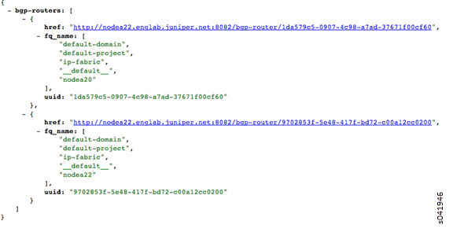
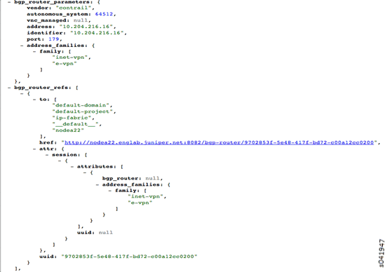
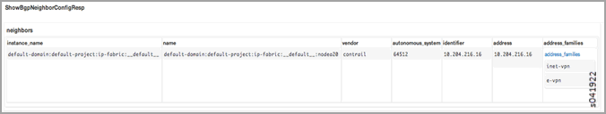
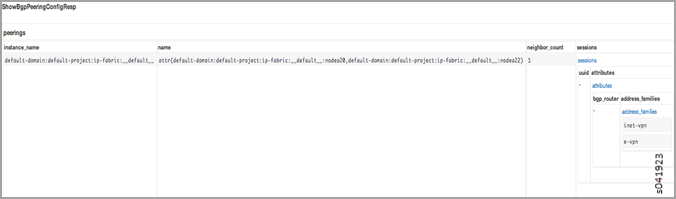
.. |Figure 5: Sample Output, Show Routing Instance| image:: images/s041925.gif
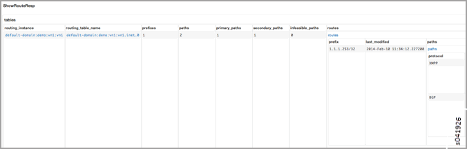
.. |Figure 7: Sample Output, Validate L3vpn Table| image:: images/s041927.gif
.. |Figure 8: Sample Output, Validate L3vpn Table, Scrolled| image:: images/s041928.gif
.. |Figure 9: Create Policy Window| image:: images/s041929.gif
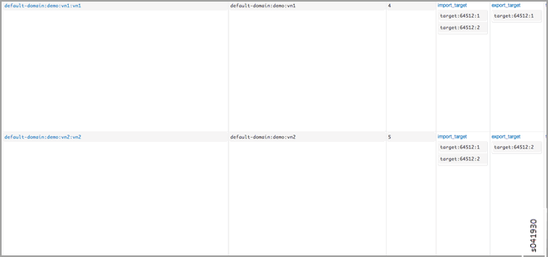
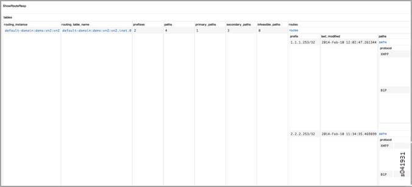
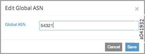
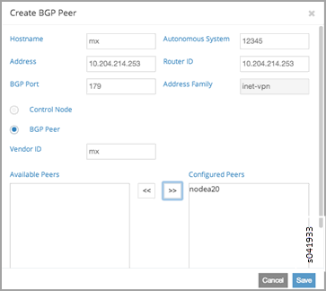
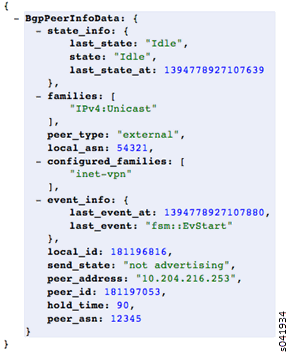
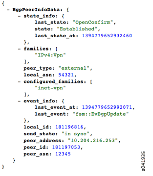
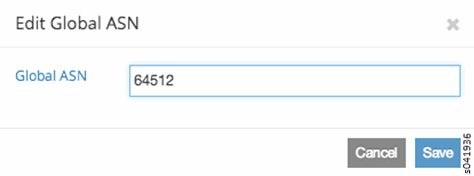
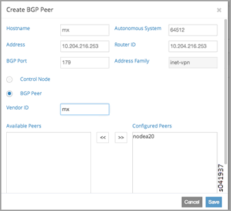
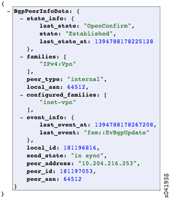
.. |Figure 19: Sample Established IBGP Peer Introspect Window| image:: images/s041939.gif
.. |Figure 20: Routing Instance Route Table| image:: images/s041940.gif
.. |Figure 21: Routing Instance Route Table| image:: images/s041940.gif
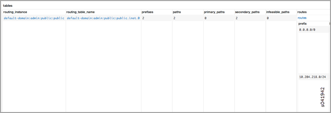
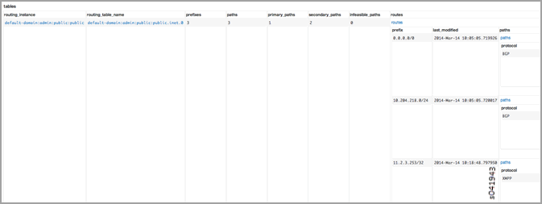
.. |Figure 24: BGP Routing Instance Route Table| image:: images/s041945.gif
