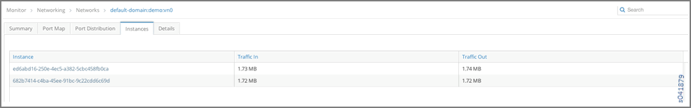
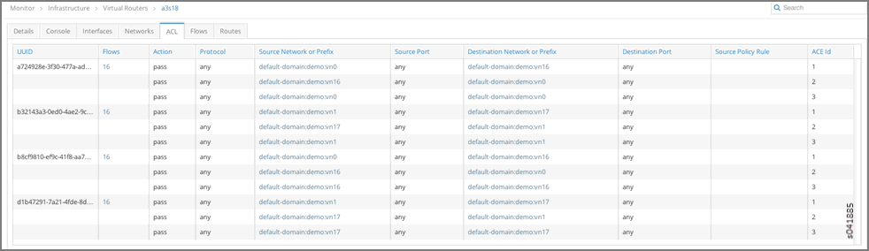
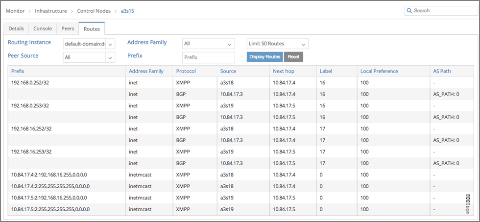
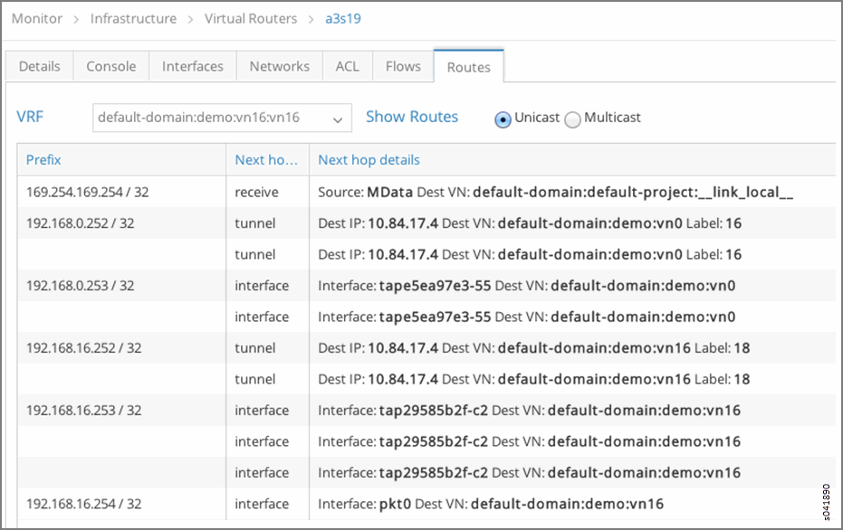
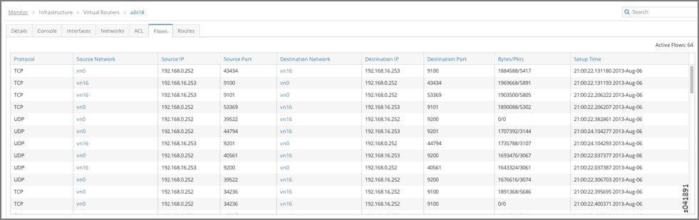
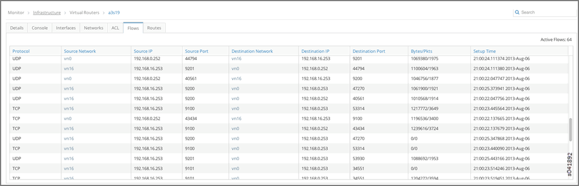

Example: Debugging Connectivity Using Monitoring for Troubleshooting
====================================================================

 

Using Monitoring to Debug Connectivity
--------------------------------------

This example shows how you can use monitoring to debug connectivity in
your Contrail system. You can use the demo setup in Contrail to use
these steps on your own.

1.  Navigate to **Monitor -> Networking -> Networks ->**
    ``default-domain:demo:vn0``, **Instance**
    ``ed6abd16-250e-4ec5-a382-5cbc458fb0ca``\ with **IP address**
    ``192.168.0.252`` in the virtual network ``vn0``. See
    `Figure 1 <debug-connectivity-vnc.html#ex-mon-netw-1>`__.

    |Figure 1: Navigate to Instance|

2.  Click the instance to view **Traffic Statistics for Instance**. See
    `Figure 2 <debug-connectivity-vnc.html#ex-mon-netw-2>`__.

    |Figure 2: Traffic Statistics for Instance|

3.  \ **Instance** ``d26c0b31-c795-400e-b8be-4d3e6de77dcf``\ with **IP
    address** ``192.168.0.253`` in the virtual network ``vn16``. See
    `Figure 3 <debug-connectivity-vnc.html#ex-mon-netw-3>`__ and
    `Figure 4 <debug-connectivity-vnc.html#ex-mon-netw-4>`__.

    |Figure 3: Navigate to Instance|

    |Figure 4: Traffic Statistics for Instance|

4.  From **Monitor->Infrastructure->Virtual
    Routers->a3s18->Interfaces**, we can see that
    **Instance**\ ``ed6abd16-250e-4ec5-a382-5cbc458fb0ca`` is hosted on
    **Virtual Router** ``a3s18``. See
    `Figure 5 <debug-connectivity-vnc.html#ex-mon-netw-5>`__.

    |Figure 5: Navigate to a3s18 Interfaces|

5.  From **Monitor->Infrastructure->Virtual
    Routers->a3s19->Interfaces**, we can see that **Instance**
    ``d26c0b31-c795-400e-b8be-4d3e6de77dcf`` is hosted on **Virtual
    Router** ``a3s19``. See
    `Figure 6 <debug-connectivity-vnc.html#ex-mon-netw-6>`__.

    |Figure 6: Navigate to a3s19 Interfaces|

6.  \ **Virtual Routers** ``a3s18`` and ``a3s19`` have the **ACL**
    entries to allow connectivity between
    ``default-domain:demo:vn0``\ and ``default-domain:demo:vn16``
    networks. See
    `Figure 7 <debug-connectivity-vnc.html#ex-mon-netw-7>`__ and
    `Figure 8 <debug-connectivity-vnc.html#ex-mon-netw-8>`__.

    |Figure 7: ACL Connectivity a3s18|

    |Figure 8: ACL Connectivity a3s19|

7.  Next, verify the routes on the control node for routing instances
    ``default-domain:demo:vn0:vn0`` and
    ``default-domain:demo:vn16:vn16``. See
    `Figure 9 <debug-connectivity-vnc.html#ex-mon-netw-9>`__ and
    `Figure 10 <debug-connectivity-vnc.html#ex-mon-netw-10>`__.

    |Figure 9: Routes default-domain:demo:vn0:vn0|

    |Figure 10: Routes default-domain:demo:vn16:vn16|

8.  We can see that VRF ``default-domain:demo:vn0:vn0`` on Virtual
    Router ``a3s18`` has the appropriate route and next hop to reach VRF
    ``default-domain:demo:front-end`` on Virtual Router ``a3s19``. See
    `Figure 11 <debug-connectivity-vnc.html#ex-mon-netw-11>`__.

    |Figure 11: Verify Route and Next Hop a3s18|

9.  We can see that VRF ``default-domain:demo:vn16:vn16`` on Virtual
    Router ``a3s19`` has the appropriate route and next hop to reach VRF
    ``default-domain:demo:vn0:vn0`` on Virtual Router ``a3s18``. See
    `Figure 12 <debug-connectivity-vnc.html#ex-mon-netw-12>`__.

    |Figure 12: Verify Route and Next Hop a3s19|

10. Finally, flows between instances (IPs ``192.168.0.252`` and
    ``192.168.16.253``) can be verified on Virtual Routers ``a3s18`` and
    ``a3s19``. See
    `Figure 13 <debug-connectivity-vnc.html#ex-mon-netw-13>`__ and
    `Figure 14 <debug-connectivity-vnc.html#ex-mon-netw-14>`__.

    |Figure 13: Flows for a3s18|

    |Figure 14: Flows for a3s19|

 

.. |Figure 2: Traffic Statistics for Instance| image:: documentation/images/s041880.gif
.. |Figure 3: Navigate to Instance| image:: documentation/images/s041881.gif
.. |Figure 4: Traffic Statistics for Instance| image:: documentation/images/s041882.gif
.. |Figure 5: Navigate to a3s18 Interfaces| image:: documentation/images/s041883.gif
.. |Figure 6: Navigate to a3s19 Interfaces| image:: documentation/images/s041884.gif

.. |Figure 8: ACL Connectivity a3s19| image:: documentation/images/s041886.gif
.. |Figure 9: Routes default-domain:demo:vn0:vn0| image:: documentation/images/s041887.gif

.. |Figure 11: Verify Route and Next Hop a3s18| image:: documentation/images/s041889.gif

