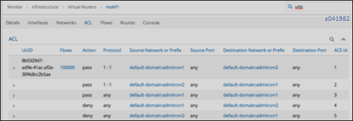
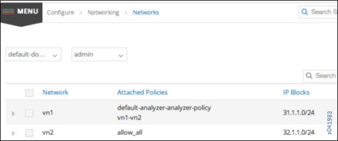
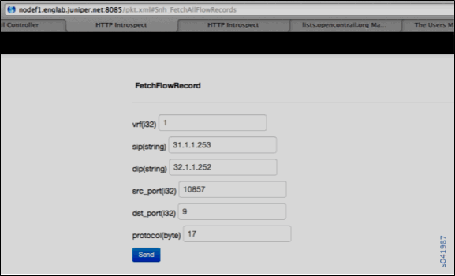
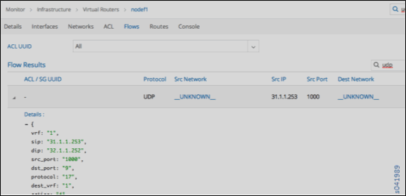

Debugging Ping Failures for Policy-Connected Networks
=====================================================

 

This topic presents troubleshooting scenarios and steps for resolving
reachability issues (ping failures) when working with policy-connected
virtual networks.

These are the methods used to configure reachability for a virtual
network or virtual machine:

-  Use network policy to exchange virtual network routes.

-  Use a floating IP address pool to associate an IP address from a
   destination virtual network to virtual machine(s) in the source
   virtual network.

-  Use an ASN/RT configuration to exchange virtual network routes with
   an MX Series router gateway.

-  Use a service instance static route configuration to route between
   service instances in two virtual networks.

This topic focuses on troubleshooting reachability for the first method
--- using network policy to exchange routes between virtual networks.

*Troubleshooting Procedure for Policy-Connected Network*

1. Check the state of the virtual machine and interface.

   Before doing anything else, check the status of the source and
   destination virtual machines.

   -  Is the **Status** of each virtual machine **Up**?

   -  Are the corresponding tap interfaces **Active**?

   Check the virtual machine status in the Contrail UI:

   |Figure 1: Virtual Machine Status Window|

   Check the tap interface status in the http agent introspect, for
   example:

   ``https://<host ip address>:8085/Snh_ItfReq?name=``

   |Figure 2: Tap Interface Status Window|

   When the virtual machine status is verified **Up**, and the tap
   interface is **Active**, you can focus on other factors that affect
   traffic, including routing, network policy, security policy, and
   service instances with static routes.

2. Check reachability and routing.

   Use the following troubleshooting guidelines whenever you are
   experiencing ping failures on virtual network routes that are
   connected by means of network policy.

   Check the network policy configuration:

   -  Verify that the policy is attached to each of the virtual
      networks.

   -  Each attached policy should have either an explicit rule allowing
      traffic from one virtual network to the other, or an allow all
      traffic rule.

   -  Verify that the order of the actions in the policy rules is
      correct, because the actions are applied in the order in which
      they are listed.

   -  If there are multiple policies attached to a virtual network,
      verify that the policies are attached in a logical order. The
      first policy listed is applied first, and its rules are applied
      first, then the next policy is applied.

   -  Finally, if either of the virtual networks does not have an
      explicit rule to allow traffic from the other virtual network, the
      traffic flow will be treated as an **UNRESOLVED** or **SHORT**
      flow and all packets will be dropped.

   Use the following sequence in the Contrail UI to check policies,
   attachments, and traffic rules:

   Check VN1-VN2 ACL information from the compute node:

   |Figure 3: Policies, Attachments, and Traffic Rule Status Window|

   Check the virtual network policy configuration with route
   information:

   |Figure 4: Virtual Network Policy Configuration Window|

   Check the VN1 route information for VN2 routes:

   |Figure 5: Virtual Network Route Information Window|

   If a route is missing, ping fails. Flow inspection in the compute
   node displays **Action: D(rop)**.

   Repeated dropstats commands confirms the drop by incrementing the
   **Flow Action Drop** counter with each iteration of dropstats.

   Flow and dropstats commands issued at the compute node:

   |Figure 6: Flow and Dropstats Command List|

   To help in debugging flows, you can use the detailed flow query from
   the agent introspect page for the compute node.

   Fields of interest include:

   -  Inputs [from **flow –l** output]: **src/dest ip, src/dest ports,
      protoco**\ l, and **vrf**

   -  Output from detailed flow query: **short_flow, src_vn,
      action_str->action**

   Flow command output:

   |Figure 7: Flow Command Output Window|

   Fetching details of a single flow:

   |Figure 8: Fetch Flow Record Window|

   Output from **FetchFlowRecord** shows unresolved IP addresses:

   |Figure 9: Unresolved IP Address Window|

   You can also retrieve information about unresolved flows from the
   Contrail UI, as shown in the following:

   |Figure 10: Unresolved Flow Details Window|

3. Check for protocol-specific network policy action.

   If you are still experiencing reachability issues, troubleshoot any
   protocol-specific action, where routes are exchanged, but only
   specific protocols are allowed.

   The following shows a sample query on a protocol-specific flow in the
   agent introspect:

   |Figure 11: Protocol-Specific Flow Sample|

   The following shows that the policy action clearly displays **deny**
   as the action.

   |Figure 12: Protocol-Specific Flow Sample With Deny Action|

*Summary*

This topic explores one area —debugging for policy-based routing.
However, in a complex system, a virtual network might have one or more
configuration methods combined that influence reachability and routing.

For example, an environment might have a virtual network VN-X configured
with policy-based routing to another virtual network VN-Y. At the same
time, there are a few virtual machines in VN-X that have a floating IP
to another virtual network VN-Z, which is connected to VN-XX via a NAT
service instance. This is a complex scenario, and you need to debug
step-by-step, taking into account all of the features working together.

Additionally, there are other considerations beyond routing and
reachability that can affect traffic flow. For example, the rules of
network policies and security groups can affect traffic to the
destination. Also, if multi-path is involved, then ECMP and RPF need to
be taken into account while debugging.

 

.. |Figure 1: Virtual Machine Status Window| image:: documentation/images/s041980.gif
.. |Figure 2: Tap Interface Status Window| image:: documentation/images/s041981.gif

.. |Figure 5: Virtual Network Route Information Window| image:: documentation/images/s041984.gif
.. |Figure 6: Flow and Dropstats Command List| image:: documentation/images/s041985.gif
.. |Figure 7: Flow Command Output Window| image:: documentation/images/S041986.gif

.. |Figure 9: Unresolved IP Address Window| image:: documentation/images/S041988.gif

.. |Figure 11: Protocol-Specific Flow Sample| image:: documentation/images/S041991.gif
.. |Figure 12: Protocol-Specific Flow Sample With Deny Action| image:: documentation/images/S041992.gif
