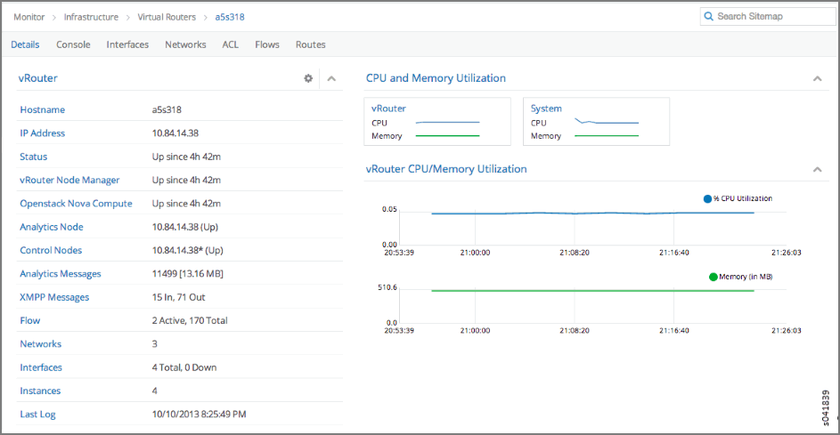

# Configuring Interface Monitoring and Mirroring

 

Contrail supports user monitoring of traffic on any guest virtual
machine interface when using the Juniper Contrail user interface.

When interface monitoring (packet capture) is selected, a default
analyzer is created and all traffic from the selected interface is
mirrored and sent to the default analyzer. If a mirroring instance is
already launched, the traffic will be redirected to the selected
instance. The interface traffic is only mirrored during the time that
the monitor packet capture interface is in use. When the capture screen
is closed, interface mirroring stops.

To configure interface mirroring:

1.  Select **Monitor &gt; Infrastructure &gt; Virtual Routers**, then
    select the vRouter that has the interface to mirror.

2.  In the list of attributes for the vRouter, select Interfaces; see
    [Figure 1](interface-monitor-mirror-vnc.html#vrouter-interfaces).

    

    A list of interfaces for that vRouter appears.

3.  For the interface to mirror, click the Action icon in the last
    column and select the option Packet Capture; see
    [Figure 2](interface-monitor-mirror-vnc.html#vr-intf).

    

    The mirror packet capture starts and displays at this screen.

    The mirror packet capture stops when you exit this screen.

 
