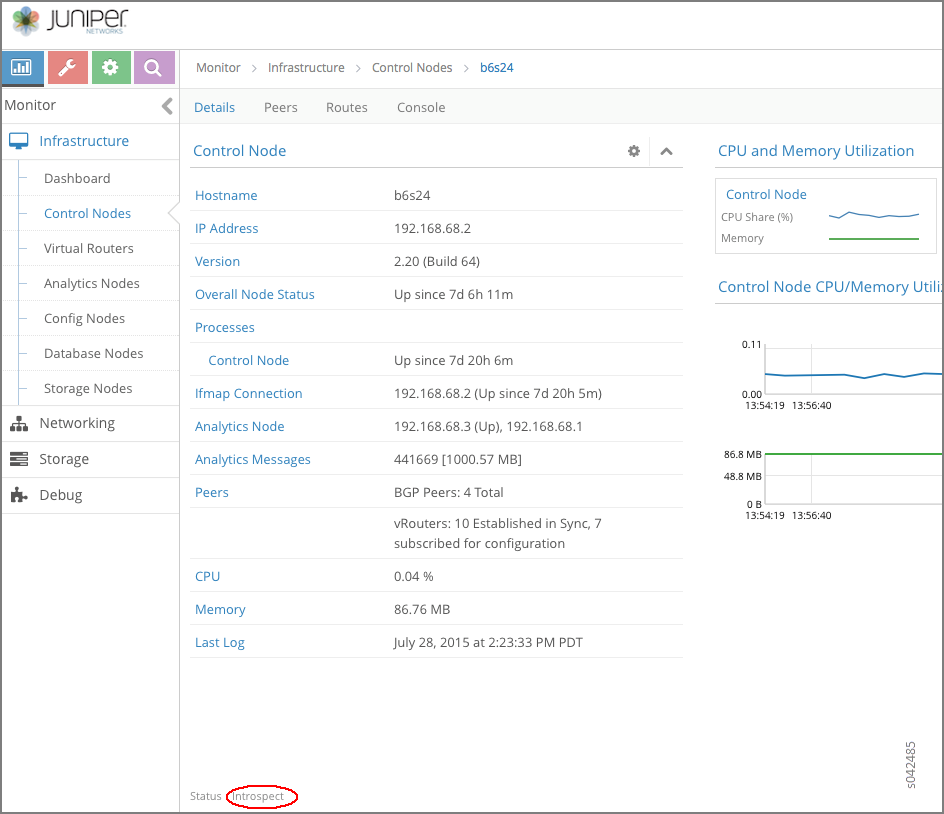
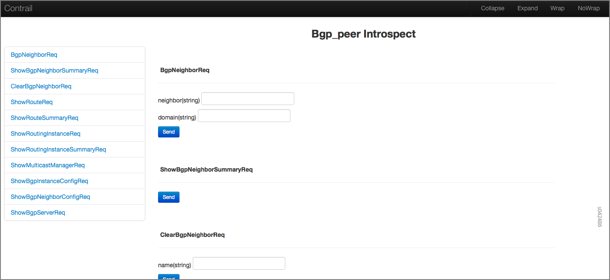

Debugging Processes Using the Contrail Introspect Feature
=========================================================

 

This topic describes how to use the Sandesh infrastructure and the
Contrail Introspect feature to debug processes.

Introspect is a mechanism for taking a program object and querying
information about it.

Sandesh is the name of a unified infrastructure in the Contrail Virtual
Networking solution.

Sandesh is a way for the Contrail daemons to provide a request-response
mechanism. Requests and responses are defined in Sandesh format and the
Sandesh compiler generates code to process the requests and send
responses.

Sandesh also provides a way to use a Web browser to send Sandesh
requests to a Contrail daemon and get the Sandesh responses. This
feature is used to debug processes by looking into the operational
status of the daemons.

Each Contrail daemon starts an HTTP server, with the following page
types:

-  The main index.html listing all Sandesh modules and the links to
   them.

-  Sandesh module pages that present HTML forms for each Sandesh
   request.

-  XML-based dynamically-generated pages that display Sandesh responses.

-  An automatically generated page that shows all code needed for
   rendering and all HTTP server-client interactions.

You can display the HTTP introspect of a Contrail daemon directly by
accessing the following Introspect ports:

-  ``<controller-ip>``:8083. This port displays the *contrail-control*
   introspect port.

-  ``<compute-ip>``:8085 This port displays the *contrail-vrouter-agent*
   introspect port.

-  ``<controller-ip>``:8087 This port displays the *contrail-schema*
   introspect port.

-  ``<controller-ip>``:8088 This port displays the
   *contrail-svc-monitor* introspect port.

-  ``<controller-ip>``:8092 This port displays the *contrail-dns*
   introspect port.

-  ``<controller-ip>``:8084 This port displays the *contrail-api*
   introspect port. (:8084/Snh_SandeshTraceRequest?x=RestApiTraceBuf)

You can use the config editor to review configured objects.

Another way to launch the Introspect page is by browsing to a particular
node page using the Contrail Web user interface.

`Figure 1 <introspect-process-debugging.html#con-node-detail-win>`__
shows the contrail-control infrastructure page. Notice the Introspect
link at the bottom of the Control Nodes Details tab window.

|Figure 1: Control Nodes Details Tab Window|

The following are the Sandesh modules for the Contrail control process
(contrail-control) Introspect port.

-  bgp_peer.xml

-  control_node.xml

-  cpuinfo.xml

-  discovery_client_stats.xml

-  ifmap_log.xml

-  ifmap_server_show.xml

-  rtarget_group.xml

-  sandesh_trace.xml

-  sandesh_uve.xml

-  service_chaining.xml

-  static_route.xml

-  task.xml

-  xmpp_server.xml

`Figure 2 <introspect-process-debugging.html#cont-intro-win>`__ shows
the Controller Introspect window.

|Figure 2: Controller Introspect Window|

`Figure 3 <introspect-process-debugging.html#bgp-peer-neigh-sum>`__
shows an example of the BGP Peer (bgp_peer.xml) Introspect page.

|Figure 3: BGP Peer Introspect Page|

`Figure 4 <introspect-process-debugging.html#bgp-neigh-sum>`__ shows an
example of the BGP Neighbor Summary Introspect page.

|Figure 4: BGP Neighbor Summary Introspect Page|

The following are the Sandesh modules for the Contrail vRouter agent
(``contrail-vrouter-agent``) Introspect port.

-  agent.xml

-  agent_stats_interval.xml

-  cfg.xml

-  controller.xml

-  cpuinfo.xml

-  diag.xml

-  discovery_client_stats.xml

-  flow_stats_interval.xml

-  ifmap_agent.xml

-  kstate.xml

-  multicast.xml

-  pkt.xml

-  port_ipc.xml

-  sandesh_trace.xml

-  sandesh_uve.xml

-  services.xml

-  stats_interval.xml

-  task.xml

-  xmpp_server.xml

`Figure 5 <introspect-process-debugging.html#agent-introspect>`__ shows
an example of the Agent (agent.xml) Introspect page.

|Figure 5: Agent Introspect Page|

 

.. |Figure 2: Controller Introspect Window| image:: documentation/images/s042488.png

.. |Figure 4: BGP Neighbor Summary Introspect Page| image:: documentation/images/s042487.png
.. |Figure 5: Agent Introspect Page| image:: documentation/images/s042489.png
