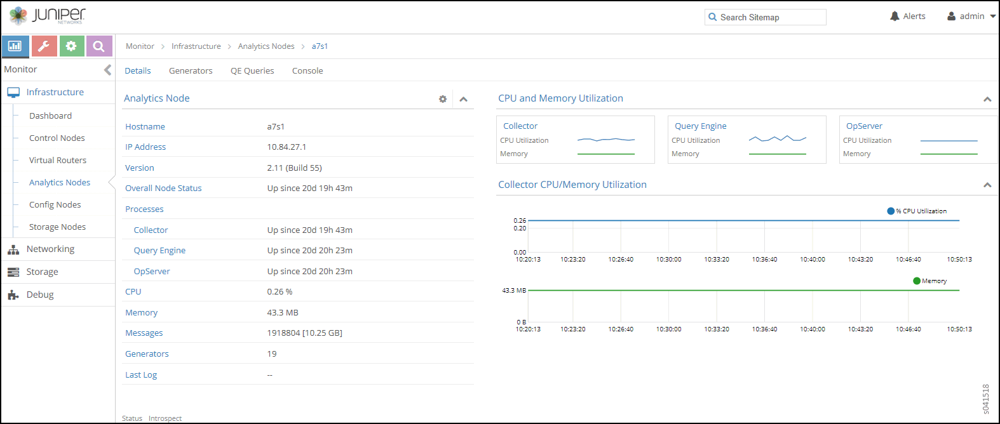

.. _monitor--infrastructure--analytics-nodes:

Monitor > Infrastructure > Analytics Nodes
==========================================

 

.. raw:: html

   

.. raw:: html

   

Select **Monitor> Infrastructure > Analytics Nodes** to view the console
logs, generators, and query expansion (QE) queries of the analytics
nodes.

.. raw:: html

   

.. raw:: html

   

Monitor Analytics Nodes
-----------------------

Select **Monitor > Infrastructure > Analytics Nodes** to view a summary
of activities for the analytics nodes; see
`Figure 1 <monitor-analytics-vnc.html#analytics-summary>`__. See
`Table 1 <monitor-analytics-vnc.html#analytics-summary-fields>`__ for
descriptions of the fields on the analytics summary.

|Figure 1: Analytics Nodes Summary|

Table 1: Fields on Analytics Nodes Summary

+----------------+----------------------------------------------------+
| Field          | Description                                        |
+================+====================================================+
| **Host name**  | The name of this node.                             |
+----------------+----------------------------------------------------+
| **IP address** | The IP address of this node.                       |
+----------------+----------------------------------------------------+
| **Version**    | The version of software installed on the system.   |
+----------------+----------------------------------------------------+
| **Status**     | The current operational status of the node — Up or |
|                | Down — and the length of time it is in that state. |
+----------------+----------------------------------------------------+
| **CPU (%)**    | The average CPU percentage usage for this node.    |
+----------------+----------------------------------------------------+
| **Memory**     | The average memory usage for this node.            |
+----------------+----------------------------------------------------+
| **Generators** | The total number of generators for this node.      |
+----------------+----------------------------------------------------+

Monitor Analytics Individual Node Details Tab
---------------------------------------------

Click the name of any analytics node displayed on the analytics summary
to view the **Details** tab for that node. See
`Figure 2 <monitor-analytics-vnc.html#analytics-details>`__.

See `Table 2 <monitor-analytics-vnc.html#analytics-details-fields>`__
for descriptions of the fields on this screen.

|Figure 2: Monitor Analytics Individual Node Details Tab|

Table 2: Monitor Analytics Individual Node Details Tab Fields

+-------------------------+-------------------------------------------+
| Field                   | Description                               |
+=========================+===========================================+
| **Hostname**            | The name of this node.                    |
+-------------------------+-------------------------------------------+
| **IP Address**          | The IP address of this node.              |
+-------------------------+-------------------------------------------+
| **Version**             | The installed version of the software.    |
+-------------------------+-------------------------------------------+
| **Overall Node Status** | The current operational status of the     |
|                         | node — Up or Down — and the length of     |
|                         | time in this state.                       |
+-------------------------+-------------------------------------------+
| **Processes**           | The current status of each analytics      |
|                         | process, including Collector, Query       |
|                         | Engine, and OpServer.                     |
+-------------------------+-------------------------------------------+
| **CPU (%)**             | The average CPU percentage usage for this |
|                         | node.                                     |
+-------------------------+-------------------------------------------+
| **Memory**              | The average memory usage of this node.    |
+-------------------------+-------------------------------------------+
| **Messages**            | The total number of messages for this     |
|                         | node.                                     |
+-------------------------+-------------------------------------------+
| **Generators**          | The total number of generators associated |
|                         | with this node.                           |
+-------------------------+-------------------------------------------+
| **Last Log**            | The date and time of the last log message |
|                         | issued about this node.                   |
+-------------------------+-------------------------------------------+

Monitor Analytics Individual Node Generators Tab
------------------------------------------------

The **Generators** tab displays information about the generators for an
individual analytics node; see
`Figure 3 <monitor-analytics-vnc.html#analytics-generators>`__. Click
the expansion arrow next to any generator name to reveal more details.
See `Table 3 <monitor-analytics-vnc.html#analytics-generators-fields>`__
for descriptions of the fields on the **Peers** tab screen.

|Figure 3: Individual Analytics Node—Generators Tab|

Table 3: Monitor Analytics Individual Node Generators Tab Fields

+--------------+------------------------------------------------------+
| Field        | Description                                          |
+==============+======================================================+
| **Name**     | The host name of the generator.                      |
+--------------+------------------------------------------------------+
| **Status**   | The current status of the peer— Up or Down — and the |
|              | length of time in that state.                        |
+--------------+------------------------------------------------------+
| **Messages** | The number of messages sent and received from this   |
|              | peer.                                                |
+--------------+------------------------------------------------------+
| **Bytes**    | The total message size in bytes.                     |
+--------------+------------------------------------------------------+

Monitor Analytics Individual Node QE Queries Tab
------------------------------------------------

The **QE Queries** tab displays the number of query expansion (QE)
messages that are in the queue for this analytics node. See
`Figure 4 <monitor-analytics-vnc.html#analytics-qe>`__.

See `Table 4 <monitor-analytics-vnc.html#analytics-qe-fields>`__ for
descriptions of the fields on the **QE Queries** tab screen.

|Figure 4: Individual Analytics Node—QE QueriesTab|

Table 4: Analytics Node QE Queries Tab Fields

+------------------+--------------------------------------------------+
| Field            | Description                                      |
+==================+==================================================+
| **Enqueue Time** | The length of time this message has been in the  |
|                  | queue waiting to be delivered.                   |
+------------------+--------------------------------------------------+
| **Query**        | The query message.                               |
+------------------+--------------------------------------------------+
| **Progress (%)** | The percentage progress for the message          |
|                  | delivery.                                        |
+------------------+--------------------------------------------------+

Monitor Analytics Individual Node Console Tab
---------------------------------------------

Click the **Console** tab for an individual analytics node to display
system logging information for a defined time period. See
`Figure 5 <monitor-analytics-vnc.html#analytics-console>`__. See
`Table 5 <monitor-analytics-vnc.html#analytics-console-tab-fields>`__
for descriptions of the fields on the **Console** tab screen.

|Figure 5: Analytics Individual Node—Console Tab|

Table 5: Monitor Analytics Individual Node Console Tab Fields

.. raw:: html

   <table data-cellspacing="0" style="border-top:thin solid black;" width="99%">
   <colgroup>
   <col style="width: 50%" />
   <col style="width: 50%" />
   </colgroup>
   <thead>
   <tr class="header">
   <th style="text-align: left;">
Field
</th>
   <th style="text-align: left;">
Description
</th>
   </tr>
   </thead>
   <tbody>
   <tr class="odd">
   <td style="text-align: left;">
<strong>Time Range</strong>
</td>
   <td style="text-align: left;">
Select a timeframe for which to review logging information as sent to the console. There are 11 options, ranging from the <strong>Last 5 mins</strong> through to the <strong>Last 24 hrs</strong>. The default display is for the <strong>Last 5 mins</strong>.
</td>
   </tr>
   <tr class="even">
   <td style="text-align: left;">
<strong>Log Category</strong>
</td>
   <td style="text-align: left;">
Select a log category to display:

   <ul>
   <li>
All
</li>
   <li>
_default_
</li>
   <li>
XMPP
</li>
   <li>
TCP
</li>
   </ul></td>
   </tr>
   <tr class="odd">
   <td style="text-align: left;">
<strong>Log Type</strong>
</td>
   <td style="text-align: left;">
Select a log type to display.
</td>
   </tr>
   <tr class="even">
   <td style="text-align: left;">
<strong>Log Level</strong>
</td>
   <td style="text-align: left;">
Select a log severity level to display:

   <ul>
   <li>
SYS_EMERG
</li>
   <li>
SYS_ALERT
</li>
   <li>
SYS_CRIT
</li>
   <li>
SYS_ERR
</li>
   <li>
SYS_WARN
</li>
   <li>
SYS_NOTICE
</li>
   <li>
SYS_INFO
</li>
   <li>
SYS_DEBUG
</li>
   </ul></td>
   </tr>
   <tr class="odd">
   <td style="text-align: left;">
<strong>Keywords</strong>
</td>
   <td style="text-align: left;">
Enter any text string to search for and display logs containing that string.
</td>
   </tr>
   <tr class="even">
   <td style="text-align: left;">
(Limit field)
</td>
   <td style="text-align: left;">
Select the number of messages to display:

   <ul>
   <li>
No Limit
</li>
   <li>
Limit 10 messages
</li>
   <li>
Limit 50 messages
</li>
   <li>
Limit 100 messages
</li>
   <li>
Limit 200 messages
</li>
   <li>
Limit 500 messages
</li>
   </ul></td>
   </tr>
   <tr class="odd">
   <td style="text-align: left;">
<strong>Auto Refresh</strong>
</td>
   <td style="text-align: left;">
Click the check box to automatically refresh the display if more messages occur.
</td>
   </tr>
   <tr class="even">
   <td style="text-align: left;">
<strong>Display Logs</strong>
</td>
   <td style="text-align: left;">
Click this button to refresh the display if you change the display criteria.
</td>
   </tr>
   <tr class="odd">
   <td style="text-align: left;">
<strong>Reset</strong>
</td>
   <td style="text-align: left;">
Click this button to clear any selected display criteria and reset all criteria to their default settings.
</td>
   </tr>
   <tr class="even">
   <td style="text-align: left;">
<strong>Time</strong>
</td>
   <td style="text-align: left;">
This column lists the time received for each log message displayed.
</td>
   </tr>
   <tr class="odd">
   <td style="text-align: left;">
<strong>Category</strong>
</td>
   <td style="text-align: left;">
This column lists the log category for each log message displayed.
</td>
   </tr>
   <tr class="even">
   <td style="text-align: left;">
<strong>Log Type</strong>
</td>
   <td style="text-align: left;">
This column lists the log type for each log message displayed.
</td>
   </tr>
   <tr class="odd">
   <td style="text-align: left;">
<strong>Log</strong>
</td>
   <td style="text-align: left;">
This column lists the log message for each log displayed.
</td>
   </tr>
   </tbody>
   </table>

 

.. |Figure 1: Analytics Nodes Summary| image:: documentation/images/s041517.gif

.. |Figure 3: Individual Analytics Node—Generators Tab| image:: documentation/images/s041523.gif
.. |Figure 4: Individual Analytics Node—QE QueriesTab| image:: documentation/images/s041524.gif
.. |Figure 5: Analytics Individual Node—Console Tab| image:: documentation/images/s041519.png
