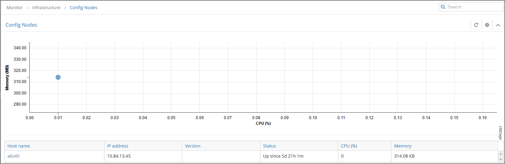
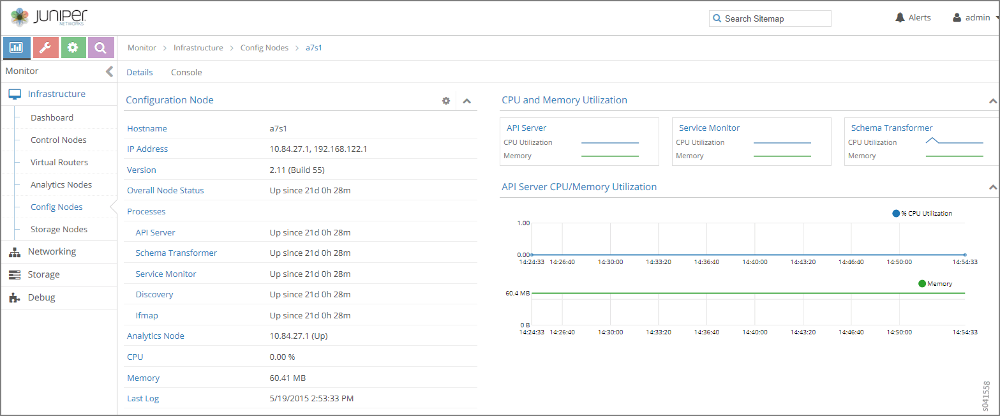
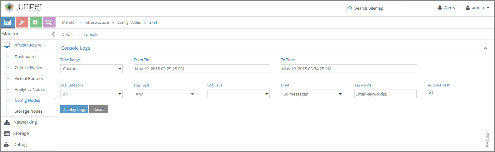

# Monitor &gt; Infrastructure &gt; Config Nodes

 

Select **Monitor &gt; Infrastructure &gt; Config Nodes** to view the
information about the system config nodes.

## Monitor Config Nodes

Select **Monitor &gt; Infrastructure &gt; Config Nodes** to view a
summary of activities for the analytics nodes. See
[Figure 1](monitor-config-vnc.html#config-nodes-summary).

[Table 1](monitor-config-vnc.html#config-nodes-summary-fields) describes
the fields in the Config Nodes summary.

Table 1: Config Nodes Summary Fields

| Field          | Description                                                                                           |
|:---------------|:------------------------------------------------------------------------------------------------------|
| **Host name**  | The name of this node.                                                                                |
| **IP address** | The IP address of this node.                                                                          |
| **Version**    | The version of software installed on the system.                                                      |
| **Status**     | The current operational status of the node — Up or Down — and the length of time it is in that state. |
| **CPU (%)**    | The average CPU percentage usage for this node.                                                       |
| **Memory**     | The average memory usage for this node.                                                               |

## Monitor Individual Config Node Details

Click the name of any config node displayed on the config nodes summary
to view the **Details** tab for that node; see
[Figure 2](monitor-config-vnc.html#config-nodes-details).

[Table 2](monitor-config-vnc.html#config-nodes-details-fields) describes
the fields on the Details screen.

Table 2: Individual Config Nodes— Details Tab Fields

| Field                   | Description                                                                                                                                              |
|:------------------------|:---------------------------------------------------------------------------------------------------------------------------------------------------------|
| **Hostname**            | The name of the config node.                                                                                                                             |
| **IP Address**          | The IP address of this node.                                                                                                                             |
| **Version**             | The installed version of the software.                                                                                                                   |
| **Overall Node Status** | The current operational status of the node — Up or Down — and the length of time it is in this state.                                                    |
| **Processes**           | The current operational status of the processes associated with the config node, including AI Server, Schema Transformer, Service Monitor, and the like. |
| **Analytics Node**      | The analytics node associated with this node.                                                                                                            |
| **CPU (%)**             | The average CPU percentage usage for this node.                                                                                                          |
| **Memory**              | The average memory usage by this node.                                                                                                                   |

## Monitor Individual Config Node Console

Click the **Console** tab for an individual config node to display
system logging information for a defined time period. See
[Figure 3](monitor-config-vnc.html#config-nodes-console).

See [Table 3](monitor-config-vnc.html#config-nodes-console-tab-fields)
for descriptions of the fields on the **Console** tab screen.

Table 3: Individual Config Node-Console Tab Fields

<table data-cellspacing="0" style="border-top:thin solid black;" width="99%">
<colgroup>
<col style="width: 50%" />
<col style="width: 50%" />
</colgroup>
<thead>
<tr class="header">
<th style="text-align: left;">
Field
</th>
<th style="text-align: left;">
Description
</th>
</tr>
</thead>
<tbody>
<tr class="odd">
<td style="text-align: left;">
<strong>Time Range</strong>
</td>
<td style="text-align: left;">
Select a timeframe for which to review logging information as sent to the console. Use the drop down calendar in the fields From Time and To Time to select the date and times to include in the time range for viewing.
</td>
</tr>
<tr class="even">
<td style="text-align: left;">
<strong>Log Category</strong>
</td>
<td style="text-align: left;">
Select from the drop down menu a log category to display. The option to view All is also available.
</td>
</tr>
<tr class="odd">
<td style="text-align: left;">
<strong>Log Type</strong>
</td>
<td style="text-align: left;">
Select a log type to display.
</td>
</tr>
<tr class="even">
<td style="text-align: left;">
<strong>Log Level</strong>
</td>
<td style="text-align: left;">
Select a log severity level to display:
</td>
</tr>
<tr class="odd">
<td style="text-align: left;">
<strong>Limit</strong>
</td>
<td style="text-align: left;">
Select from a list an amount to limit the number of messages displayed:

<ul>
<li>
All
</li>
<li>
Limit 10 messages
</li>
<li>
Limit 50 messages
</li>
<li>
Limit 100 messages
</li>
<li>
Limit 200 messages
</li>
<li>
Limit 500 messages
</li>
</ul></td>
</tr>
<tr class="even">
<td style="text-align: left;">
<strong>Keywords</strong>
</td>
<td style="text-align: left;">
Enter any key words by which to filter the log messages displayed.
</td>
</tr>
<tr class="odd">
<td style="text-align: left;">
<strong>Auto Refresh</strong>
</td>
<td style="text-align: left;">
Click the check box to automatically refresh the display if more messages occur.
</td>
</tr>
<tr class="even">
<td style="text-align: left;">
<strong>Display Logs</strong>
</td>
<td style="text-align: left;">
Click this button to refresh the display if you change the display criteria.
</td>
</tr>
<tr class="odd">
<td style="text-align: left;">
<strong>Reset</strong>
</td>
<td style="text-align: left;">
Click this button to clear any selected display criteria and reset all criteria to their default settings.
</td>
</tr>
</tbody>
</table>

 
