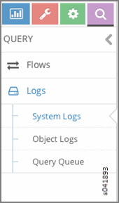
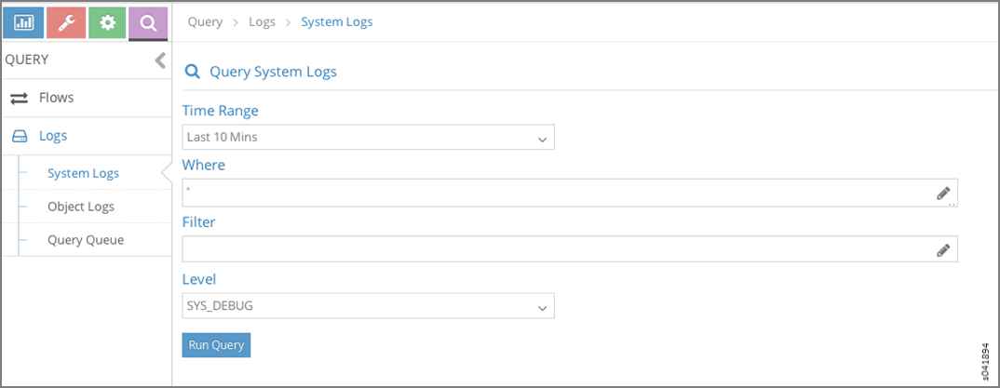
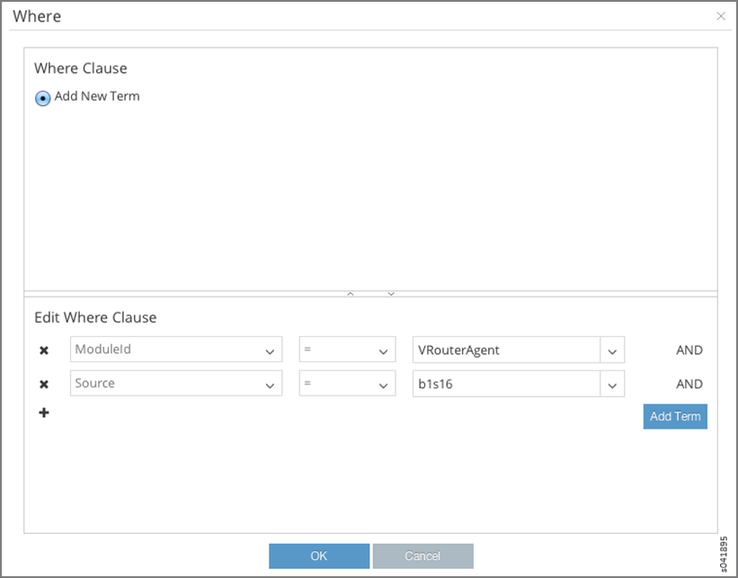
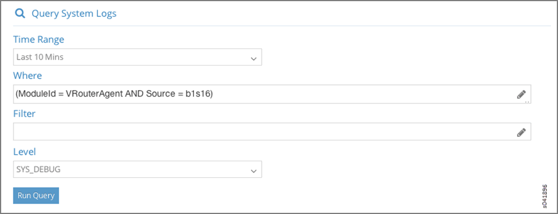
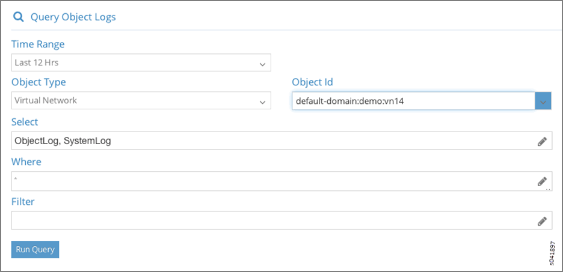

.. _query--logs:

Query > Logs
============

 

.. raw:: html

   

.. raw:: html

   

The **Query > Logs** option allows you to access the system log and
object log activity of any Contrail Controller component from one
central location.

.. raw:: html

   

.. raw:: html

   

.. _query--logs-menu-options:

Query > Logs Menu Options
-------------------------

Click **Query > Logs** to access the **Query Logs** menu, where you can
select **System Logs** to view system log activity, **Object Logs** to
view object logs activity, and **Query Queue** to create custom queries
of log activity; see
`Figure 1 <monitoring-syslog-vnc.html#query-syslog-menu>`__.

|Figure 1: Query > Logs|

.. _query--logs--system-logs:

Query > Logs > System Logs
--------------------------

Click **Query > Logs > System Logs** to access the **Query System Logs**
menu, where you can view system logs according to criteria that you
determine. See `Figure 2 <monitoring-syslog-vnc.html#query-syslog>`__.

|Figure 2: Query > Logs > System Logs|

The query fields available on the **Query System Logs** screen are
described in `Table 1 <monitoring-syslog-vnc.html#syslog-table>`__.

Table 1: Query System Logs Fields

.. raw:: html

   <table data-cellspacing="0" style="border-top:thin solid black;" width="99%">
   <colgroup>
   <col style="width: 50%" />
   <col style="width: 50%" />
   </colgroup>
   <thead>
   <tr class="header">
   <th style="text-align: left;">
Field
</th>
   <th style="text-align: left;">
Description
</th>
   </tr>
   </thead>
   <tbody>
   <tr class="odd">
   <td style="text-align: left;">
<strong>Time Range</strong>
</td>
   <td style="text-align: left;">
Select a range of time for which to see the system logs:

   <ul>
   <li>
Last 10 Mins
</li>
   <li>
Last 30 Mins
</li>
   <li>
Last 1 Hr
</li>
   <li>
Last 6 Hrs
</li>
   <li>
Last 12 Hrs
</li>
   <li>
Custom
</li>
   </ul>
   
If you click Custom, enter a desired time range in two new fields: <strong>From Time</strong> and <strong>To Time</strong>.
</td>
   </tr>
   <tr class="even">
   <td style="text-align: left;">
<strong>Where</strong>
</td>
   <td style="text-align: left;">
Click the edit button (pencil icon) to open a query-writing window, where you can specify query values for variables such as Source, Module, MessageType, and the like, in order to retrieve specific information.
</td>
   </tr>
   <tr class="odd">
   <td style="text-align: left;">
<strong>Level</strong>
</td>
   <td style="text-align: left;">
Select the message severity level to view:

   <ul>
   <li>
SYS_NOTICE
</li>
   <li>
SYS_EMERG
</li>
   <li>
SYS_ALERT
</li>
   <li>
SYS_CRIT
</li>
   <li>
SYS_ERR
</li>
   <li>
SYS_WARN
</li>
   <li>
SYS_INFO
</li>
   <li>
SYS_DEBUG
</li>
   </ul></td>
   </tr>
   <tr class="even">
   <td style="text-align: left;">
<strong>Run Query</strong>
</td>
   <td style="text-align: left;">
Click this button to retrieve the system logs that match the query. The logs are listed in a box with columns showing the <strong>Time</strong>, <strong>Source</strong>, <strong>Module Id</strong>, <strong>Category</strong>, <strong>Log Type</strong>, and <strong>Log</strong> message.
</td>
   </tr>
   <tr class="odd">
   <td style="text-align: left;">
<strong>Export</strong>
</td>
   <td style="text-align: left;">
This button appears after you click <strong>Run Query</strong>, allowing you to export the list of system messages to a text/csv file.
</td>
   </tr>
   </tbody>
   </table>

Sample Query for System Logs
----------------------------

This section shows a sample system logs query designed to show all
**System Logs** from ``ModuleId = VRouterAgent on Source = b1s16`` and
filtered by **Level** ``= SYS_DEBUG``.

1. At the **Query System Logs** screen, click in the **Where** field to
   access the **Where** query screen and enter information defining the
   location to query in the **Edit Where Clause** section and click
   **OK**; see `Figure 3 <monitoring-syslog-vnc.html#sample-query>`__.

   |Figure 3: Edit Where Clause|

2. The information you defined at the Where screen displays on the
   **Query System Logs**. Enter any more defining information needed;
   see `Figure 4 <monitoring-syslog-vnc.html#sample-query2>`__. When
   finished, click **Run Query** to display the results.

   |Figure 4: Sample Query System Logs|

.. _query--logs--object-logs:

Query > Logs > Object Logs
--------------------------

Object logs allow you to search for logs associated with a particular
object, for example, all logs for a specified virtual network. Object
logs record information related to modifications made to objects,
including creation, deletion, and other modifications; see
`Figure 5 <monitoring-syslog-vnc.html#object-tab>`__.

|Figure 5: Query > Logs > Object Logs|

The query fields available on the **Object Logs** screen are described
in `Table 2 <monitoring-syslog-vnc.html#objects-table>`__.

Table 2: Object Logs Query Fields

.. raw:: html

   <table data-cellspacing="0" style="border-top:thin solid black;" width="99%">
   <colgroup>
   <col style="width: 50%" />
   <col style="width: 50%" />
   </colgroup>
   <thead>
   <tr class="header">
   <th style="text-align: left;">
Field
</th>
   <th style="text-align: left;">
Description
</th>
   </tr>
   </thead>
   <tbody>
   <tr class="odd">
   <td style="text-align: left;">
<strong>Time Range</strong>
</td>
   <td style="text-align: left;">
Select a range of time for which to see the logs:

   <ul>
   <li>
Last 10 Mins
</li>
   <li>
Last 30 Mins
</li>
   <li>
Last 1 Hr
</li>
   <li>
Last 6 Hrs
</li>
   <li>
Last 12 Hrs
</li>
   <li>
Custom
</li>
   </ul>
   
If you click Custom, enter a desired time range in two new fields: <strong>From Time</strong> and <strong>To Time</strong>.
</td>
   </tr>
   <tr class="even">
   <td style="text-align: left;">
<strong>Object Type</strong>
</td>
   <td style="text-align: left;">
Select the object type for which to show logs:

   <ul>
   <li>
Virtual Network
</li>
   <li>
Virtual Machine
</li>
   <li>
Virtual Router
</li>
   <li>
BGP Peer
</li>
   <li>
Routing Instance
</li>
   <li>
XMPP Connection
</li>
   </ul></td>
   </tr>
   <tr class="odd">
   <td style="text-align: left;">
<strong>Object Id</strong>
</td>
   <td style="text-align: left;">
Select from a list of available identifiers the name of the object you wish to use.
</td>
   </tr>
   <tr class="even">
   <td style="text-align: left;">
<strong>Select</strong>
</td>
   <td style="text-align: left;">
Click the edit button (pencil icon) to open a window where you can select searchable types by clicking a checkbox:

   <ul>
   <li>
ObjectLog
</li>
   <li>
SystemLog
</li>
   </ul></td>
   </tr>
   <tr class="odd">
   <td style="text-align: left;">
<strong>Where</strong>
</td>
   <td style="text-align: left;">
Click the edit button (pencil icon) to open the query-writing window, where you can specify query values for variables such as <strong>Source</strong>, <strong>ModuleId</strong>, and <strong>MessageType</strong>, in order to retrieve information as specific as you wish.
</td>
   </tr>
   <tr class="even">
   <td style="text-align: left;">
<strong>Run Query</strong>
</td>
   <td style="text-align: left;">
Click this button to retrieve the system logs that match the query. The logs are listed in a box with columns showing the <strong>Time</strong>, <strong>Source</strong>, <strong>Module Id</strong>, <strong>Category</strong>, <strong>Log Type</strong>, and <strong>Log</strong> message.
</td>
   </tr>
   <tr class="odd">
   <td style="text-align: left;">
<strong>Export</strong>
</td>
   <td style="text-align: left;">
This button appears after you click <strong>Run Query</strong>, allowing you to export the list of system messages to a text/csv file.
</td>
   </tr>
   </tbody>
   </table>

 

