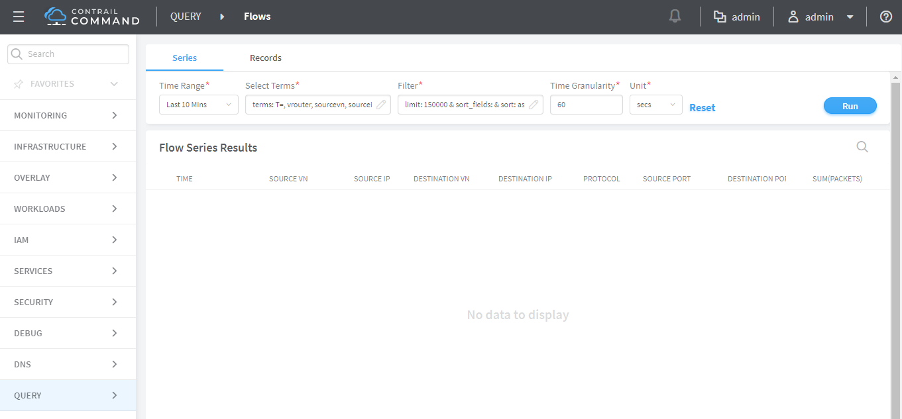
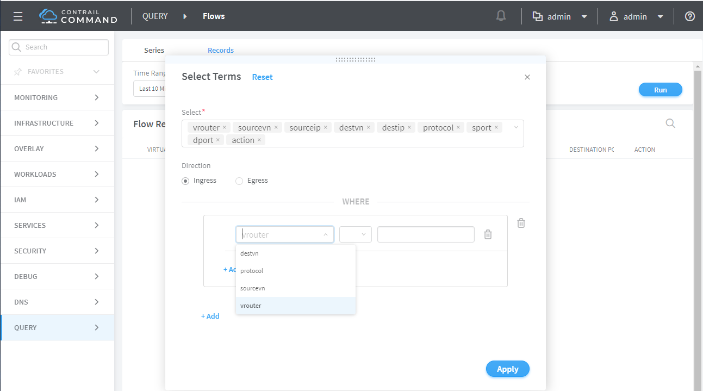

# Creating a Query for Flows

 

Select **Query &gt; Flows** to perform rich and complex SQL-like queries
on flows in the Contrail Controller. You can use the query results for
such things as gaining insight into the operation of applications in a
virtual network, performing historical analysis of flow issues, and
pinpointing problem areas with flows.

## Query Flow Series Table

Select **Query &gt; Flows &gt; Series** to create queries of the flow
series table. The results are in the form of time series data for flow
series. See [Figure 1](query-flows-cc.html#query-flows-series).

The query fields available on the screen for the **Series** tab are
described in [Table 1](query-flows-cc.html#flow-table). Enter query data
into the fields to create a SQL-like query to display and analyze flows.

Table 1: Query Flow Series Fields

<table data-cellspacing="0" style="border-top:thin solid black;" width="99%">
<colgroup>
<col style="width: 50%" />
<col style="width: 50%" />
</colgroup>
<thead>
<tr class="header">
<th style="text-align: left;">
Field
</th>
<th style="text-align: left;">
Description
</th>
</tr>
</thead>
<tbody>
<tr class="odd">
<td style="text-align: left;">
<strong>Time Range</strong>
</td>
<td style="text-align: left;">
Select a range of time to display the flow series:

<ul>
<li>
Last 10 Mins
</li>
<li>
Last 30 Mins
</li>
<li>
Last 1 Hr
</li>
<li>
Last 6 Hrs
</li>
<li>
Last 12 Hrs
</li>
<li>
Custom
</li>
</ul>

Click <strong>Custom</strong> to enter a specific custom time range in two fields: <strong>Start Time</strong> and <strong>End Time</strong>.
</td>
</tr>
<tr class="even">
<td style="text-align: left;">
<strong>Select Terms</strong>
</td>
<td style="text-align: left;">
Click the edit button (pencil icon) to open a <strong>Select Terms</strong> window (<a href="query-flows-cc.html#select-terms">Figure 2</a>), where you can click one or more fields to display from the flow series, such as <strong>Virtual Router, Source VN, Destination VN, SUM(bytes), SUM(packets)</strong>, and more.
</td>
</tr>
<tr class="odd">
<td style="text-align: left;">
<strong>Direction</strong>
</td>
<td style="text-align: left;">
Select the desired flow direction: <strong>Ingress</strong> or <strong>Egress</strong>.
</td>
</tr>
<tr class="even">
<td style="text-align: left;">
<strong>Where</strong>
</td>
<td style="text-align: left;">
Click the <strong>+Add</strong> to open a query-writing window, where you can specify query values for variables such as <strong>destvn, protocol, sourcevn, and vrouter</strong>.
</td>
</tr>
<tr class="odd">
<td style="text-align: left;">
<strong>Filter</strong>
</td>
<td style="text-align: left;">
Click the edit button (pencil icon) to open a <strong>Filters</strong> window (<a href="query-flows-cc.html#query-flows-series">Figure 1</a>), where you can select filter items to sort by, the sort order, and limits to the number of results returned.
</td>
</tr>
<tr class="even">
<td style="text-align: left;">
<strong>Time Granularity</strong>
</td>
<td style="text-align: left;">
When <strong>Time Granularity</strong> is selected, you have the option to view results in graph or flowchart form. Graph buttons appear on the screen above the <strong>Export</strong> button. Click a graph button to transform the tabular results into a graphical chart display.
</td>
</tr>
<tr class="odd">
<td style="text-align: left;">
<strong>Unit</strong>
</td>
<td style="text-align: left;">
Select minutes or seconds for unit of measurement.
</td>
</tr>
<tr class="even">
<td style="text-align: left;">
<strong>Run</strong>
</td>
<td style="text-align: left;">
Click <strong>Run</strong> to retrieve the flows that match the query you created. The flows are listed on the lower portion of the screen in a box with columns identifying the selected fields for each flow.
</td>
</tr>
<tr class="odd">
<td style="text-align: left;">
<strong>Export</strong>
</td>
<td style="text-align: left;">
The Export button is displayed after you click <strong>Run</strong>. This allows you to export the list of flows to a text <code class="inline" data-v-pre="">.csv</code> file.
</td>
</tr>
</tbody>
</table>

The **Select Terms** window allows you to select one or more attributes
of a flow series by clicking each attribute desired. See
[Figure 2](query-flows-cc.html#select-terms). Select **SUM(Bytes)** or
**SUM(Packets)** to aggregate bytes and packets in intervals.

Use the **Filters** window to refine the display of query results for
flows, by defining an attribute by which to sort the results, the sort
order of the results, and any limit needed to restrict the number of
results. See [Figure 3](query-flows-cc.html#flow-series-filter).

## Query Individual Flow Records

Select **Query &gt; Flow &gt; Records** to create queries of individual
flow records for detailed debugging of connectivity issues between
applications and virtual machines. Queries at this level return records
of the active flows within a given time period.

The query fields available on the screen for the **Records** tab are
described in [Table 2](query-flows-cc.html#flow-records-table1). Enter
query data into the fields to create an SQL-like query to display and
analyze flows.

Table 2: Query Flow Records Fields

<table data-cellspacing="0" style="border-top:thin solid black;" width="99%">
<colgroup>
<col style="width: 50%" />
<col style="width: 50%" />
</colgroup>
<thead>
<tr class="header">
<th style="text-align: left;">
Field
</th>
<th style="text-align: left;">
Description
</th>
</tr>
</thead>
<tbody>
<tr class="odd">
<td style="text-align: left;">
<strong>Time Range</strong>
</td>
<td style="text-align: left;">
Select a range of time for the flow records:

<ul>
<li>
Last 10 Mins
</li>
<li>
Last 30 Mins
</li>
<li>
Last 1 Hr
</li>
<li>
Last 6 Hrs
</li>
<li>
Last 12 Hrs
</li>
<li>
Custom
</li>
</ul>

Click <strong>Custom</strong> to enter a specified custom time range in two fields: <strong>Start Time</strong> and <strong>End Time</strong>.
</td>
</tr>
<tr class="even">
<td style="text-align: left;">
<strong>Select Terms</strong>
</td>
<td style="text-align: left;">
Click the edit button (pencil icon) to open a <strong>Select Terms</strong> window (<a href="query-flows-cc.html#select-records-2005">Figure 4</a>), where you can click one or more attributes to display for the flow records, including <strong>vrouter, sourcevn, sourceip, destvn, destip, protocol, dport,</strong> and <strong>action</strong>.
</td>
</tr>
<tr class="odd">
<td style="text-align: left;">
<strong>Direction</strong>
</td>
<td style="text-align: left;">
Select the desired flow direction: <strong>Ingress</strong> or <strong>Egress</strong>.
</td>
</tr>
<tr class="even">
<td style="text-align: left;">
<strong>Where</strong>
</td>
<td style="text-align: left;">
Click <strong>+Add</strong> to open a query window where you can specify query values for <strong>destvn, protocol, sourcevn,</strong> and <strong>vrouter</strong>.
</td>
</tr>
<tr class="odd">
<td style="text-align: left;">
<strong>Run</strong>
</td>
<td style="text-align: left;">
Click <strong>Run</strong> to retrieve the flow records that match the query you created. The records are listed on the lower portion of the screen in a box with columns identifying the fields for each flow.
</td>
</tr>
<tr class="even">
<td style="text-align: left;">
<strong>Export</strong>
</td>
<td style="text-align: left;">
The <strong>Export</strong> button is displayed after you click <strong>Run</strong>, allowing you to export the list of flows to a text <code class="filepath">.csv</code> file.
</td>
</tr>
</tbody>
</table>

The **Select Terms** window allows you to select one or more attributes
to display for the flow records selected. See
[Figure 5](query-flows-cc.html#records-select-terms).

## Using the Query Window

The query window is available by clicking the **+Add** in the **Where**
field. Use the query window to enter query statements. See
[Figure 5](query-flows-cc.html#records-select-terms).

You can restrict the query to a particular source VN and destination VN
combination using the **Select** section.

The **Where** supports logical AND and logical OR operations, and is
modeled as a logical OR of multiple AND terms. For example: ( (term1 AND
term2 AND term3..) OR (term4 AND term5) OR…).

Each term is a single variable expression such as **sourcevn = vn1**.

See [Table 3](query-flows-cc.html#query-window-fields) for descriptions
of the fields in the query window.

Table 3: Query Window Fields and Descriptions

<table data-cellspacing="0" style="border-top:thin solid black;" width="99%">
<colgroup>
<col style="width: 50%" />
<col style="width: 50%" />
</colgroup>
<thead>
<tr class="header">
<th style="text-align: left;">
Item
</th>
<th style="text-align: left;">
Description
</th>
</tr>
</thead>
<tbody>
<tr class="odd">
<td style="text-align: left;">
—
</td>
<td style="text-align: left;">
Select from a list of available item types the type from which to query.

<ul>
<li>
destvn
</li>
<li>
protocol
</li>
<li>
sourcevn
</li>
<li>
vrouter
</li>
</ul></td>
</tr>
<tr class="even">
<td style="text-align: left;">
(operator)
</td>
<td style="text-align: left;">
<strong>=</strong>(equal to) and <strong>Starts with</strong> are available.
</td>
</tr>
<tr class="odd">
<td style="text-align: left;">
<strong>AND +</strong>
</td>
<td style="text-align: left;">
Click the <strong>+Add</strong> to add more elements to your query. Repeat to include additional query elements to your query statement.
</td>
</tr>
<tr class="even">
<td style="text-align: left;">
<strong>Apply</strong>
</td>
<td style="text-align: left;">
Click to enter the query into the fields on the main screen.
</td>
</tr>
</tbody>
</table>

The **Where** clause supports logical AND and logical OR operations.

The **Where** can be modeled as logical OR of multiple AND terms. (
(term1 AND term2 AND term3..) OR (term4 AND term5) OR…).

Each term is a single variable expression such as **Source VN = VN1.**

## Display Flows Query Queue

Select **Query &gt; Flows &gt; Query Queue** to display queries that are
in the queue waiting to be performed on the data.

The query fields available on the screen for the **Records** tab are
described in [Table 4](query-flows-cc.html#flow-records-table). Enter
query data into the fields to create an SQL-like query to display and
analyze flows.

Table 4: Query Flow Records Fields

| Field          | Description                                                                                                                                                       |
|:---------------|:------------------------------------------------------------------------------------------------------------------------------------------------------------------|
| **Date**       | The date and time the query was started.                                                                                                                          |
| **Query**      | A display of the parameters set for the query.                                                                                                                    |
| **Progress**   | The percentage completion of the query to date.                                                                                                                   |
| **Records**    | The number of records matching the query to date.                                                                                                                 |
| **Status**     | The status of the query, such as **completed**.                                                                                                                   |
| **Time Taken** | The amount of time in seconds it has taken the query to return the matching records.                                                                              |
| (Action icon)  | Click the **Action** icon and select **View Results** to view a list of the records that match the query, or click **Delete** to remove the query from the queue. |

 
