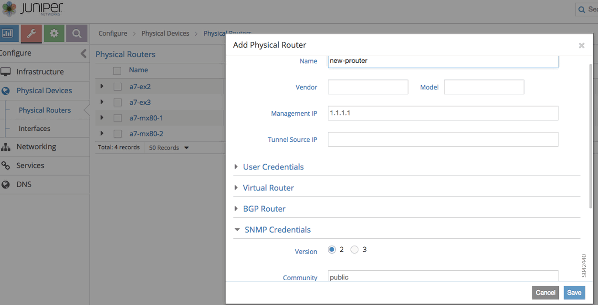
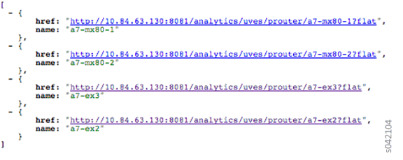
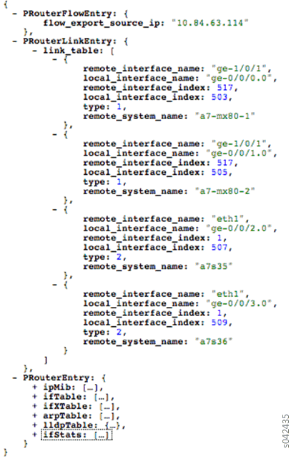
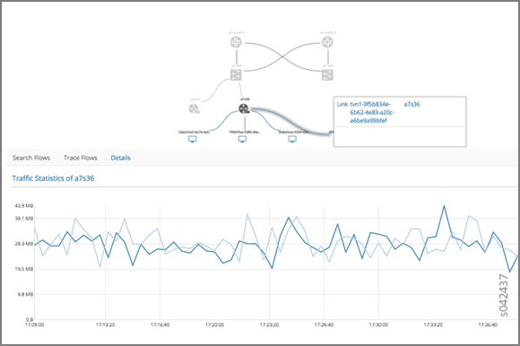
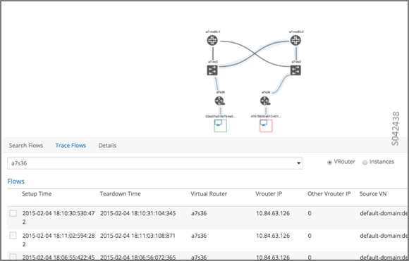
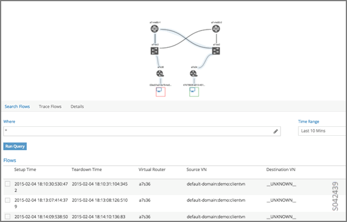

# Underlay Overlay Mapping in Contrail

 

## Overview: Underlay Overlay Mapping using Contrail Analytics

**Note**

This topic applies to Contrail Networking Release 2005 and earlier.
Starting in Contrail Networking Release 2008, you can view the path a
packet takes in a network. See [Viewing Packet Path in Topology
View](../../concept/topology-view-packet-path.html).

Today’s cloud data centers consist of large collections of
interconnected servers that provide computing and storage capacity to
run a variety of applications. The servers are connected with redundant
TOR switches, which in turn, are connected to spine routers. The cloud
deployment is typically shared by multiple tenants, each of whom usually
needs multiple isolated networks. Multiple isolated networks can be
provided by overlay networks that are created by forming tunnels (for
example, gre, ip-in-ip, mac-in-mac) over the underlay or physical
connectivity.

As data flows in the overlay network, Contrail can provide statistics
and visualization of the traffic in the underlay network.

## Underlay Overlay Analytics Available in Contrail

Contrail allows you to view a variety of analytics related to underlay
and overlay traffic in the Contrail Web user interface. The following
are some of the analytics that Contrail provides for statistics and
visualization of overlay underlay traffic.

-   View the topology of the underlay network.

    A user interface view of the physical underlay network with a drill
    down mechanism to show connected servers (contrail computes) and
    virtual machines on the servers.

-   View the details of any element in the topology.

    You can view details of a pRouter, vRouter, or virtual machine link
    between two elements. You can also view traffic statistics in a
    graphical view corresponding to the selected element.

-   View the underlay path of an overlay flow.

    Given an overlay flow, you can get the underlay path used for that
    flow and map the path in the topology view.

## Architecture and Data Collection

Accumulation of the data to map an overlay flow to its underlay path is
performed in several steps across Contrail modules.

The following outlines the essential steps:

1.  The SNMP collector module polls physical
    routers.

    The SNMP collector module receives the authorizations and
    configurations of the physical routers from the Contrail config
    module, and polls all of the physical routers, using SNMP protocol.
    The collector uploads the data to the Contrail analytics collectors.
    The SNMP information is stored in the pRouter UVEs (physical router
    user visible entities).

2.  IPFIX and sFlow protocols are used to collect the
    flow statistics.

    The physical router is configured to send flow statistics to the
    collector, using one of the collection protocols: Internet Protocol
    Flow Information Export (IPFIX) or sFlow (an industry standard for
    sampled flow of packet export at Layer 2).

3.  The topology module reads the SNMP
    information.

    The Contrail topology module reads SNMP information from the pRouter
    UVEs from the analytics API, computes the neighbor list, and writes
    the neighbor information into the pRouter UVEs. This neighbor list
    is used by the Contrail WebUI to display the physical topology.

4.  The Contrail user interface reads and displays the
    topology and statistics.

    The Contrail user interface module reads the topology information
    from the Contrail analytics and displays the physical topology. It
    also uses information stored in the analytics to display graphs for
    link statistics, and to show the map of the overlay flows on the
    underlay network.

## New Processes/Services for Underlay Overlay Mapping

The `contrail-snmp-collector` and the `contrail-topology` are new
daemons that are both added to the `contrail-analytics` node. The
`contrail-analytics` package contains these new features and their
associated files. The contrail-status displays the new services.

### Example: contrail-status

The following is an example of using `contrail-status` to show the
status of the new process and service for underlay overlay mapping.

    user@host:~# contrail-status

    == Contrail Control ==

    supervisor-control:      active

    contrail-control       active

    …

    == Contrail Analytics ==

    supervisor-analytics:     active

    …

    contrail-query-engine     active

    contrail-snmp-collector    active

    contrail-topology       active

### Example: Service Command

The `service` command can be used to start, stop, and restart the new
services. See the following example.

    user@host:~# service contrail-snmp-collector status

    contrail-snmp-collector     RUNNING  pid 12179, uptime 1 day, 14:59:11

## External Interfaces Configuration for Underlay Overlay Mapping

This section outlines the external interface configurations necessary
for successful underlay overlay mapping for Contrail analytics.

## Physical Topology

The typical physical topology includes:

-   Servers connected to the ToR switches.

-   ToR switches connected to spine switches.

-   Spine switches connected to core switches.

The following is an example of how the topology is depicted in the
Contrail WebUI analytics.

## SNMP Configuration

Configure SNMP on the physical devices so that the
`contrail-snmp-collector` can read SNMP data.

The following shows an example SNMP configuration from a Juniper
Networks device.

`set snmp community public authorization read-only`

## Link Layer Discovery Protocol (LLDP) Configuration

Configure LLDP on the physical device so that the
`contrail-snmp-collector` can read the neighbor information of the
routers.

The following is an example of LLDP configuration on a Juniper Networks
device.

`set protocols lldp interface all `

`set protocols lldp-med interface all`

## IPFIX and sFlow Configuration

Flow samples are sent to the `contrail-collector` by the physical
devices. Because the `contrail-collector` supports the sFlow and IPFIX
protocols for receiving flow samples, the physical devices, such as MX
Series devices or ToR switches, must be configured to send samples using
one of those protocols.

### Example: sFlow Configuration

The following shows a sample sFlow configuration. In the sample, the IP
variable `<source ip>`refers to the loopback or IP that can be reachable
of the device that acts as an sflow source, and the other IP variable
`<collector_IP_data>` is the address of the collector device.

    root@host> show configuration protocols sflow | display set

    set protocols sflow polling-interval 0

    set protocols sflow sample-rate ingress 10

    set protocols sflow source-ip <source ip>4

    set protocols sflow collector <collector_IP_data>  udp-port 6343

    set protocols sflow interfaces ge-0/0/0.0

    set protocols sflow interfaces ge-0/0/1.0

    set protocols sflow interfaces ge-0/0/2.0

    set protocols sflow interfaces ge-0/0/3.0

    set protocols sflow interfaces ge-0/0/4.0

### Example: IPFIX Configuration

The following is a sample IPFIX configuration from a Juniper Networks
device. The IP address variable `<ip_sflow collector>` represents the
sflow collector (control-collector analytics node) and `<source ip>`
represents the source (outgoing) interface on the router/switch device
used for sending flow data to the collector. This could also be the lo0
address, if it s reachable from the Contrail cluster.

    root@host> show configuration chassis | display set

    set chassis tfeb slot 0 sampling-instance sample-ins1

    set chassis network-services 

    root@host> show configuration chassis tfeb | display set

    set chassis tfeb slot 0 sampling-instance sample-ins1

    root@host > show configuration services flow-monitoring | display set

    set services flow-monitoring version-ipfix template t1 flow-active-timeout 30

    set services flow-monitoring version-ipfix template t1 flow-inactive-timeout 30

    set services flow-monitoring version-ipfix template t1 template-refresh-rate packets 10

    set services flow-monitoring version-ipfix template t1 ipv4-template

    root@host > show configuration interfaces | display set | match sampling

    set interfaces ge-1/0/0 unit 0 family inet sampling input

    set interfaces ge-1/0/1 unit 0 family inet sampling input

    root@host> show configuration forwarding-options sampling | display set

    set forwarding-options sampling instance sample-ins1 input rate 1

    set forwarding-options sampling instance sample-ins1 family inet output flow-server <ip_sflow collector> port 4739

    set forwarding-options sampling instance sample-ins1 family inet output flow-server <ip_sflow collector> version-ipfix template t1

    set forwarding-options sampling instance sample-ins1 family inet output inline-jflow source-address <source ip>

## Sending pRouter Information to the SNMP Collector in Contrail

Information about the physical devices must be sent to the SNMP
collector before the full analytics information can be read and
displayed. Typically, the pRouter information is taken from the
`contrail-config`.

*SNMP collector getting pRouter information from contrail-config*

The physical routers are added to the `contrail-config` by using the
Contrail user interface or by using direct API, by means of provisioning
or other scripts. Once the configuration is in the `contrail-config`,
the `contrail-snmp-collector` gets the physical router information from
`contrail-config`. The SNMP collector uses this list and the other
configuration parameters to perform SNMP queries and to populate pRouter
UVEs.

## pRouter UVEs

pRouter UVEs are accessed from the REST APIs on your system from
`contrail-analytics-api`, using a URL of the form:

`http://<host ip>:8081/analytics/uves/prouters`

The following is sample output from a pRouter REST API:

Details of a pRouter UVE can be obtained from your system, using a URL
of the following form:

`http://<host ip>:8081/analytics/uves/prouter/a7-ex3?flat`

The following is sample output of a pRouter UVE.

## Contrail User Interface for Underlay Overlay Analytics

The topology view and related functionality is accessed from the
Contrail Web user interface, **Monitor &gt; Physical Topology**.

## Enabling Physical Topology on the Web UI

To enable the **Physical Topology** section in the Contrail Web UI:

1.  Add the following lines to
    the` /etc/contrail/config.global.js` file of all the
    `contrail-webui `nodes:
    

    

        config.optFeatureList = {};
        config.optFeatureList.mon_infra_underlay = true;

    

    

2.  Restart webui supervisor.

    `service supervisor-webui restart`

    The **Physical Topology** section is now available on the Contrail
    Web UI.

## Viewing Topology to the Virtual Machine Level

In the Contrail user interface, it is possible to drill down through
displayed topology to the virtual machine level. The following diagram
shows the virtual machines instantiated on a7s36 vRouter and the full
physical topology related to each.

## Viewing the Traffic of any Link

At **Monitor &gt; Physical Topology**, double click any link on the
topology to display the traffic statistics graph for that link. The
following is an example.

## Trace Flows

Click the **Trace Flows** tab to see a list of active flows. To see the
path of a flow, click a flow in the active flows list, then click the
**Trace Flow** button. The path taken in the underlay by the selected
flow displays. The following is an example.

*Limitations of Trace Flow Feature*

Because the Trace Flow feature uses ip traceroute to determine the path
between the two vRouters involved in the flow, it has the same
limitations as the ip traceroute, including that Layer 2 routers in the
path are not listed, and therefore do not appear in the topology.

## Search Flows and Map Flows

Click the **Search Flows** tab to open a search dialog, then click the
**Search** button to list the flows that match the search criteria. You
can select a flow from the list and click **Map Flow** to display the
underlay path taken by the selected flow in the topology. The following
is an example.

## Overlay to Underlay Flow Map Schemas

The schema to query the underlay mapping information for an overlay flow
is obtained from a REST API, which can be accessed on your system using
a URL of the following form:

`http://<host ip>:8081/analytics/table/OverlayToUnderlayFlowMap/schema`

### Example: Overlay to Underlay Flow Map Schema

    {"type": "FLOW",

    "columns": [

    {"datatype": "string", "index": true, "name": "o_svn", "select": false, "suffixes": ["o_sip"]},

    {"datatype": "string", "index": false, "name": "o_sip", "select": false, "suffixes": null},

    {"datatype": "string", "index": true, "name": "o_dvn", "select": false, "suffixes": ["o_dip"]},

    {"datatype": "string", "index": false, "name": "o_dip", "select": false, "suffixes": null},

    {"datatype": "int", "index": false, "name": "o_sport", "select": false, "suffixes": null},

    {"datatype": "int", "index": false, "name": "o_dport", "select": false, "suffixes": null},

    {"datatype": "int", "index": true, "name": "o_protocol", "select": false, "suffixes": ["o_sport", "o_dport"]},

    {"datatype": "string", "index": true, "name": "o_vrouter", "select": false, "suffixes": null},

    {"datatype": "string", "index": false, "name": "u_prouter", "select": null, "suffixes": null},

    {"datatype": "int", "index": false, "name": "u_pifindex", "select": null, "suffixes": null},

    {"datatype": "int", "index": false, "name": "u_vlan", "select": null, "suffixes": null},

    {"datatype": "string", "index": false, "name": "u_sip", "select": null, "suffixes": null},

    {"datatype": "string", "index": false, "name": "u_dip", "select": null, "suffixes": null},

    {"datatype": "int", "index": false, "name": "u_sport", "select": null, "suffixes": null},

    {"datatype": "int", "index": false, "name": "u_dport", "select": null, "suffixes": null},

    {"datatype": "int", "index": false, "name": "u_protocol", "select": null, "suffixes": null},

    {"datatype": "string", "index": false, "name": "u_flowtype", "select": null, "suffixes": null},

    {"datatype": "string", "index": false, "name": "u_otherinfo", "select": null, "suffixes": null}]}

The schema for underlay data across pRouters is defined in the Contrail
installation at:

`http://<host ip>:8081/analytics/table/StatTable.UFlowData.flow/schema`

### Example: Flow Data Schema for Underlay

    {"type": "STAT",

    "columns": [

    {"datatype": "string", "index": true, "name": "Source", "suffixes": null},

    {"datatype": "int", "index": false, "name": "T", "suffixes": null},

    {"datatype": "int", "index": false, "name": "CLASS(T)", "suffixes": null},

    {"datatype": "int", "index": false, "name": "T=", "suffixes": null},

    {"datatype": "int", "index": false, "name": "CLASS(T=)", "suffixes": null},

    {"datatype": "uuid", "index": false, "name": "UUID", "suffixes": null},

    {"datatype": "int", "index": false, "name": "COUNT(flow)", "suffixes": null},

    {"datatype": "string", "index": true, "name": "name", "suffixes": ["flow.pifindex"]},

    {"datatype": "int", "index": false, "name": "flow.pifindex", "suffixes": null},

    {"datatype": "int", "index": false, "name": "SUM(flow.pifindex)", "suffixes": null},

    {"datatype": "int", "index": false, "name": "CLASS(flow.pifindex)", "suffixes": null},

    {"datatype": "int", "index": false, "name": "flow.sport", "suffixes": null},

    {"datatype": "int", "index": false, "name": "SUM(flow.sport)", "suffixes": null},

    {"datatype": "int", "index": false, "name": "CLASS(flow.sport)", "suffixes": null},

    {"datatype": "int", "index": false, "name": "flow.dport", "suffixes": null},

    {"datatype": "int", "index": false, "name": "SUM(flow.dport)", "suffixes": null},

    {"datatype": "int", "index": false, "name": "CLASS(flow.dport)", "suffixes": null},

    {"datatype": "int", "index": true, "name": "flow.protocol", "suffixes": ["flow.sport", "flow.dport"]},

    {"datatype": "int", "index": false, "name": "SUM(flow.protocol)", "suffixes": null},

    {"datatype": "int", "index": false, "name": "CLASS(flow.protocol)", "suffixes": null},

    {"datatype": "string", "index": true, "name": "flow.sip", "suffixes": null},

    {"datatype": "string", "index": true, "name": "flow.dip", "suffixes": null},

    {"datatype": "string", "index": true, "name": "flow.vlan", "suffixes": null},

    {"datatype": "string", "index": false, "name": "flow.flowtype", "suffixes": null},

    {"datatype": "string", "index": false, "name": "flow.otherinfo", "suffixes": null}]}

### Example: Typical Query for Flow Map

The following is a typical query. Internally, the `analytics-api`
performs a query into the `FlowRecordTable`, then into the
`StatTable.UFlowData.flow`, to return list of `(prouter, pifindex)`
pairs that give the underlay path taken for the given overlay flow.

    FROM

    OverlayToUnderlayFlowMap

    SELECT

    prouter, pifindex

    WHERE

    o_svn, o_sip, o_dvn, o_dip, o_sport, o_dport, o_protocol = <overlay flow>

## Module Operations for Overlay Underlay Mapping

## SNMP Collector Operation

The Contrail SNMP collector uses a Net-SNMP library to talk to a
physical router or any SNMP agent. Upon receiving SNMP packets, the data
is translated to the Python dictionary, and corresponding UVE objects
are created. The UVE objects are then posted to the SNMP collector.

The SNMP module sleeps for some configurable period, then forks a
collector process and waits for the process to complete. The collector
process goes through a list of devices to be queried. For each device,
it forks a greenlet task (Python coroutine), accumulates SNMP data,
writes the summary to a JSON file, and exits. The parent process then
reads the JSON file, creates UVEs, sends the UVEs to the collector, then
goes to sleep again.

The pRouter UVE sent by the SNMP collector carries only the raw MIB
information.

### Example: pRouter Entry Carried in pRouter UVE

The definition below shows the `pRouterEntry` carried in the
`pRouterUVE`. Additionally, an example `LldpTable `definition is shown.

The following create a virtual table as defined by:

    http://<host ip>:8081/analytics/table/StatTable.UFlowData.flow/schema

    struct LldpTable {

      1: LldpLocalSystemData lldpLocalSystemData

      2: optional list<LldpRemoteSystemsData> lldpRemoteSystemsData

    }

    struct PRouterEntry {

      1: string name (key="ObjectPRouter")

      2: optional bool deleted

      3: optional LldpTable lldpTable

      4: optional list<ArpTable> arpTable

      5: optional list<IfTable> ifTable

      6: optional list<IfXTable> ifXTable

      7: optional list<IfStats> ifStats (tags="name:.ifIndex")

      8: optional list<IpMib> ipMib

    }

    uve sandesh PRouterUVE {

      1: PRouterEntry data

    }

## Topology Module Operation

The topology module reads UVEs posted by the SNMP collector and computes
the neighbor table, populating the table with remote system name, local
and remote interface names, the remote type (pRouter or vRouter) and
local and remote ifindices. The topology module sleeps for a while,
reads UVEs, then computes the neighbor table and posts the UVE to the
collector.

The pRouter UVE sent by the topology module carries the neighbor list,
so the clients can put together all of the pRouter neighbor lists to
compute the full topology.

The corresponding pRouter UVE definition is the following.

    struct LinkEntry {

      1: string remote_system_name

      2: string local_interface_name

      3: string remote_interface_name

      4: RemoteType type

      5: i32 local_interface_index

      6: i32 remote_interface_index

    }

    struct PRouterLinkEntry {

      1: string name (key="ObjectPRouter")

      2: optional bool deleted

      3: optional list<LinkEntry> link_table

    }

    uve sandesh PRouterLinkUVE {

      1: PRouterLinkEntry data

    }

## IPFIX and sFlow Collector Operation

An IPFIX and sFlow collector has been implemented in the Contrail
collector. The collector receives the IPFIX and sFlow samples and stores
them as statistics samples in the analytics database.

### Example: IPFIX sFlow Collector Data

The following definition shows the data stored for the statistics
samples and the indices that can be used to perform queries.

    struct UFlowSample {

      1: u64 pifindex

      2: string sip

      3: string dip

      4: u16 sport

      5: u16 dport

      6: u16 protocol

      7: u16 vlan

      8: string flowtype

      9: string otherinfo

    }

    struct UFlowData {

      1: string name (key="ObjectPRouterIP")

      2: optional bool deleted

      3: optional list<UFlowSample> flow (tags="name:.pifindex, .sip, .dip, .protocol:.sport, .protocol:.dport, .vlan")

    }

## Troubleshooting Underlay Overlay Mapping

This section provides a variety of links where you can research errors
that may occur with underlay overlay mapping.

### System Logs

Logs for `contrail-snmp-collector` and `contrail-topology` are in the
following locations on an installed Contrail system:

`/var/log/contrail/contrail-snmp-collector-stdout.log`

`/var/log/contrail/contrail-topology.log`

### Introspect Utility

Use URLs of the following forms on your Contrail system to access the
introspect utilities for SNMP data and for topology data.

-   SNMP data introspect

    `http://<host ip>:5920/Snh_SandeshUVECacheReq?x=PRouterEntry`

-   Topology data introspect

    `http://<host ip>:5921/Snh_SandeshUVECacheReq?x=PRouterLinkEntry`

## Script to add pRouter Objects

The usual mechanism for adding pRouter objects to `contrail-config `is
through Contrail UI. But you also have the ability to add these objects
using the Contrail `vnc-api`. To add one pRouter, save the file with the
name `cfg-snmp.py`, and then execute the command as shown:

`python cfg-snmp.py `

### Example: Content for cfg-snmp.py

    #!python

    from vnc_api import vnc_api

    from vnc_api.gen.resource_xsd import SNMPCredentials

    vnc = vnc_api.VncApi('admin', 'abcde123', 'admin')

    apr = vnc_api.gen.resource_client.PhysicalRouter(name='a7-mx80-1')

    apr.set_physical_router_management_ip('ip_address')

    apr.set_physical_router_dataplane_ip(''ip_address')

    apr.set_physical_router_snmp_credentials(SNMPCredentials(version=2, v2_community='public'))

    vnc.physical_router_create(apr)

    #$ABC123

    apr = vnc_api.gen.resource_client.PhysicalRouter(name='a7-mx80-2')

    apr.set_physical_router_management_ip('ip_address')

    apr.set_physical_router_dataplane_ip('ip_address')

    apr.set_physical_router_snmp_credentials(SNMPCredentials(version=2, v2_community='public'))

    vnc.physical_router_create(apr)

    #$ABC123'

    apr = vnc_api.gen.resource_client.PhysicalRouter(name='a7-ex3')

    apr.set_physical_router_management_ip('source_ip')

    apr.set_physical_router_dataplane_ip('source_ip'')

    apr.set_physical_router_snmp_credentials(SNMPCredentials(version=2, v2_community='public'))

    vnc.physical_router_create(apr)

    #$ABC123'

    apr = vnc_api.gen.resource_client.PhysicalRouter(name='a7-ex2')

    apr.set_physical_router_management_ip('ip_address')

    apr.set_physical_router_dataplane_ip('ip_address')

    apr.set_physical_router_snmp_credentials(SNMPCredentials(version=2, v2_community='public'))

    vnc.physical_router_create(apr)

    #$ABC123'

 
