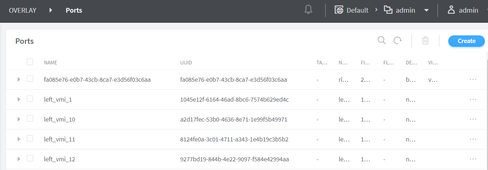
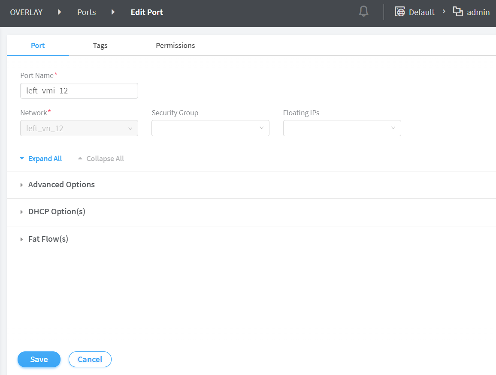
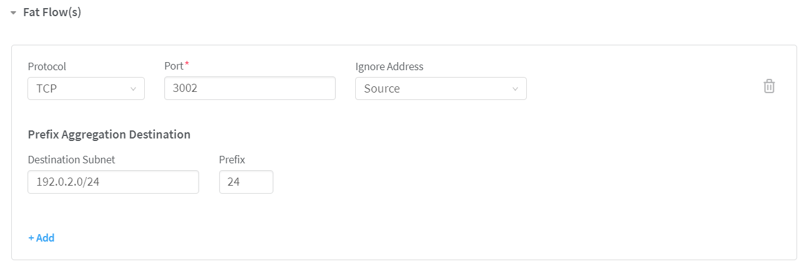
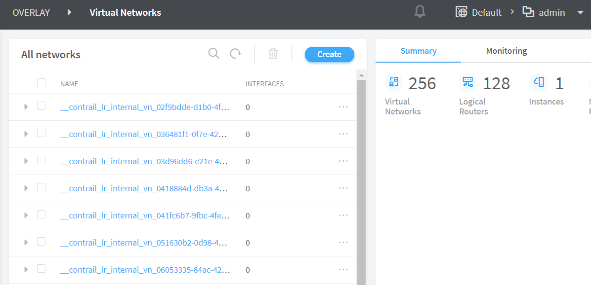
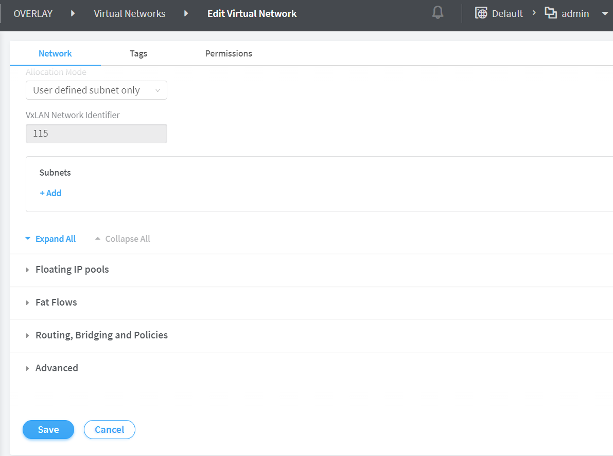

# Fat Flows

 

Service Providers provide services to several subscribers and as a
result, large volume of flows are processed at the Contrail
vRouter-level and Contrail Agent-level. Processing large volume of flows
affects the flow setup rate and increases latency. Fat flow helps reduce
the number of flows that are handled by Contrail.

## Understanding Fat Flow

Contrail Networking optimizes the number of flows that are sent or
received by a virtual machine by reusing a flow. A single flow pair or a
fat flow comprises of a single forward and single reverse flow entry. A
fat flow is used for a number of sessions between two end points that
use the same application protocol.

For example, multiple DNS sessions from a client to a server can be set
up by using a single flow pair. In Contrail Neyworking, the flow key can
be reduced from five tuples to two tuples, which consists of source IP
address, destination IP address, server port, and internet protocol.
This can be configured by specifying the fat flow protocol on the
virtual machine interface. The client port, however, is not used in the
flow key.

You can configure fat flows by specifying the list of fat-flow protocols
on a virtual machine interface. For each such application protocol, the
list contains the protocol and port pairs. If you want to enable the fat
flow feature on the client side, the configuration must be applied on
the client virtual machine interface as well. Contrail Networking also
enables you to configure fat flow at the virtual network (VN) level.
When configured at the VN level, the fat flow configuration is applied
to all VMIs under the configured VN.

Contrail Networking supports aggregation of multiple flows into a single
flow by ignoring source and destination ports or IP addresses, with the
following possible options:

-   ignore source and/or destination ports

-   ignore source and/or destination IP addresses

-   ignore a combination of source and/or destination ports and IP
    addresses

Prefix-Based Fat Flow

Contrail Networking enables you to configure the Ignore Address field
that reduces the number of flows. You can also create fat flows by
configuring prefix length. Service provider subscribers in a common IP
address pool can access any IP address in the pool. Contrail Networking
also supports prefix-based fat flows. Prefix-based fat flow supports
mask processing where you can create flows based on a group of
subscribers. This ensures that continuous flows in the same subnet are
grouped into a common fat flow that is configured with the same protocol
and port numbers. You can apply prefix length-based fat flow on source
IP address while the Ignore Address option is configured on the
destination IP address, resulting in a reduction of flow processing.

For example, you use prefix-based fat flow to create one flow for 255 IP
end points in a /24 subnet (aggregate) mask or one flow for 65,535 IP
end points in a /16 subnet (aggregate) mask. This results in a huge
reduction on the number of flows created, and a corresponding increase
in the number of traffic flows going through vRouter without being
limited by vRouter flow setup rate.

## Configuring Fat Flow from Contrail Command

You use the Contrail Command user interface (UI) to configure fat flow.

You can configure fat flow from:

-   **Overlay**&gt;**Ports** or

-   **Overlay**&gt;**Virtual Networks**

Configuring Fat Flow from
**Overlay**&gt;**Ports**

To configure fat flow from **Overlay**&gt;**Ports**:

Click **Overlay**&gt;**Ports**.

The Ports page is displayed. See
[Figure 1](contrail-fat-flows.html#ports-page).

Select the port you want to configure by selecting the check box next to
the name of the port, and then click the **Edit** icon.

The Edit Port page is displayed. See
[Figure 2](contrail-fat-flows.html#edit-port).

Click **Fat Flow(s)** to display the fields that you can edit.

You can edit the fields listed in
[Table 1](contrail-fat-flows.html#edit-fat-flows-5.1).

Table 1: Edit Fat Flow(s)

Field

Action

**Protocol**

Change the protocol that is currently being used to any one of the
following protocols given in the **Protocol** list:

-   ICMP

-   SCTP

-   TCP (default)

-   UDP

You can select ICMP for both IPv4 and IPv6 traffic.

**Port**

Edit the Port field to any value between 0 through 65,535.

Enter 0 to ignore both source and destination port numbers.

**Note:** If you select ICMP as the protocol, the **PORT** field is not
enabled.

**Ignore Address**

Change the Ignore Address field to any one of the following options:

-   **Destination**—If you choose Destination as the option, Prefix
    Aggregation Source fields are only enabled. See
    [Figure 3](contrail-fat-flows.html#ignore-add-destination).

-   **None** (default)—If you choose None as the option, both Prefix
    Aggregation Source and Prefix Aggregation Destination fields are
    enabled. See [Figure 4](contrail-fat-flows.html#ignore-add-none).

-   **Source**—If you choose Source as the option, Prefix Aggregation
    Destination fields are only enabled. See
    [Figure 5](contrail-fat-flows.html#ignore-add-source).

**Note:** Fat flow in Contrail Networking supports aggregation of
multiple flows into a single flow by ignoring source and destination
ports or IP addresses.

**Prefix Aggregation Source**

**Source Subnet**

Edit source IP subnet.

Ensure that the source subnet of the flows match. For example, to create
fat flows with 192.0.2.0/24 as the subnet, enter 192.0.2.0/24 in the
**Source Subnet** field.

Valid range of the subnet mask: /8 through /32.

For more information, refer to the Understanding Source and Destination section.

**Prefix**

Edit source subnet prefix length.

The prefix length you enter is used to aggregate flows matching the
source subnet. For example, when the source subnet is 10.1.0.0/16 and
prefix length is 24, the flows matching the source subnet is aggregated
to 10.1.x.0/24 flows.

Valid range of the prefix length: /(subnet mask of the source subnet)
through /32.

For more information, refer to the Understanding Source and Destination section.

**Note:** Contrail Networking enables you to configure subnet and prefix
length.

**Prefix Aggregation Destination**

**Destination Subnet**

Edit destination IP address.

Ensure that the destination subnet of the flows match. For example, to
create fat flows with 192.0.2.0/24 as the subnet, enter 192.0.2.0/24 in
the **Destination Subnet** field.

Valid range of the subnet mask: /8 through /32.

For more information, refer to the Understanding Source and Destination section.

**Prefix**

Edit destination subnet prefix length.

The prefix length you enter is used to aggregate flows matching the
destination subnet. For example, when the destination subnet is
10.1.0.0/16 and prefix length is 24, the flows matching the destination
subnet is aggregated to 10.1.x.0/24 flows.

Valid range of the prefix length: /(subnet mask of the destination
subnet) through /32.

For more information, refer to the Understanding Source and Destination section.

**Note:** Contrail Networking enables you to configure subnet and prefix
length.

Click **Save** to update new configuration information.

**Note**

Understanding Source and
Destination

-   Source—For packets
    from the local virtual machine, source refers to the source IP of
    the packet. For packets from the physical interface, source refers
    to the destination IP of the packet.

-   Destination—For
    packets from the local virtual machine, destination refers to the
    destination IP of the packet. For packets from the physical
    interface, destination refers to the source IP of the packet.

Configuring Fat Flow from
**Overlay**&gt;**Virtual Networks**

Contrail Networking also enables you to configure fat flow at the
virtual network (VN) level. When you configure fat flow from the VN
level, the fat flow configuration is applied to all VMIs under the
configured VN.

To configure fat flow from **Overlay**&gt;**Virtual Networks**:

Click **Overlay**&gt;**Virtual Networks**.

The Virtual Networks page is displayed. See
[Figure 6](contrail-fat-flows.html#all-networks).

Select the virtual network you want to edit by selecting the check box
next to the name of the virtual network, and then click the **Edit**
icon.

The Edit Virtual Network page is displayed. See
[Figure 7](contrail-fat-flows.html#edit-vn).

Click **Fat Flows** to display the fields that you can edit.

You can edit the fields listed in
[Table 2](contrail-fat-flows.html#edit-fat-flow-5.1).

Table 2: Edit Fat Flows

Field

Action

**Protocol**

Change the protocol that is currently being used to any one of the
following protocols given in the **Protocol** list:

-   ICMP

-   SCTP

-   TCP (default)

-   UDP

You can select ICMP for both IPv4 and IPv6 traffic.

**Port**

Edit the Port field to any value between 0 through 65,535.

Enter 0 to ignore both source and destination port numbers.

**Note:** If you select ICMP as the protocol, the **PORT** field is not
enabled.

**Ignore Address**

Change the Ignore Address field to any one of the following options:

-   **Destination**—If you choose Destination as the option, Prefix
    Aggregation Source fields are only enabled. See
    [Figure 3](contrail-fat-flows.html#ignore-add-destination).

-   **None** (default)—If you choose None as the option, both Prefix
    Aggregation Source and Prefix Aggregation Destination fields are
    enabled. See [Figure 4](contrail-fat-flows.html#ignore-add-none).

-   **Source**—If you choose Source as the option, Prefix Aggregation
    Destination fields are only enabled. See
    [Figure 5](contrail-fat-flows.html#ignore-add-source).

**Note:** Fat flow in Contrail Networking supports aggregation of
multiple flows into a single flow by ignoring source and destination
ports or IP addresses.

**Prefix Aggregation Source**

**Source Subnet**

Edit source IP address.

Ensure that the source subnet of the flows match. For example, to create
fat flows with 192.0.2.0/24 as the subnet, enter 192.0.2.0/24 in the
**Source Subnet** field.

Valid range of the subnet mask: /8 through /32.

For more information, refer to the Understanding Source and Destination section.

**Prefix**

Edit source subnet prefix length.

The prefix length you enter is used to aggregate flows matching the
source subnet. For example, when the source subnet is 10.1.0.0/16 and
prefix length is 24, the flows matching the source subnet is aggregated
to 10.1.x.0/24 flows.

Valid range of the prefix length: /(subnet mask of the source subnet)
through /32.

For more information, refer to the Understanding Source and Destination section.

**Note:** Contrail Networking enables you to configure subnet and prefix
length.

**Prefix Aggregation Destination**

**Destination Subnet**

Edit destination IP address.

Ensure that the destination subnet of the flows match. For example, to
create fat flows with 192.0.2.0/24 as the subnet, enter 192.0.2.0/24 in
the **Destination Subnet** field.

Valid range of the subnet mask: /8 through /32.

For more information, refer to the Understanding Source and Destination section.

**Prefix**

Edit destination subnet prefix length.

The prefix length you enter is used to aggregate flows matching the
destination subnet. For example, when the destination subnet is
10.1.0.0/16 and prefix length is 24, the flows matching the destination
subnet is aggregated to 10.1.x.0/24 flows.

Valid range of the prefix length: /(subnet mask of the destination
subnet) through /32.

For more information, refer to the Understanding Source and Destination section.

**Note:** Contrail Networking enables you to configure subnet and prefix
length.

(Optional) If you have not already added fat flow information, you can
add information by clicking **+Add**. You can enter information as given
in [Table 2](contrail-fat-flows.html#edit-fat-flow-5.1).

Click **Save** to add new configuration information.

**Note**

-   A service virtual machine (SVM) is a virtualized network function
    (VNF) that is a part of a service chain. Fat flow configuration on
    SVM is supported when:

    -   Left virtual machine interface: Ignore source address and/or
        Prefix aggregation destination

    -   Right virtual machine interface: Ignore destination address
        and/or Prefix aggregation source

-   Fat flow on service virtual machine interfaces (SVMIs) in scale-out
    mode is supported when all SVMIs are on the same compute, and not on
    the source or destination compute.

-   Fat flow configuration across all SVMs must be consistent.

## Limitations of Fat Flow

The following are the limitations of fat flow.

-   Drop in packet per second (pps) performance depends on the number of
    rules or configuration.

-   Network policy configuration must be consistent with fat flow
    configuration.

 
