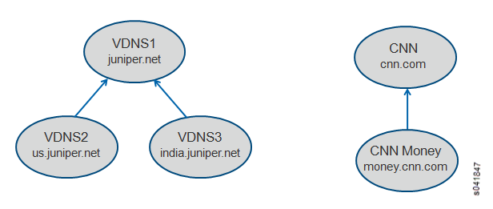
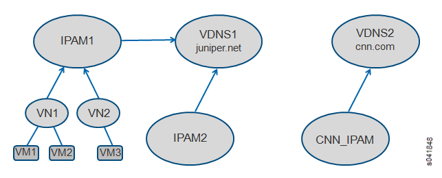
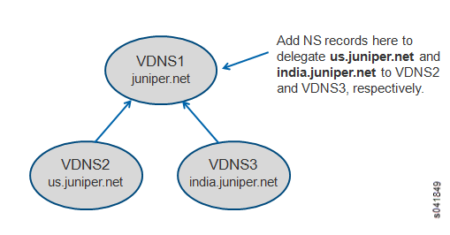
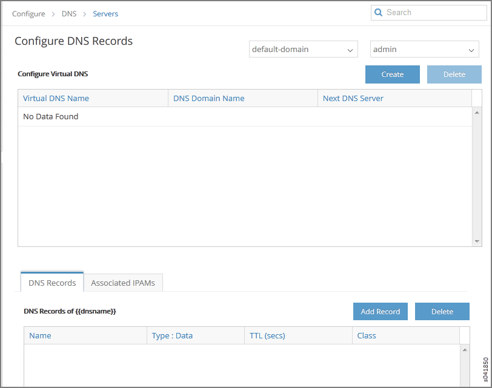
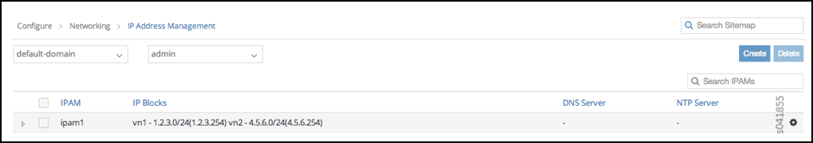

Configuring DNS Servers
=======================

 

DNS Overview
------------

Domain Name System (DNS) is the standard protocol for resolving domain
names into IP addresses so that traffic can be routed to its
destination. DNS provides the translation between human-readable domain
names and their IP addresses. The domain names are defined in a
hierarchical tree, with a root followed by top-level and next-level
domain labels.

A DNS server stores the records for a domain name and responds to
queries from clients based on these records. The server is authoritative
for the domains for which it is configured to be the name server. For
other domains, the server can act as a caching server, fetching the
records by querying other domain name servers.

The following are the key attributes of domain name service in a virtual
world:

-  It should be possible to configure multiple domain name servers to
   provide name resolution service for the virtual machines spawned in
   the system.

-  It should be possible to configure the domain name servers to form
   DNS server hierarchies required by each tenant.

   -  The hierarchies can be independent and completely isolated from
      other similar hierarchies present in the system, or they can
      provide naming service to other hierarchies present in the system.

-  DNS records for the virtual machines spawned in the system should be
   updated dynamically when a virtual machine is created or destroyed.

-  The service should be scalable to handle an increase in servers and
   the resulting increased numbers of virtual machines and DNS queries
   handled in the system.

Defining Multiple Virtual Domain Name Servers in Contrail
---------------------------------------------------------

Contrail provides the flexibility to define multiple virtual domain name
servers under each domain in the system. Each virtual domain name server
is an authoritative server for the DNS domain configured.
`Figure 1 <configure-dns-vnc.html#dns-example>`__ shows examples of
virtual DNS servers defined in **default-domain**, providing the name
service for the DNS domains indicated.

|Figure 1: DNS Servers Examples|

IPAM and Virtual DNS
--------------------

Each IP address management (IPAM) service in the system can refer to one
of the virtual DNS servers configured. The virtual networks and virtual
machines spawned are associated with the DNS domain specified in the
corresponding IPAM. When the VMs are configured with DHCP, they receive
the domain assignment in the DHCP **domain-name** option. Examples are
shown in `Figure 2 <configure-dns-vnc.html#ipam-example>`__

|Figure 2: IPAM and Virtual DNS|

DNS Record Types
----------------

DNS records can be added statically. DNS record types **A, CNAME, PTR**,
and **NS** are currently supported in the system. Each record includes
the type, class (IN), name, data, and TTL values. See
`Table 1 <configure-dns-vnc.html#dns-record-types>`__ for descriptions
of the record types.

Table 1: DNS Record Types Supported

+-----------------+---------------------------------------------------+
| DNS Record Type | Description                                       |
+=================+===================================================+
| **A**           | Used for mapping hostnames to IPv4 addresses.     |
|                 | Name refers to the name of the virtual machine,   |
|                 | and data is the IPv4 address of the virtual       |
|                 | machine.                                          |
+-----------------+---------------------------------------------------+
| **CNAME**       | Provides an alias to a name. Name refers to the   |
|                 | name of the virtual machine, and data is the new  |
|                 | name (alias) for the virtual machine.             |
+-----------------+---------------------------------------------------+
| **PTR**         | A pointer to a record, it provides reverse        |
|                 | mapping from an IP address to a name. Name refers |
|                 | to the IP address, and data is the name for the   |
|                 | virtual machine. The address in the PTR record    |
|                 | should be part of a subnet configured for a VN    |
|                 | within one of the IPAMs referring to this virtual |
|                 | DNS server.                                       |
+-----------------+---------------------------------------------------+
| **NS**          | Used to delegate a subdomain to another DNS       |
|                 | server. The DNS server could be another virtual   |
|                 | DNS server defined in the system or the IP        |
|                 | address of an external DNS server reachable via   |
|                 | the infrastructure. Name refers to the subdomain  |
|                 | being delegated, and data is the name of the      |
|                 | virtual DNS server or IP address of an external   |
|                 | server.                                           |
+-----------------+---------------------------------------------------+

`Figure 3 <configure-dns-vnc.html#ns-example>`__ shows an example usage
for the DNS record type of **NS**.

|Figure 3: Example Usage for NS Record Type|

Configuring DNS on the User Interface
-------------------------------------

DNS can be configured by using the user interface or by using scripts.
The following procedure shows how to configure DNS through the Juniper
Networks Contrail interface.

1. Access **Configure > DNS > Servers** to create or delete virtual DNS
   servers and records.

   The **Configure DNS Records** page appears; see
   `Figure 4 <configure-dns-vnc.html#config-dns-record>`__.

   |Figure 4: Configure DNS Records|

2. To add a new DNS server, click the **Create** button.

   Enter DNS server information in the **Add DNS** window; see
   `Figure 5 <configure-dns-vnc.html#add-dns-svr>`__

   |Figure 5: Add DNS|

   Complete the fields for the new server; see
   `Table 2 <configure-dns-vnc.html#add-dns-fields>`__.

   Table 2: Add DNS Fields

   +--------------------------+------------------------------------------+
   | Field                    | Description                              |
   +==========================+==========================================+
   | **Server Name**          | Enter a name for this server.            |
   +--------------------------+------------------------------------------+
   | **Domain Name**          | Enter the name of the domain for this    |
   |                          | server.                                  |
   +--------------------------+------------------------------------------+
   | **Time To Live**         | Enter the **TTL** in seconds.            |
   +--------------------------+------------------------------------------+
   | **Next DNS Server**      | Select from a list the name of the next  |
   |                          | DNS server to process DNS requests if    |
   |                          | they cannot be processed at this server, |
   |                          | or **None**.                             |
   +--------------------------+------------------------------------------+
   | **Load Balancing Order** | Select the load-balancing order from a   |
   |                          | list—**Random, Fixed, Round Robin**.     |
   |                          | When a name has multiple records         |
   |                          | matching, the configured record order    |
   |                          | determines the order in which the        |
   |                          | records are sent in the response. Select |
   |                          | **Random** to have the records sent in   |
   |                          | random order. Select **Fixed** to have   |
   |                          | records sent in the order of creation.   |
   |                          | Select **Round Robin** to have the       |
   |                          | record order cycled for each request to  |
   |                          | the record.                              |
   +--------------------------+------------------------------------------+
   | **OK**                   | Click **OK** to create the record.       |
   +--------------------------+------------------------------------------+
   | **Cancel**               | Click **Cancel** to clear the fields and |
   |                          | start over.                              |
   +--------------------------+------------------------------------------+

3. To add a new DNS record, from the **Configure DNS Records** page,
   click the **Add Record** button in the lower right portion of the
   screen.

   The **Add DNS Record** window appears; see
   `Figure 6 <configure-dns-vnc.html#add-dns-record>`__.

   |Figure 6: Add DNS Record|

4. Complete the fields for the new record; see
   `Table 3 <configure-dns-vnc.html#add-dns-record-fields>`__.

   Table 3: Add DNS Record Fields

   +------------------+--------------------------------------------------+
   | Field            | Description                                      |
   +==================+==================================================+
   | **Record Name**  | Enter a name for this record.                    |
   +------------------+--------------------------------------------------+
   | **Type**         | Select the record type from a list—**A, CNAME,   |
   |                  | PTR, NS.**                                       |
   +------------------+--------------------------------------------------+
   | **IP Address**   | Enter the IP address for the location for this   |
   |                  | record.                                          |
   +------------------+--------------------------------------------------+
   | **Class**        | Select the record class from a list—**IN** is    |
   |                  | the default.                                     |
   +------------------+--------------------------------------------------+
   | **Time To Live** | Enter the **TTL** in seconds.                    |
   +------------------+--------------------------------------------------+
   | **OK**           | Click **OK** to create the record.               |
   +------------------+--------------------------------------------------+
   | **Cancel**       | Click **Cancel** to clear the fields and start   |
   |                  | over.                                            |
   +------------------+--------------------------------------------------+

5. To associate an IPAM to a virtual DNS server, from the **Configure
   DNS Records** page, select the **Associated IPAMs** tab in the lower
   right portion of the screen and click the **Edit** button.

   The **Associate IPAMs to DNS** window appears; see
   `Figure 7 <configure-dns-vnc.html#associate-IPAM>`__.

   |Figure 7: Associate IPAMs to DNS|

   Complete the IPAM associations, using the field descriptions in
   `Table 4 <configure-dns-vnc.html#ipams-fields>`__.

   Table 4: Associate IPAMs to DNS Fields

   +----------------------------+----------------------------------------+
   | Field                      | Description                            |
   +============================+========================================+
   | **Associate to All IPAMs** | Select this box to associate the       |
   |                            | selected DNS server to all available   |
   |                            | IPAMs.                                 |
   +----------------------------+----------------------------------------+
   | **Available IPAMs**        | This column displays the currently     |
   |                            | available IPAMs.                       |
   +----------------------------+----------------------------------------+
   | **Associated IPAMs**       | This column displays the IPAMs         |
   |                            | currently associated with the selected |
   |                            | DNS server.                            |
   +----------------------------+----------------------------------------+
   | **>>**                     | Use this button to associate an        |
   |                            | available IPAM to the selected DNS     |
   |                            | server, by selecting an available IPAM |
   |                            | in the left column and clicking this   |
   |                            | button to move it to the Associated    |
   |                            | IPAMs column. The selected IPAM is now |
   |                            | associated with the selected DNS       |
   |                            | server.                                |
   +----------------------------+----------------------------------------+
   | **<<**                     | Use this button to disassociate an     |
   |                            | IPAM from the selected DNS server, by  |
   |                            | selecting an associated IPAM in the    |
   |                            | right column and clicking this button  |
   |                            | to move it to the left column          |
   |                            | (Available IPAMs). The selected IPAM   |
   |                            | is now disassociated from the selected |
   |                            | DNS server.                            |
   +----------------------------+----------------------------------------+
   | **OK**                     | Click **OK** to commit the changes     |
   |                            | indicated in the window.               |
   +----------------------------+----------------------------------------+
   | **Cancel**                 | Click **Cancel** to clear all entries  |
   |                            | and start over.                        |
   +----------------------------+----------------------------------------+

6. Use the **IP Address Management** page (**Configure > Networking > IP
   Address Management**); see
   `Figure 8 <configure-dns-vnc.html#config-IPAM>`__) to configure the
   DNS mode for any DNS server and to associate an IPAM to DNS servers
   of any mode or to tenants’ IP addresses.

   |Figure 8: Configure IP Address Management|

7. To associate an IPAM to a virtual DNS server or to tenant’s IP
   addresses, at the **IP Address Management** page, select the network
   associated with this IPAM, then click the **Action** button in the
   last column, and click **Edit**.

   The **Edit IP Address Management** window appears; see
   `Figure 9 <configure-dns-vnc.html#dns-window>`__.

   |Figure 9: DNS Server|

8. In the first field, select the **DNS Method** from a list (**None,
   Default DNS, Tenant DNS, Virtual DNS**; see
   `Table 5 <configure-dns-vnc.html#dns-modes>`__.

   Table 5: DNS Modes

   +-----------------+---------------------------------------------------+
   | DNS Mode        | Description                                       |
   +=================+===================================================+
   | **None**        | Select **None** when no DNS support is required   |
   |                 | for the VMs.                                      |
   +-----------------+---------------------------------------------------+
   | **Default**     | In default mode, DNS resolution for VMs is        |
   |                 | performed based on the name server configuration  |
   |                 | in the server infrastructure. The subnet default  |
   |                 | gateway is configured as the DNS server for the   |
   |                 | VM, and the DHCP response to the VM has this DNS  |
   |                 | server option. DNS requests sent by a VM to the   |
   |                 | default gateway are sent to the name servers      |
   |                 | configured on the respective compute nodes. The   |
   |                 | responses are sent back to the VM.                |
   +-----------------+---------------------------------------------------+
   | **Tenant**      | Configure this mode when a tenant wants to use    |
   |                 | its own DNS servers. Configure the list of        |
   |                 | servers in the IPAM. The server list is sent in   |
   |                 | the DHCP response to the VM as DNS servers. DNS   |
   |                 | requests sent by the VMs are routed the same as   |
   |                 | any other data packet based on the available      |
   |                 | routing information.                              |
   +-----------------+---------------------------------------------------+
   | **Virtual DNS** | Configure this mode to support virtual DNS        |
   |                 | servers (VDNS) to resolve the DNS requests from   |
   |                 | the VMs. Each IPAM can have a virtual DNS server  |
   |                 | configured in this mode.                          |
   +-----------------+---------------------------------------------------+

9. Complete the remaining fields on this page, and click **OK** to
   commit the changes, or click **Cancel** to clear the fields and start
   over.

Configuring DNS Using Scripts
-----------------------------

You can configure DNS by using scripts that are available in the
contrail-utils RPM/DEB package in the ``/opt/contrail/utils`` directory.
The scripts are copied to the config_api_container or config node when
you install the contrail-utils RPM/DEB package. You can execute the
scripts from either the config_api container or the config node. The
scripts are described in
`Table 6 <configure-dns-vnc.html#dns-scripts>`__.

**Caution**

Be aware of the following cautions when using scripts to configure DNS:

-  DNS doesn’t allow special characters in the names, other than -
   (dash) and . (period). Any records that include special characters in
   the name will be discarded by the system.

-  The IPAM DNS mode and association should only be edited when there
   are *no* virtual machine instances in the virtual networks associated
   with the IPAM.

Table 6: DNS Scripts

.. raw:: html

   <table data-cellspacing="0" style="border-top:thin solid black;" width="99%">
   <colgroup>
   <col style="width: 50%" />
   <col style="width: 50%" />
   </colgroup>
   <thead>
   <tr class="header">
   <th style="text-align: left;">
Action
</th>
   <th style="text-align: left;">
Script
</th>
   </tr>
   </thead>
   <tbody>
   <tr class="odd">
   <td style="text-align: left;">
Add a virtual DNS server
</td>
   <td style="text-align: left;">
Script: <code class="inline" data-v-pre="">add_virtual_dns.py</code>

   
Sample usage: <code class="inline" data-v-pre="">python add_virtual_dns.py --api_server_ip 10.204.216.21 --api_server_port 8082 --name vdns1 --domain_name default-domain --dns_domain juniper.net --dyn_updates --record_order random --ttl 1200 --next_vdns default-domain:vdns2 </code>
</td>
   </tr>
   <tr class="even">
   <td style="text-align: left;">
Delete a virtual DNS server
</td>
   <td style="text-align: left;">
Script: <code class="inline" data-v-pre="">del_virtual_dns_record.py</code>

   
Sample usage: <code class="inline" data-v-pre="">python del_virtual_dns.py --api_server_ip 10.204.216.21 --api_server_port 8082 --fq_name default-domain:vdns1</code>
</td>
   </tr>
   <tr class="odd">
   <td style="text-align: left;">
Add a DNS record
</td>
   <td style="text-align: left;">
Script: <code class="inline" data-v-pre="">add_virtual_dns_record.py </code>

   
Sample usage: <code class="inline" data-v-pre="">python add_virtual_dns_record.py --api_server_ip 10.204.216.21 --api_server_port 8082 --name rec1 --vdns_fqname default-domain:vdns1 --rec_name one --rec_type A --rec_class IN --rec_data 1.2.3.4 --rec_ttl 2400</code>
</td>
   </tr>
   <tr class="even">
   <td style="text-align: left;">
Delete a DNS record
</td>
   <td style="text-align: left;">
Script: <code class="inline" data-v-pre="">del_virtual_dns_record.py </code>

   
Sample usage: <code class="inline" data-v-pre="">python del_virtual_dns_record.py --api_server_ip 10.204.216.21 --api_server_port 8082 --fq_name default-domain:vdns1:rec1</code>
</td>
   </tr>
   <tr class="odd">
   <td style="text-align: left;">
Associate a virtual DNS server with an IPAM
</td>
   <td style="text-align: left;">
Script: <code class="inline" data-v-pre="">associate_virtual_dns.py </code>

   
Sample usage: <code class="inline" data-v-pre="">python associate_virtual_dns.py --api_server_ip 10.204.216.21 --api_server_port 8082 --ipam_fqname default-domain:demo:ipam1 --vdns_fqname default-domain:vdns1</code>
</td>
   </tr>
   <tr class="even">
   <td style="text-align: left;">
Disassociate a virtual DNS server with an IPAM
</td>
   <td style="text-align: left;">
Script: <code class="inline" data-v-pre="">disassociate_virtual_dns.py </code>

   
Sample usage: <code class="inline" data-v-pre="">python disassociate_virtual_dns.py --api_server_ip 10.204.216.21 --api_server_port 8082 --ipam_fqname default-domain:demo:ipam1 --vdns_fqname default-domain:vdns1</code>
</td>
   </tr>
   </tbody>
   </table>

 

.. |Figure 5: Add DNS| image:: images/s041864.gif
.. |Figure 6: Add DNS Record| image:: images/s041853.gif
.. |Figure 7: Associate IPAMs to DNS| image:: images/s041854.gif

.. |Figure 9: DNS Server| image:: images/s041857.gif
