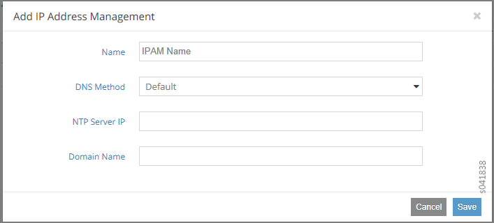
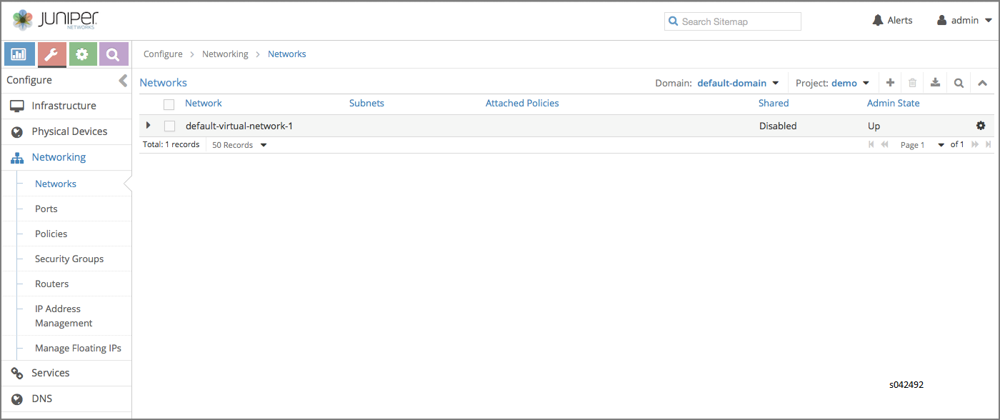
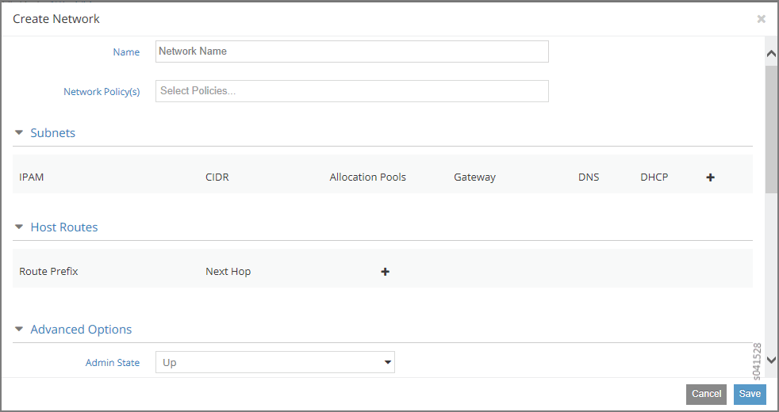

# Creating a Virtual Network with Juniper Networks Contrail

 

Contrail makes creating a virtual network very easy for a self-service
user. You create networks and network policies at the user dashboard,
then associate policies with each network. The following procedure shows
how to create a virtual network when using Juniper Networks Contrail.

1.  You need to create an IP address management (IPAM)
    for your project for to create a virtual network. Select
    **Configure &gt; Networking &gt; IP Address Management**, then click
    the **Create** button.

    The **Add IP Address Management** window appears, see
    [Figure 1](creating-virtual-network-juniper-vnc.html#add-ipam).

    

2.  Complete the fields in **Add IP Address
    Management**: The fields are described in
    [Table 1](creating-virtual-network-juniper-vnc.html#ipam-field-desc).

    Table 1: Add IP Address Management Fields

    | Field             | Description                                                                                                    |
    |:------------------|:---------------------------------------------------------------------------------------------------------------|
    | **Name**          | Enter a name for the IPAM you are creating.                                                                    |
    | **DNS Method**    | Select from a list the domain name server method for this IPAM: **Default, Virtual DNS, Tenant**, or **None**. |
    | **NTP Server IP** | Enter the IP address of an NTP server to be used for this IPAM.                                                |
    | **Domain Name**   | Enter a domain name to be used for this IPAM.                                                                  |

3.  Select **Configure &gt; Networking &gt;
    Networks** to access the **Configure Networks** page; see
    [Figure 2](creating-virtual-network-juniper-vnc.html#config-networks).

    

4.  Verify that your project is displayed as active
    in the upper-right field, then click the icon. The **Create
    Network** window is displayed. See
    [Figure 3](creating-virtual-network-juniper-vnc.html#create-network).
    Use the scroll bar to access all sections of this window.

    

5.  Complete the fields in the **Create Network**
    window with values that identify the network name, network policy,
    and IP options as needed. See field descriptions in
    [Table 2](creating-virtual-network-juniper-vnc.html#net-field-desc).

    Table 2: Create Network Fields

    | Field                 | Description                                                                                                                                                                                                                                                                                                                                                                                                                                                                       |
    |:----------------------|:----------------------------------------------------------------------------------------------------------------------------------------------------------------------------------------------------------------------------------------------------------------------------------------------------------------------------------------------------------------------------------------------------------------------------------------------------------------------------------|
    | **Name**              | Enter a name for the virtual network you are creating.                                                                                                                                                                                                                                                                                                                                                                                                                            |
    | **Network Policy**    | Select the policy to be applied to this network from the list of available policies. You can select more than one policy by clicking each one needed.                                                                                                                                                                                                                                                                                                                             |
    | **Subnets**           | Use this area to identify and manage subnets for this virtual network. Click the + icon to open fields for IPAM, CIDR, Allocation Pools, Gateway, DNS, and DHCP. Select the subnet to be added from a drop down list in the IPAM field. Complete the remaining fields as necessary. You can add multiple subnets to a network. When finished, click the + icon to add the selections into the columns below the fields. Alternatively, click the - icon to remove the selections. |
    | **Host Routes**       | Use this area to add or remove host routes for this network. Click the + icon to open fields where you can enter the Route Prefix and the Next Hop. Click the + icon to add the information, or click the - icon to remove the information.                                                                                                                                                                                                                                       |
    | **Advanced Options**  | Use this area to add or remove advanced options, including identifying the Admin State as Up or Down, to identify the network as Shared or External, to add DNS servers, or to define a VxLAN Identifier.                                                                                                                                                                                                                                                                         |
    | **Floating IP Pools** | Use this area to identify and manage the floating IP address pools for this virtual network. Click the + icon to open fields where you can enter the Pool Name and Projects. Click the + icon to add the information, or click the - icon to remove the information.                                                                                                                                                                                                              |
    | **Route Target**      | Move the scroll bar down to access this area, then specify one or more route targets for this virtual network. Click the + icon to open fields where you can enter route target identifiers. Click the + icon to add the information, or click the - icon to remove the information.                                                                                                                                                                                              |

6.  To save your network, click the **Save** button,
    or click **Cancel** to discard your work and start over.

 
