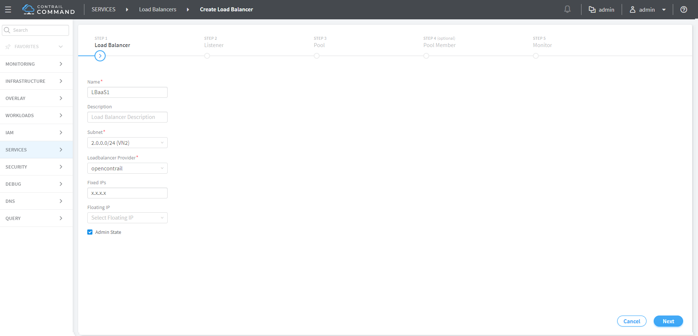
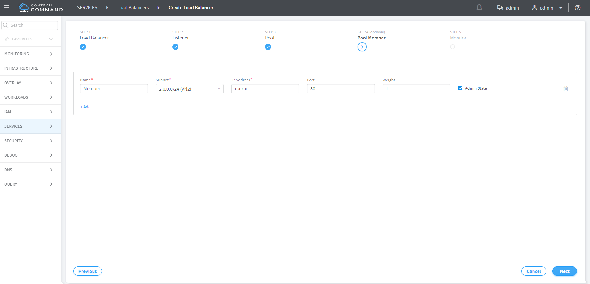

Configuring Load Balancing as a Service in Contrail
===================================================

 

Overview: Load Balancing as a Service
-------------------------------------

Load Balancing as a Service (LBaaS) is a feature available through
OpenStack Neutron. Contrail Release 1.20 and greater allows the use of
the Neutron API for LBaaS to apply open source load balancing
technologies to provision a load balancer in the Contrail system.

The LBaaS load balancer enables the creation of a pool of virtual
machines serving applications, all front-ended by a virtual-ip. The
LBaaS implementation has the following features:

-  Load balancing of traffic from clients to a pool of backend servers.
   The load balancer proxies all connections to its virtual IP.

-  Provides load balancing for HTTP, TCP, and HTTPS.

-  Provides health monitoring capabilities for applications, including
   HTTP, TCP, and ping.

-  Enables floating IP association to ``virtual-ip`` for public access
   to the backend pool.

In `Figure 1 <load-balance-as-service-vnc.html#config-lbaas>`__, the
load balancer is launched with the virtual IP address 198.51.100.2. The
backend pool of virtual machine applications (App Pool) is on the subnet
203.0.113.0/24. Each of the application virtual machines gets an IP
address (virtual-ip) from the pool subnet. When a client connects to the
``virtual-ip`` for accessing the application, the load balancer proxies
the TCP connection on its ``virtual-ip``, then creates a new TCP
connection to one of the virtual machines in the pool.

The pool member is selected using one of following methods:

-  weighted round robin (WRR), based on the weight assignment

-  least connection, selects the member with the fewest connections

-  source IP selects based on the ``source-ip`` of the packet

|Figure 1: Load Balancing as a Service in Contrail|

Additionally, the load balancer monitors the health of each pool member
using the following methods:

-  Monitors TCP by creating a TCP connection at intervals.

-  Monitors HTTP by creating a TCP connection and issuing an HTTP
   request at intervals.

-  Monitors ping by checking if a member can be reached by pinging.

Contrail LBaaS Implementation
-----------------------------

Contrail supports the OpenStack LBaaS Neutron APIs and creates relevant
objects for LBaaS, including ``virtual-ip``,
``loadbalancer-pool, loadbalancer-member,`` and
``loadbalancer-healthmonitor``. Contrail creates a service instance when
a ``loadbalancer-pool`` is associated with a ``virtual-ip`` object. The
service scheduler then launches a namespace on a randomly selected
virtual router and spawns HAProxy into that namespace. The configuration
for HAProxy is picked up from the load balancer objects. Contrail
supports high availability of namespaces and HAProxy by spawning active
and standby on two different vrouters.

.. raw:: html

   

A Note on Installation
~~~~~~~~~~~~~~~~~~~~~~

To use the LBaaS feature, HAProxy, version 1.5 or greater and
``iproute2``, version 3.10.0 or greater must both be installed on the
Contrail compute nodes.

If you are using fab commands for installation, the haproxy and iproute2
packages will be installed automatically with LBaaS if you set the
following:

::

   env.enable_lbaas=True

.. raw:: html

   

.. raw:: html

   

Use the following to check the version of the ``iproute2`` package on
your system:

::

   root@nodeh5:/var/log# ip -V
   ip utility, iproute2-ss130716
   root@nodeh5:/var/log#

.. raw:: html

   

.. raw:: html

   

Limitations
~~~~~~~~~~~

LBaaS currently has these limitations:

-  A pool should not be deleted before deleting the VIP.

-  Multiple VIPs cannot be associated with the same pool. If pool needs
   to be reused, create another pool with the same members and bind it
   to the second VIP.

-  Members cannot be moved from one pool to another. If needed, first
   delete the members from one pool, then add to a different pool.

-  In case of active-standby failover, namespaces might not get cleaned
   up when the agent restarts.

-  The floating-ip association needs to select the VIP port and not the
   service ports. ​

.. raw:: html

   

Configuring LBaaS Using CLI
---------------------------

The LBaaS feature is enabled on Contrail through Neutron API calls. The
following procedure shows how to create a pool network and a VIP network
using CLI. The VIP network is created in the public network and members
are added in the pool network.

.. raw:: html

   

Creating a Load Balancer
~~~~~~~~~~~~~~~~~~~~~~~~

Use the following steps to create a load balancer in Contrail.

1. Create a VIP network.

   ``neutron net-create vipnet``

   ``neutron subnet-create –-name vipsubnet vipnet 198.51.100.2``

2. Create a pool network.

   ``neutron net-create poolnet``

   ``neutron subnet-create --name poolsubnet poolnet 203.0.113.0/24``

3. Create a pool for HTTP.

   ``neutron lb-pool-create --lb-method ROUND_ROBIN --name mypool --protocol HTTP --subnet-id poolsubnet``

4. Add members to the pool.

   ``neutron lb-member-create --address 203.0.113.3 --protocol-port 80 mypool``

   ``neutron lb-member-create --address 203.0.113.4 --protocol-port 80 mypool``

5. Create a VIP for HTTP and associate it to the pool.

   ``neutron lb-vip-create --name myvip --protocol-port 80 --protocol HTTP--subnet-id vipsubnet mypool``

.. raw:: html

   

.. raw:: html

   

Deleting a Load Balancer
~~~~~~~~~~~~~~~~~~~~~~~~

Use the following steps to delete a load balancer in Contrail.

1. Delete the VIP.

   ``neutron lb-vip-delete <vip-uuid>``

2. Delete members from the pool.

   ``neutron lb-member-delete <member-uuid>``

3. Delete the pool.

   ``neutron lb-pool-delete <pool-uuid>``

.. raw:: html

   

.. raw:: html

   

Managing Healthmonitor for Load Balancer
~~~~~~~~~~~~~~~~~~~~~~~~~~~~~~~~~~~~~~~~

Use the following commands to create a healthmonitor, associate a
healthmonitor to a pool, disassociate a healthmonitor, and delete a
healthmonitor.

1. Create a healthmonitor.

   ``neutron lb-healthmonitor-create --delay 20 --timeout 10 --max-retries 3 --type HTTP``

2. Associate a healthmonitor to a pool.

   ``neutron lb-healthmonitor-associate <healthmonitor-uuid> mypool``

3. Disassociate a healthmonitor from a pool.

   ``neutron lb-healthmonitor-disassociate <healthmonitor-uuid> mypool``

.. raw:: html

   

.. raw:: html

   

Configuring an SSL VIP with an HTTP Backend Pool
~~~~~~~~~~~~~~~~~~~~~~~~~~~~~~~~~~~~~~~~~~~~~~~~

Use the following steps to configure an SSL VIP with an HTTP backend
pool.

1. Copy an SSL certificate to all compute nodes.

   ``scp ssl_certificate.pem <compute-node-ip> <certificate-path>``

2. Update the information
   in\ ``/etc/contrail/contrail-vrouter-agent.conf``.

   ``# SSL certificate path haproxy``

   ``haproxy_ssl_cert_path=<certificate-path>``

3. Restart ``contrail-vrouter-agent.``\ 

   ``service contrail-vrouter-agent restart``

4. Create a VIP for port 443 (SSL)​.

   ``neutron lb-vip-create --name myvip --protocol-port 443 --protocol HTTP --subnet-id vipsubnet mypool​``

.. raw:: html

   

Configuring LBaaS using the Contrail Command UI
-----------------------------------------------

Create, edit, or delete load balancers using the Contrail Command UI.
Use the following guidelines when creating load balancers:

-  Each load balancer consists of one or more listeners, pools, pool
   members, and health monitors.

   -  Listener: Port that listens for traffic from a particular load
      balancer. Multiple listeners can be associated with a single load
      balancer.

   -  Pool: Group of hosts that serves traffic from the load balancer.

   -  Pool Member: Server that is specified by the IP address and port
      for which it uses to serve the traffic it receives from the load
      balancer.

   -  Health Monitor: Health monitors are associated with pools and help
      divert traffic away from pool members that are temporarily
      offline.

-  Each load balancer can have multiple pools with one or more listeners
   for each pool.

-  The native load balancer has a single pool that is shared among
   multiple listeners.

.. raw:: html

   

.. _creating-a-load-balancer-1:

Creating a Load Balancer
~~~~~~~~~~~~~~~~~~~~~~~~

Use the following steps to create a load balancer with the load balancer
wizard.

1. Go to **Services > Load Balancers**.

   |Figure 2: Create Load Balancers|

2. To create a load balancer, click **Create**.

   |Figure 3: Load Balancer Information|

   Add the load balancer information:

   -  **Name**: Name of the load balancer.

   -  **Description**: (Optional) Description of the load balancer.

   -  **Subnet**: Drop-down menu displays all subnets from list of all
      available networks. The subnet is the network on which to allocate
      the IP address of the load balancer.

   -  **Loadbalancer Provider**: Drop-down menu includes available
      options. Default is opencontrail.

   -  **Fixed IPs**: (Optional) IPv4 or IPv6 address.

   -  **Floating IP**: (Optional) IPv4 or IPv6 address.

   -  **Admin State**: Check the checkbox for UP or uncheck the checkbox
      for DOWN. Default is UP.

3. Click **Next**. The Listener fields are displayed.

   |Figure 4: Listener Information|

   Add the listener information:

   -  **Name**: Name of the listener.

   -  **Description**: (Optional) Description of the listener.

   -  **Protocol**: Dropdown menu includes HTTP and TCP.

   -  **Port**: Must be an integer in the range of 1 to 65535.

   -  **Connection Limit**: (Optional). -1indicates an infinite limit.

   -  **Admin State**: Check the checkbox for UP or uncheck the checkbox
      for DOWN. Default is UP.

4. Click **Next**. The Pool fields are displayed.

   |Figure 5: Pool Information|

   Add the pool information:

   -  **Name**: Name of the pool.

   -  **Description**: (Optional) Description of the pool.

   -  **Method**: Load balancing method used to distribute incoming
      requests. Dropdown menu includes LEAST_CONNECTIONS, ROUND_ROBIN,
      and SOURCE_IP.

   -  **Protocol**: The protocol used by the pool and its members for
      the load balancer traffic. Dropdown menu includes TCP and HTTP.

   -  **Session Persistence**: (Optional) Default value is an empty
      dictionary.

   -  **Admin State**: Check the checkbox for UP or uncheck the checkbox
      for DOWN. Default is UP.

5. Click **Next**. The list of available pool member instances are
   displayed. To add an external member, click the \ |image1|\  **Add**
   icon. Each pool member must have a unique IP address and port
   combination.

   |Figure 6: Pool Member Information|

   The pool member information includes:

   -  **Name**: Name of the pool member.

   -  **Subnet**: The subnet in which to access the member.

   -  **IP Address**: The IP address of the member that is used to
      receive traffic from the load balancer.

   -  **Port**: The port to which the member listens to receive traffic
      from the load balancer.

   -  **Weight**: The default value is 1.

   -  **Admin State**: Check the checkbox for UP or uncheck the checkbox
      for DOWN. Default is UP.

6. Click **Next**. The Monitor fields are displayed.

   |Figure 7: Health Monitor Information|

   Add the health monitor information:

   -  **Monitor Type**: Dropdown menu includes HTTP, PING, and TCP.

   -  **HTTP Method**: Required if monitor type is HTTP. Dropdown menu
      includes GET and HEAD. The default value is GET.

   -  **Expected HTTP Status Code**: Required if monitor type is HTTP.
      The default value is 200.

   -  **URL Path**: Required if monitor type is HTTP. The default value
      is “/.”

   -  **Health check interval (sec)**: The time interval, in seconds,
      between each health check. The default value is 5.

   -  **Retry count before markdown**: The maximum number of failed
      health checks before the state of a member is changed to OFFLINE.
      The default value is 3.

   -  **Timeout (sec)**: The maximum number of seconds allowed for any
      given health check to complete. The timeout value should always be
      less than the health check interval. The default value is 5.

   -  **Admin State**: Check the checkbox for UP or uncheck the checkbox
      for DOWN. Default is UP.

   Click **Finish**.

.. raw:: html

   

.. raw:: html

   

Viewing or Editing Load Balancers
~~~~~~~~~~~~~~~~~~~~~~~~~~~~~~~~~

Use the following steps to view or edit existing load balancers.

1. Go to **Services > Load Balancers**. A summary screen of the Load
   Balancers is displayed.

   |Figure 8: Summary Screen of Load Balancers|

2. To view summary of a load balancer, click the drop down arrow next to
   a load balancer listed in the summary screen. The Load Balancer Info
   window is displayed.

   |Figure 9: Load Balancer Info Window|

.. raw:: html

   

.. raw:: html

   

.. _deleting-a-load-balancer-1:

Deleting a Load Balancer
~~~~~~~~~~~~~~~~~~~~~~~~

To delete the load balancer, click the trash can icon.

|image2|

.. raw:: html

   

 

.. |Figure 1: Load Balancing as a Service in Contrail| image:: documentation/images/g300523.png
.. |Figure 2: Create Load Balancers| image:: documentation/images/s009589.png

.. |Figure 4: Listener Information| image:: documentation/images/s009592.png
.. |Figure 5: Pool Information| image:: documentation/images/s009593.png
.. |image1| image:: documentation/images/s042494.png

.. |Figure 7: Health Monitor Information| image:: documentation/images/s009595.png
.. |Figure 8: Summary Screen of Load Balancers| image:: documentation/images/s009596.png
.. |Figure 9: Load Balancer Info Window| image:: documentation/images/s009598.png
.. |image2| image:: documentation/images/s009590.png
