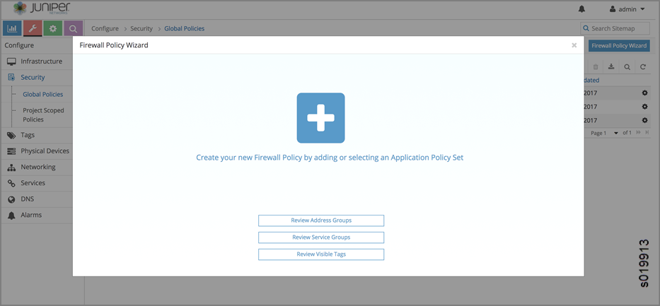
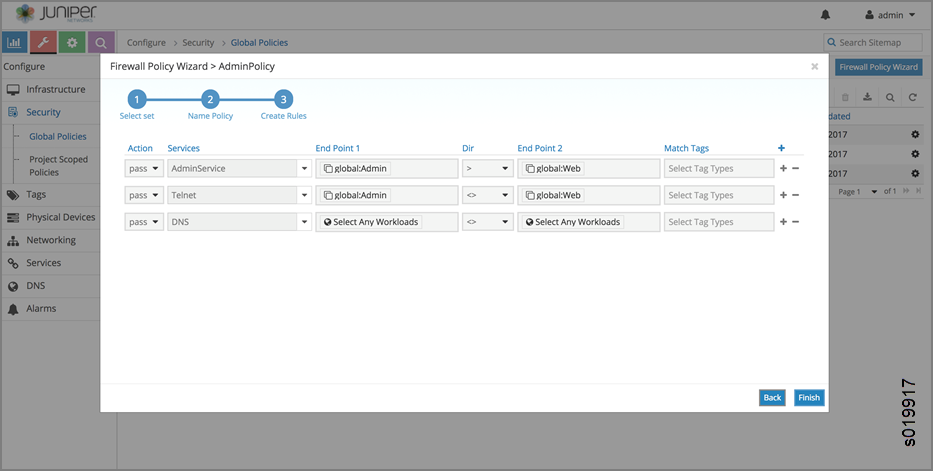
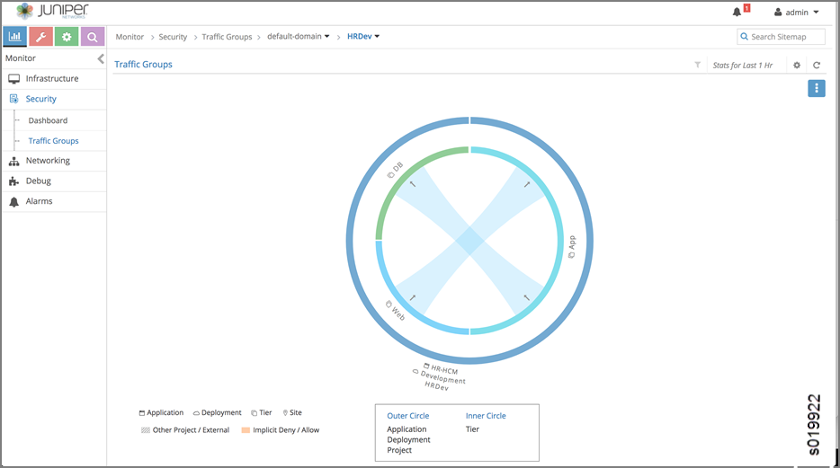
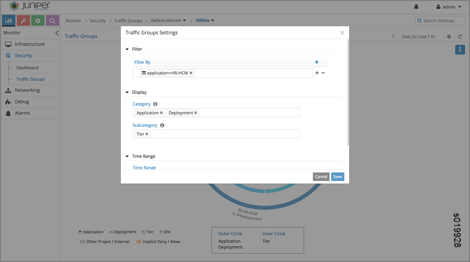

Security Policy Features
========================

 

Overview of Existing Network Policy and Security Groups in Contrail
-------------------------------------------------------------------

Contrail virtual networks are isolated by default. Workloads in a
virtual network cannot communicate with workloads in other virtual
networks, by default. A Contrail network policy may be used to connect
two virtual networks. In addition, Contrail network policy also provides
security between two virtual networks by allowing or denying specified
traffic.

In modern cloud environments, workloads are moving from one server to
another, one rack to another and so on. Therefore, users must rely less
on using IP addresses or other network coordinates to identify the
endpoints to be protected. Instead users must leverage application
attributes to author policies, so that the policies don't need to be
updated on account of workload mobility.

You might want to segregate traffic based on the different categories of
data origination, such as:

-  Protecting the application itself

-  Segregating traffic for specific component tiers within the
   application

-  Segregating traffic based on the deployment environment for the
   application instance

-  Segregating traffic based on the specific geographic location where
   the application is deployed

There are many other possible scenarios where traffic needs to be
segregated.

Additionally, you might need to group workloads based on combinations of
tags. These intents are hard to express with existing network policy
constructs or Security Group constructs. Besides, existing policy
constructs leveraging the network coordinates, must continually be
rewritten or updated each time workloads move and their associated
network coordinates change.

Security Policy Enhancements
----------------------------

As the Contrail environment has grown and become more complex, it has
become harder to achieve desired security results with the existing
network policy and security group constructs. The Contrail network
policies have been tied to routing, making it difficult to express
security policies for environments such as cross sectioning between
categories, or having a multi-tier application supporting development
and production environment workloads with no cross environment traffic.

Starting with Contrail Release 4.1, limitations of the current network
policy and security group constructs are addressed by supporting
decoupling of routing from security policies, multidimension
segmentation, and policy portability. This release also enhances user
visibility and analytics functions for security.

Contrail Release 4.1 introduces new firewall security policy objects,
including the following enhancements:

-  Routing and policy decoupling—introducing new firewall policy
   objects, which decouples policy from routing.

-  Multidimension segmentation—segment traffic and add security
   features, based on multiple dimensions of entities, such as
   application, tier, deployment, site, usergroup, and so on.

-  Policy portability—security policies can be ported to different
   environments, such as ‘from development to production’, ‘from
   pci-complaint to production’, ‘to bare metal environment’ and ‘to
   container environment’.

-  Visibility and analytics

Using Tags and Configuration Objects to Enhance Security Policy
---------------------------------------------------------------

Starting with Contrail Release 4.1, tags and configuration objects are
used to create new firewall policy objects that decouple routing and
network policies, enabling multidimension segmentation and policy
portability.

Multidimension traffic segmentation helps you segment traffic based on
dimensions such as application, tier, deployment, site, and usergroup.

You can also port security policies to different environments.
Portability of policies are enabled by providing match conditions for
tags. Match tags must be added to the policy rule to match tag values of
source and destination workloads without mentioning tag values. For
example, in order for the
``‘allow protocol tcp source application-tier=web destination application-tier=application match application and site’``
rule to take effect, the application and site values must match.

Predefined Tags
~~~~~~~~~~~~~~~

You can choose predefined tags based on the environment and deployment
requirements.

Predefined tags include:

-  application

-  application-tier

-  deployment

-  site

-  label (a special tag that allows the user to label objects)

Custom Tags
^^^^^^^^^^^

You can also define custom tags for a Kubernetes environment. You can
define tags in the UI or upload configurations in JSON format.

Example Tag Usage
^^^^^^^^^^^^^^^^^

``application = HRApp application-tier = Web site = USA``

Tagging Objects
~~~~~~~~~~~~~~~

A user can tag the objects project, VN, VM, and VMI with tags and values
to map their security requirements. Tags follow the hierarchy of
project, VN, VM and VMI and are inherited in that order. This gives an
option for the user to provide default settings for any tags at any
level. Policies can specify their security in terms of tagged endpoints,
in addition to expressing in terms of ip prefix, network, and address
groups endpoints.

Policy Application
~~~~~~~~~~~~~~~~~~

Policy application is a new object, implemented by means of the
application tag. The user can create a list of policies per application
to be applied during the flow acceptance evaluation. Introducing global
scoped policies and project scoped policies. There are global scoped
policies, which can be applied globally for all projects, and project
scoped policies, which are applied to specific projects.

Configuration Objects
---------------------

The following are the configuration objects for the new security
features.

-  firewall-policy

-  firewall-rule

-  policy-management

-  application-policy

-  service-group

-  address-group

-  tag

-  global-application-policy

Configuration Object Tag Object
~~~~~~~~~~~~~~~~~~~~~~~~~~~~~~~

Each configuration object tag object contains:

-  tag: one of the defined tag types, stored as string and a 32-bit ID.

-  tag type: Contains the type string and ID (the first 16 bits of the
   tag) and references to the tag resource type

Each value entered by the user creates a unique ID that is set in the
tag_id field. The system can have up to 64 million tag values. On
average, each tag can have up to 2k values, but there are no
restrictions per tag.

Tags and labels can be attached to any object, for example, project, VN,
VM, VMI, and policy, and these objects have a tag reference list to
support multiple tags.

RBAC controls the users allowed to modify or remove attached tags. Some
tags (typically facts) are attached by the system by default or by means
of introspection.

Tag APIs
^^^^^^^^

Tag APIs are used to give RBAC per tag in any object (VMI, VM, Project
….).

-  REST: ``HTTP POST to /set_tag_<tag_type>/<obj_uuid>``

-  Python: ``set_tag_<tag_type> (object_type, object_uuid, tag_value)``

Configuration also supports the following APIs:

-  tag query

-  tags (policy)

-  tags (application tag)

-  object query

-  tags (object)

-  tags (type, value)

Label
^^^^^

Label is special tag type, used to assign labels for objects. All of the
tag constructs are valid, except that tag type is ‘label'. One
difference from other tags is that an object can have any number of
labels. All other tag types are restricted to one tag per object.

Local and Global Tags
^^^^^^^^^^^^^^^^^^^^^

Tags can be defined globally or locally under a project; tag objects are
children of either config-root or a project. An object can be tagged
with a tag in its project or with a globally-scoped tag.

Analytics
^^^^^^^^^

When given a tag query with a SQL where clause and select clause,
analytics should give out objects. The query can also contain labels,
and the labels can have different operators.

Example:

User might want to know: a list of VMIs where
``’site == USA and deployment == Production'``

list of VMIs where ``’site == USA and deployment == Production has ’``

Given tag SQL where clause and select clause, analytics should give out
flows.

Control Node
^^^^^^^^^^^^

The control node passes the tags, along with route updates, to agents
and other control nodes.

Agent
^^^^^

Agent gets attached tags along with configuration objects. Agent also
gets route updates containing tags associated with IP route. This
process is similar to getting security group IDs along with the route
update.

Address-Group Configuration Object
~~~~~~~~~~~~~~~~~~~~~~~~~~~~~~~~~~

There are multiple ways to add IP address to address-group.

-  Manually add IP prefixes to the address-group by means of
   configuration.

-  Label a work load with the address-group’s specified label. All ports
   that are labelled with the same label are considered to be part of
   that address-group.

-  Use introspect workloads, based on certain criteria, to add
   ip-address to address-group.

Configuration
^^^^^^^^^^^^^

The address-group object refers to a label object, description, and list
of IP prefixes. The label - object is created using the tag APIs.

.. _agent-1:

Agent
^^^^^

Agent gets address-group and label objects referenced in policy
configuration. Agent uses this address group for matching policy rules.

.. _analytics-1:

Analytics
^^^^^^^^^

When given address group label, analytics gets all the objects
associated with it. Given address group label, get all the flows
associated with it.

Service-Group Configuration Object
~~~~~~~~~~~~~~~~~~~~~~~~~~~~~~~~~~

Configuration

The service-group contains a list of ports and protocols. The open stack
service-group has a list of service objects; the service object contains
attributes: id, name, service group id, protocol, source_port,
destination_port, icmp_code, icmp_type, timeout, tenant id.

Agent

Agent gets service-group object as it is referred to in a policy rule.
Agent uses this service group during policy evaluation.

Application-policy-set Configuration Object
~~~~~~~~~~~~~~~~~~~~~~~~~~~~~~~~~~~~~~~~~~~

The application-policy-set configuration object can refer to a tag of
type application, network-policy objects, and firewall-policy objects.
This object can be local (project) or globally scoped.

When an application tag is attached to an application-policy-set object,
the policies referred by that object are automatically applied to the
ports that have the same application tag.

Any firewall-policies referred by the application-policy-set objects are
ordered using sequence numbers. If the same application tag is attached
to multiple application-policy-sets, all those sets will apply, but
order among those sets is undefined.

One application-policy-set (called default-policy-application-set) is
special in that policies referred by it are applied to all interfaces by
default, after applying policies referred to other
application-policy-sets.

Upon seeing the application tag for any object, the associated policies
are sent to agent. Agent will use this information to find out the list
of policies to be applied and their sequence during flow evaluation.
User can attach application tag to allowed objects (Project, VN, VM or
VMI).

Policy-management Configuration Object
~~~~~~~~~~~~~~~~~~~~~~~~~~~~~~~~~~~~~~

Policy-management is a global container object for all policy-related
configuration.

Policy-management object contains

-  network-policies (NPs)

-  firewall-policies (FWPs)

-  application-policy-sets

-  global-policy objects

-  global-policy-apply objects

-  NPs - List of contrail networking policy objects

-  FWPs - List of new firewall policy objects

-  Application-policies - List of Application-policy objects

-  Global-policies - List of new firewall policy objects, that are
   defined for global access

-  Global-policy-apply - List of global policies in a sequence, and
   these policies applied during flow evaluation.

-  Network Policies (NP) references are available, as they are today.

Firewall-policy Configuration Object
~~~~~~~~~~~~~~~~~~~~~~~~~~~~~~~~~~~~

``Firewall-policy``\ is a new policy object that contains a list of
firewall-rule-objects and audited flag. Firewall-policy can be project
or global scoped depending on usage. Includes an audited Boolean flag to
indicate that the owner of the policy indicated that the policy is
audited. Default is False, and will have to explicitly be set to True
after review. Generates a log event for audited with timestamp and user
details.

Firewall-rule Configuration Object
~~~~~~~~~~~~~~~~~~~~~~~~~~~~~~~~~~

Firewall-rule is a new rule object, which contains the following fields.
The syntax is to give information about their layout inside the rule.

-  | <sequence number>
   | There is a string object sequence number on the link from
     firewall-policy to firewall-policy-rule objects. The sequence
     number decides the order in which the rules are applied.

-  [< id >]

   uuid

-  [name < name >]

   Unique name selected by user

-  [description < description >]

-  public

-  {permit \| deny}

-  [ protocol {< protocol-name > \| any } destination-port { < port
   range > \| any } [ source-port { < port range > \| any} ] ] \|
   service-group < name >

-  endpoint-1 { [ip < prefix > ] \| [virtual-network < vnname >] \|
   [address-group < group name >] \| [tags T1 == V1 && T2 == V2 … && Tn
   == Vn && label == label name...] \| any}

-  { -> \| <- \| <-> }

   Specifies connection direction. All the rules are connection oriented
   and this option gives the direction of the connection.

-  endpoint-2 { [ip < prefix > ] \| [virtual-network < vnname >] \|
   [address-group < group name >] \| [tags T1 == V1 && T2 == V2 … && Tn
   == Vn && label == label name...] \| any }

   Tags at endpoints support an expression of tags. We support only ‘==‘
   and ‘&&’ operators. User can specify labels also as part the
   expression. Configuration object contains list of tag names (or
   global:tag-name in case of global tags) for endpoints.

-  [ match_tags {T1 …. Tn} \| none} ]

   List of tag types or none. User can specify either match with list of
   tags or none. Match with list of tags mean, source and destination
   tag values should match for the rule to take effect.

-  [ log\| mirror \| alert \| activate \| drop \| reject \| sdrop ]

   complex actions

-  { enable \| disable }

   A boolean flag to indicate the rule is enabled or disabled.
   Facilitates selectively turn off the rules, without remove the rule
   from the policy. Default is True.

-  filter

Compilation of Rules
^^^^^^^^^^^^^^^^^^^^

Whenever the API server receives a request to create/update a firewall
policy rule object, it analyzes the object data to make sure that all
virtual-networks, address-group, tag objects exist. If any of them do
not exist, the request will be rejected. In addition, it will actually
create a reference to those objects mentioned in the two endpoints. This
achieves two purposes. First, we don't allow users to name non-existent
objects in the rule and second, the user is not allowed to delete those
objects without first removing them from all rules that are referring to
them.

Using the Contrail Web User Interface to Manage Security Policies
-----------------------------------------------------------------

-  `Adding Security
   Policies <security-policy-enhancements.html#jd0e421>`__

-  `Managing Policy Tags <security-policy-enhancements.html#jd0e495>`__

-  `Viewing Global
   Policies <security-policy-enhancements.html#jd0e528>`__

-  `Visualizing Traffic
   Groups <security-policy-enhancements.html#jd0e566>`__

Adding Security Policies
~~~~~~~~~~~~~~~~~~~~~~~~

1. To add a security policy, go to **Configure > Security > Global
   Policies**. Near the upper right, click the button **Firewall Policy
   Wizard**. The **Firewall Policy Wizard** appears, where you can
   create your new firewall policy by adding or selecting an application
   policy set. See `Figure 1 <security-policy-enhancements.html#fw1>`__.

   |Figure 1: Firewall Policy Wizard|

2. Click the large + on the Firewall Policy Wizard screen to view the
   **Application Policy Sets** window. The existing application policy
   sets are displayed. See
   `Figure 2 <security-policy-enhancements.html#fw2>`__.

   |Figure 2: Application Policy Sets|

3. To create a new firewall policy, click the application policy set in
   the list to which the new firewall policy will belong. The **Edit
   Application Policy Sets** window appears, displaying a field for the
   description of the selected policy set and listing firewall policies
   associated with the set. See
   `Figure 3 <security-policy-enhancements.html#fw3>`__, where the
   **HRPolicySet** has been selected.

   |Figure 3: Edit Application Policy Sets|

4. To view all firewall policies, click the Application Policy Sets link
   in the left side.

   See `Figure 4 <security-policy-enhancements.html#fw4>`__.

   |Figure 4: All Firewall Policies|

5. Select any listed firewall policy to view or edit the rules
   associated with that policy. See
   `Figure 5 <security-policy-enhancements.html#fw5>`__, where all the
   rules for the **AdminPolicy** are listed. Use the dropdown menus in
   each field to add or change policy rules, and use the +, - icons to
   the right of each rule to add or delete the rule.

   |Figure 5: Firewall Policy Rules|

Managing Policy Tags
~~~~~~~~~~~~~~~~~~~~

You can use the Contrail web user interface to create and manage the
tags used to provide granularity to security policies. You can have
global tags, applicable to the entire system, or project tags, defined
for specific uses in specific projects.

1. To manage policy tags, go to **Configure > Tags > Global Tags**. The
   **Tags** window appears, listing all of the tags in use in the
   system, with the associated virtual networks, ports, and projects for
   each tag. Tags are defined first by type, such as application,
   deployment, site, tier, and so on. See
   `Figure 6 <security-policy-enhancements.html#fw6>`__.

   |Figure 6: Tags|

2. You can click through any listed tag to see the rules to which the
   tag is applied. See
   `Figure 7 <security-policy-enhancements.html#fw7>`__, which shows the
   application tags that are applied to the current application sets.
   You can also reach this page from **Configure > Security > Global
   Policies**.

   |Figure 7: View Application Tags|

Viewing Global Policies
~~~~~~~~~~~~~~~~~~~~~~~

From **Configure > Security > Global Policies**, in addition to viewing
the policies includes in application policy sets, you can also view all
firewall policies, all service groups policies, and all address groups
policies.

1. To view and manage the global firewall policies, from **Configure >
   Security > Global Policies**, click the Firewall Policies tab to view
   the details for system firewall policies, see
   `Figure 8 <security-policy-enhancements.html#fw8>`__\ 

   |Figure 8: Firewall Policies|

2. To view and manage the service groups policies, from **Configure >
   Security > Global Policies**, click the **Service Groups** tab to
   view the details for system policies for service groups, see
   `Figure 9 <security-policy-enhancements.html#fw9>`__.

   |Figure 9: Service Groups|

Visualizing Traffic Groups
~~~~~~~~~~~~~~~~~~~~~~~~~~

Use **Monitor > Security > Traffic Groups** to explore visual
representations of how policies are applied to traffic groups. See
`Figure 10 <security-policy-enhancements.html#fw10>`__, which is a
visual representation of the source and destination traffic for the past
one hour of a traffic group named Traffic Groups. The outer circle
represents traffic tagged with application, deployment, or project. The
inner circle represents traffic tagged with tier. The center of the
circle shows the traffic origination and destination.

|Figure 10: Traffic Groups|

You can click in the right side of the screen to get details of the
policy rules that have been matched by the selected traffic. See
`Figure 11 <security-policy-enhancements.html#fw11>`__.

|Figure 11: Traffic Groups, Policy Details|

You can click in the right side of the screen to get to the **Settings**
window, where you can change the type of view and change which items
appear in the visual representation. See
`Figure 12 <security-policy-enhancements.html#fw12>`__.

|Figure 12: Traffic Groups, Settings|

You can click on the name of a policy that has been matched to view the
endpoint statistics, including source tags and remote tags, of the
traffic currently represented in the visual. See
`Figure 13 <security-policy-enhancements.html#fw13>`__.

|Figure 13: Traffic Groups, Endpoint Statistics|

You can click deeper through any linked statistic to view more details
about that statistic, see
`Figure 15 <security-policy-enhancements.html#fw15>`__ and
`Figure 15 <security-policy-enhancements.html#fw15>`__.

|Figure 14: Traffic Groups, Details|

|Figure 15: Traffic Groups, Details|

You can change the settings of what statistics are displayed in each
traffic group at the **Traffic Groups Settings** screen see
`Figure 16 <security-policy-enhancements.html#fw16>`__.

|Figure 16: Traffic Groups Settings|

 

.. |Figure 2: Application Policy Sets| image:: documentation/images/s019914.png
.. |Figure 3: Edit Application Policy Sets| image:: documentation/images/s019915.png
.. |Figure 4: All Firewall Policies| image:: documentation/images/s019916.png

.. |Figure 6: Tags| image:: documentation/images/s019918.png
.. |Figure 7: View Application Tags| image:: documentation/images/s019919.png
.. |Figure 8: Firewall Policies| image:: documentation/images/s019920.png
.. |Figure 9: Service Groups| image:: documentation/images/s019921.png

.. |Figure 11: Traffic Groups, Policy Details| image:: documentation/images/s019923.png
.. |Figure 12: Traffic Groups, Settings| image:: documentation/images/s019924.png
.. |Figure 13: Traffic Groups, Endpoint Statistics| image:: documentation/images/s019925.png
.. |Figure 14: Traffic Groups, Details| image:: documentation/images/s019926.png
.. |Figure 15: Traffic Groups, Details| image:: documentation/images/s019927.png

