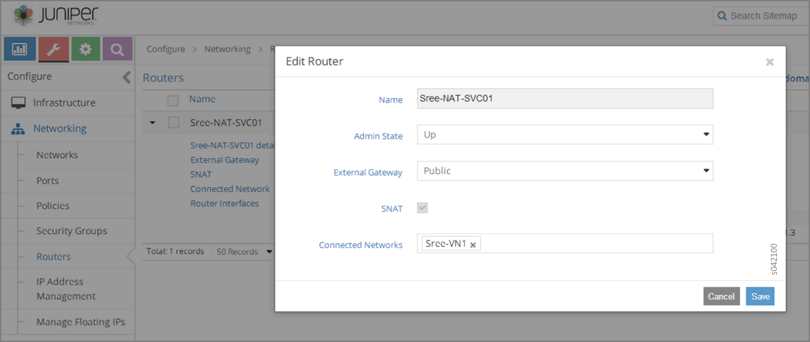
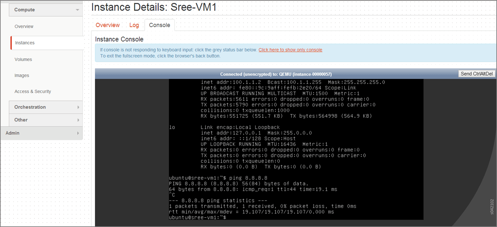
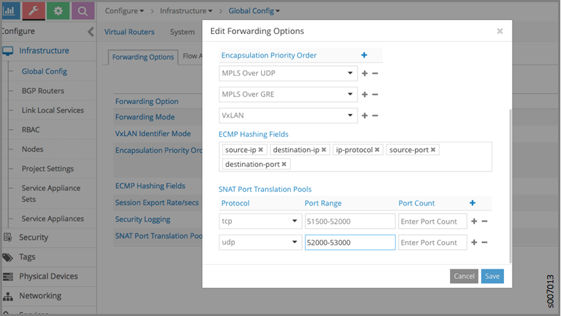

# Source Network Address Translation (SNAT)

 

## Overview

Source Network Address Translation (source-nat or SNAT) allows traffic
from a private network to go out to the internet. Virtual machines
launched on a private network can get to the internet by going through a
gateway capable of performing SNAT. The gateway has one arm on the
public network and as part of SNAT, it replaces the source IP of the
originating packet with its own public side IP. As part of SNAT, the
source port is also updated so that multiple VMs can reach the public
network through a single gateway public IP.

The following diagram shows a virtual network with the private subnet of
10.1.1.0/24. The default route for the virtual network points to the
SNAT gateway. The gateway replaces the source-ip from 10.1.1.0/24 and
uses its public address 172.21.1.1 for outgoing packets. To maintain
unique NAT sessions the source port of the traffic also needs to be
replaced.

## Neutron APIs for Routers

OpenStack supports SNAT gateway implementation through its Neutron APIs
for routers. The SNAT flag can be enabled or disabled on the external
gateway of the router. The default is True (enabled).

The Tungsten Fabric plugin supports the Neutron APIs for routers and
creates the relevant service-template and service-instance objects in
the API server. The service scheduler in Tungsten Fabric instantiates
the gateway on a randomly-selected virtual router. Tungsten Fabric uses
network namespace to support this feature.

### Example Configuration: SNAT for Contrail

The SNAT feature is enabled on Tungsten Fabric through Neutron API
calls.

The following configuration example shows how to create a test network
and a public network, allowing the test network to reach the public
domain through the SNAT gateway.

1.  Create the public network and set the router
    external flag.

    `neutron net-create public  `

    `neutron subnet-create public 172.21.1.0/24  `

    `neutron net-update public -- --router:external=True`

2.  Create the test network.

    `neutron net-create test  `

    `neutron subnet-create --name test-subnet test 10.1.1.0/24`

3.  Create the router with one interface in
    test.

    `neutron router-create r1 `

    `neutron router-interface-add r1 test-subnet  `

4.  Set the external gateway for the router.

    `neutron router-gateway-set r1 public`

## Network Namespace

Setting the external gateway is the trigger for Tungsten Fabric to set
up the Linux network namespace for SNAT.

The network namespace can be cleared by issuing the following Neutron
command:

`neutron router-gateway-clear r1 `

## Using the Web UI to Configure Routers with SNAT

You can use the Contrail user interface to configure routers for SNAT
and to check the SNAT status of routers.

To enable SNAT for a router, go to **Configure &gt; Networking &gt;
Routers**. In the list of routers, select the router for which SNAT
should be enabled. Click the Edit cog to reveal the **Edit Routers**
window. Click the check box for SNAT to enable SNAT on the router.

The following shows a router for which SNAT has been **Enabled**.

When a router has been **Enabled** for SNAT, the configuration can be
seen by selecting **Configure &gt; Networking &gt; Routers**. In the
list of routers, click open the router of interest. In the list of
features for that router, the status of SNAT is listed. The following
shows a router that has been opened in the list. The status of the
router shows that SNAT is **Enabled**.

You can view the real time status of a router with SNAT by viewing the
instance console, as in the following.

## Using the Web UI to Configure Distributed SNAT

The distributed SNAT feature allows virtual machines to communicate with
the IP fabric network using the existing forwarding infrastructure for
compute node connectivity. This functionality is achieved through port
address translation of virtual machine traffic using the IP address of
the compute node as the public address.

The following distributed SNAT use case is supported:

-   Virtual networks with distributed SNAT enabled can communicate with
    the IP fabric network. The session must be initiated from a virtual
    machine. Sessions initiated from the external network are not
    supported.

Distributed SNAT is supported only for TCP and UDP, and you can
configure discrete port ranges for both protocols.

A pool of ports is used for distributed SNAT. To create a pool of ports,
go to **Configure &gt; Infrastructure &gt; Global Config**. The
following shows an example of a port range used for port address
translation.

To use distributed SNAT, you must enable SNAT on the virtual network. To
enable SNAT on the virtual network, go to **Configure &gt; Networking
&gt; Networks**. The following shows a virtual network for which SNAT
has been enabled under Advanced Options.

 
