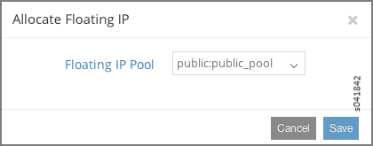

Example: Deploying a Multi-Tier Web Application
===============================================

 

Multi-Tier Web Application Overview
-----------------------------------

A common requirement for a cloud tenant is to create a tiered web
application in leased cloud space. The tenant enjoys the favorable
economics of a private IT infrastructure within a shared services
environment. The tenant seeks speedy setup and simplified operations.

The following example shows how to set up a simple tiered web
application using Contrail. The example has a web server that a user
accesses by means of a public floating IP address. The front-end web
server gets the content it serves to customers from information stored
in a SQL database server that resides on a back-end network. The web
server can communicate directly with the database server without going
through any gateways. The public (or client) can only communicate to the
web server on the front-end network. The client is not allowed to
communicate directly with any other parts of the infrastructure. See
`Figure 1 <web-use-case-vnc.html#tier-web>`__.

|Figure 1: Simple Tiered Web Use Case|

Example: Setting Up Virtual Networks for a Simple Tiered Web Application
------------------------------------------------------------------------

This example provides basic steps for setting up a simple multi-tier
network application. Basic creation steps are provided, along with links
to the full explanation for each of the creation steps. Refer to the
links any time you need more information about completing a step.

1. Working with a system that has the Contrail software installed and
   provisioned, create a project named **demo**.

   For more information; see `Creating Projects in OpenStack for
   Configuring Tenants in Contrail <creating-projects-vnc.html>`__.

2. In the **demo** project, create three virtual networks:

   1. A network named **public** with IP address **10.84.41.0/24**

      This is a special use virtual network for floating IP addresses—
      it is assigned an address block from the public floating address
      pool that is assigned to each web server. The assigned block is
      the only address block advertised outside of the data center to
      clients that want to reach the web services provided.

   2. A network named **frontend** with IP address **192.168.1.0/24**

      This network is the location where the web server virtual machine
      instances are launched and attached. The virtual machines are
      identified with private addresses that have been assigned to this
      virtual network.

   3. A network named **backend** with IP address **192.168.2.0/24**

      This network is the location where the database server virtual
      machines instances are launched and attached. The virtual machines
      are identified with private addresses that have been assigned to
      this virtual network.

   For more information; see `Creating a Virtual Network with OpenStack
   Contrail <creating-virtual-network-vnc.html>`__ or `Creating a
   Virtual Network with Juniper Networks
   Contrail <creating-virtual-network-juniper-vnc.html>`__.

3. Create a floating IP pool named **public_pool** for the **public**
   network within the **demo** project; see
   `Figure 2 <web-use-case-vnc.html#floating-pool>`__.

   |Figure 2: Create Floating IP Pool|

4. Allocate the floating IP pool **public_pool** to the **demo**
   project; see `Figure 3 <web-use-case-vnc.html#allo>`__.

   |Figure 3: Allocate Floating IP|

5. Verify that the floating IP pool has been allocated; see **Configure
   > Networking > Allocate Floating IPs.**\ 

6. Create a policy that allows any host to talk to any host using any IP
   address, protocol, and port, and apply this policy between the
   **frontend** network and the **backend** network.

   This now allows communication between the web servers in the
   front-end network and the database servers in the back-end network.

7. Launch the virtual machine instances that represent the web server
   and the database server.\ **Note**\ 

   Your installation might not include the virtual machines needed for
   the web server and the database server. Contact your account team if
   you need to download the VMs for this setup.

   On the **Instances** tab for this project, select **Launch Instance**
   and for each instance that you launch, complete the fields to make
   the following associations:

   -  Web server VM: select **frontend** network and the policy created
      to allow communication between **frontend** and **backend**
      networks. Apply the floating IP address pool to the web server.

   -  Database server VM: select **backend** network and the policy
      created to allow communication between **frontend** and
      **backend** networks.

Verifying the Multi-Tier Web Application
----------------------------------------

Verify your web setup.

-  To demonstrate this web application setup, go to the client machine,
   open a browser, and navigate to the address in the **public** network
   that is assigned to the web server in the **frontend** network.

   The result will display the Contrail interface with various data
   populated, verifying that the web server is communicating with the
   database server in the **backend** network and retrieving data.

   The client machine only has access to the public IP address. Attempts
   to browse to any of the addresses assigned to the **frontend**
   network or to the **backend** network should fail.

Sample Addressing Scheme for Simple Tiered Web Application
----------------------------------------------------------

Use the information in
`Table 1 <web-use-case-vnc.html#sample-address>`__ as a guide for
addressing devices in the simple tiered web example.

Table 1: Sample Addressing Scheme for Example

.. raw:: html

   <table data-cellspacing="0" style="border-top:thin solid black;" width="99%">
   <colgroup>
   <col style="width: 50%" />
   <col style="width: 50%" />
   </colgroup>
   <thead>
   <tr class="header">
   <th style="text-align: left;">
System Name
</th>
   <th style="text-align: left;">
Address Allocation
</th>
   </tr>
   </thead>
   <tbody>
   <tr class="odd">
   <td style="text-align: left;">
System001
</td>
   <td style="text-align: left;">
10.84.11.100
</td>
   </tr>
   <tr class="even">
   <td style="text-align: left;">
System002
</td>
   <td style="text-align: left;">
10.84.11.101
</td>
   </tr>
   <tr class="odd">
   <td style="text-align: left;">
System003
</td>
   <td style="text-align: left;">
10.84.11.102
</td>
   </tr>
   <tr class="even">
   <td style="text-align: left;">
System004
</td>
   <td style="text-align: left;">
10.84.11.103
</td>
   </tr>
   <tr class="odd">
   <td style="text-align: left;">
System005
</td>
   <td style="text-align: left;">
10.84.11.104
</td>
   </tr>
   <tr class="even">
   <td style="text-align: left;">
MX80-1
</td>
   <td style="text-align: left;">
10.84.11.253

   
10.84.45.1 (public connection)
</td>
   </tr>
   <tr class="odd">
   <td style="text-align: left;">
MX80-2
</td>
   <td style="text-align: left;">
10.84.11.252

   
10.84.45.2 (public connection)
</td>
   </tr>
   <tr class="even">
   <td style="text-align: left;">
EX4200
</td>
   <td style="text-align: left;">
10.84.11.254

   
10.84.45.254 (public connection)

   
10.84.63.259 (public connection)
</td>
   </tr>
   <tr class="odd">
   <td style="text-align: left;">
frontend network
</td>
   <td style="text-align: left;">
192.168.1.0/24
</td>
   </tr>
   <tr class="even">
   <td style="text-align: left;">
backend network
</td>
   <td style="text-align: left;">
192.168.2.0/24
</td>
   </tr>
   <tr class="odd">
   <td style="text-align: left;">
public network (floating address)
</td>
   <td style="text-align: left;">
10.84.41.0/24
</td>
   </tr>
   </tbody>
   </table>

Sample Physical Topology for Simple Tiered Web Application
----------------------------------------------------------

`Figure 4 <web-use-case-vnc.html#sample-topology>`__ provides a
guideline diagram for the physical topology for the simple tiered web
application example.

|Figure 4: Sample Physical Topology for Simple Tiered Web Application|

Sample Physical Topology Addressing
-----------------------------------

`Figure 5 <web-use-case-vnc.html#sample-addressing>`__ provides a
guideline diagram for addressing the physical topology for the simple
tiered web application example.

|Figure 5: Sample Physical Topology Addressing|

 

.. |Figure 1: Simple Tiered Web Use Case| image:: documentation/images/s041840.gif
.. |Figure 2: Create Floating IP Pool| image:: documentation/images/s041841.gif

.. |Figure 4: Sample Physical Topology for Simple Tiered Web Application| image:: documentation/images/s041844.gif
.. |Figure 5: Sample Physical Topology Addressing| image:: documentation/images/s041845.gif
