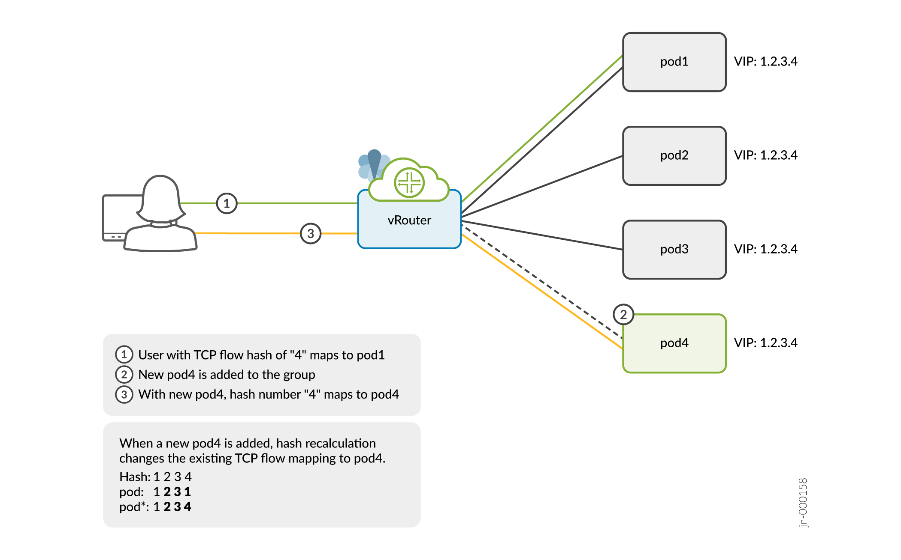

Stickiness for Load-Balanced Flows
==================================

Flow stickiness is a beta feature in Tungsten Fabric Release R21.12 that helps to minimize flow remapping across equal cost multipath (ECMP) groups in a load-balanced system.

We’ll show you an example of a flow remapping problem that occurs when a new member is added to a three-member ECMP load-balancing system. See Figure 1 for the workflow.

|Figure 1: Example for Scale-Out Load-Balancing Scenario|

In this example, you’ll send a flow request to the IP address 1.2.3.4. Because this is a three members group with the VIP address 1.2.3.4, vRouter sends the request to pod1 based on the flow hash calculation. Let's add a new member pod4 to the same VIP group. The request is now diverted and redirected to pod4 based on the flow hash recalculation.

Flow stickiness reduces such flow being remapped and retains the flow with the original path to pod1 though a new member pod4 is added. If adding pod4 affects the flow, vRouter reprograms the flow table and rebalances the flow with pod1.

.. _Table 1:

*Table 1* : Expected Results When Members Are Added to or Deleted from ECMP Group

+--------------------------------------------------------------+------------------------------------------------------------------------------------+---------------------------------------------------------------------------------------------------------------------------------------+
| Example Scenario                                             | Normal (Static) Hash Result                                                        | Flow Stickiness Result                                                                                                                |
+==============================================================+====================================================================================+=======================================================================================================================================+
| ECMP group size is 3.                                        | Based on the flow hash, traffic will be directed to pod1.                          | Based on the flow hash, traffic will be directed to pod1.                                                                             |
+--------------------------------------------------------------+------------------------------------------------------------------------------------+---------------------------------------------------------------------------------------------------------------------------------------+
| Add one more pod to the same service. ECMP group size is 4.  | Flow redistribution is possible and traffic may now be redirected to another pod.  | Traffic will continue to be directed to pod1.                                                                                         |
+--------------------------------------------------------------+------------------------------------------------------------------------------------+---------------------------------------------------------------------------------------------------------------------------------------+
| Delete one pod from same service. ECMP group size is 2.      | Flow redistribution is possible and traffic may now be redirected to another pod.  | Unless pod1 is deleted, traffic will continue to be directed to it. If pod1 is deleted, the session must be reinitiated from client.  |
+--------------------------------------------------------------+------------------------------------------------------------------------------------+---------------------------------------------------------------------------------------------------------------------------------------+

Flow stickiness is only supported when the flow is an ECMP flow before and after scaling up or scaling down.

Here's an example of how flow stickiness may not work as expected:

+-----------------------------------------+------------------+------------------------------------------------------------------------------------------------+
| Example Deployment                      | Scenario         | Result                                                                                         |
+=========================================+==================+================================================================================================+
| Two pods in two computes, one in each.  | Before scale-up  | With respect to the compute forwarding the traffic, flow will be a non-ecmp.                   |
|                                         +------------------+------------------------------------------------------------------------------------------------+                                                                                                
|                                         |   After scale-up | Flow becomes an ECMP flow and triggers rehashing. This may cause the flow stickiness to fail.  |                                                                                               
+-----------------------------------------+------------------+------------------------------------------------------------------------------------------------+

