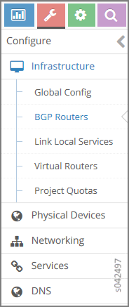

Configuring the Control Node with BGP
=====================================

An important task after a successful installation is to configure the
control node with BGP. This procedure shows how to configure basic BGP
peering between one or more virtual network controller control nodes and
any external BGP speakers. External BGP speakers, such as Juniper
Networks MX80 routers, are needed for connectivity to instances on the
virtual network from an external infrastructure or a public network.

Before you begin, ensure that the following tasks are completed:

-  The Tungsten Fabric Controller base system image has been installed on all
   servers.

-  The role-based services have been assigned and provisioned.

-  IP connectivity has been verified between all nodes of the
   Tungsten Fabric Controller.

-  You have access to Tungsten Fabric Web User Interface (WebUI). You can access the user interface at
   **http://``nn.nn.nn.nn``:8143**, where **``nn.nn.nn.nn``** is the IP
   address of the configuration node server that is running the TF
   service.

These topics provide instructions to configure the Control Node with
BGP.

Configuring the Control Node from Tungsten Fabric WebUI
-------------------------------------------------------

To configure BGP peering in the control node:

1. From the Tungsten Fabric Controller module control node
   (**http://``nn.nn.nn.nn``:8143**), select :menuselection:`Configure > Infrastructure > BGP Routers`.

   |Figure 1: Configure> Infrastructure > BGP Routers|

   A summary screen of the control nodes and BGP routers is displayed;
   see.

   |Figure 2: BGP Routers Summary|

2. (Optional) The global AS number is 64512 by default. To change the AS
   number, on the :guilabel:`BGP Router` summary screen click the gear wheel and
   select :guilabel:`Edit`. In the Edit BGP Router window enter the new number.

3. To create control nodes and BGP routers, on the :guilabel:`BGP Routers`
   summary screen, click the |image1|  icon. The :guilabel:`Create BGP
   Router` window is displayed.

   |Figure 3: Create BGP Router|

4. In the :guilabel:`Create BGP Router` window, click :guilabel:`BGP Router` to add a
   new BGP router or click :guilabel:`Control Node` to add control nodes.

   For each node you want to add, populate the fields with values for
   your system.

   Table 1: Create BGP Router Fields

   +-------------------------+-------------------------------------------+
   | Field                   | Description                               |
   +=========================+===========================================+
   | **Hostname**            | Enter a name for the node being added.    |
   +-------------------------+-------------------------------------------+
   | **Vendor ID**           | Required for external peers. Populate     |
   |                         | with a text identifier, for example,      |
   |                         | “MX-0”. (BGP peer only)                   |
   +-------------------------+-------------------------------------------+
   | **IP Address**          | The IP address of the node.               |
   +-------------------------+-------------------------------------------+
   | **Router ID**           | Enter the router ID.                      |
   +-------------------------+-------------------------------------------+
   | **Autonomous System**   | Enter the AS number in the range 1-65535  |
   |                         | for the node. (BGP peer only)             |
   +-------------------------+-------------------------------------------+
   | **Address Families**    | Enter the address family, for example,    |
   |                         | **inet-vpn**                              |
   +-------------------------+-------------------------------------------+
   | **Hold Time**           | BGP session hold time. The default is 90  |
   |                         | seconds; change if needed.                |
   +-------------------------+-------------------------------------------+
   | **BGP Port**            | The default is 179; change if needed.     |
   +-------------------------+-------------------------------------------+
   | **Authentication Mode** | Enable MD5 authentication if desired.     |
   +-------------------------+-------------------------------------------+
   | **Authentication key**  | Enter the Authentication Key value.       |
   +-------------------------+-------------------------------------------+
   | **Physical Router**     | The type of the physical router.          |
   +-------------------------+-------------------------------------------+
   | **Available Peers**     | Displays peers currently available.       |
   +-------------------------+-------------------------------------------+
   | **Configured Peers**    | Displays peers currently configured.      |
   +-------------------------+-------------------------------------------+

5. Click :guilabel:`Save` to add each node that you create.

6. To configure an existing node as a peer, select it from the list in
   the :guilabel:`Available Peers` box, then click :guilabel:`>>` to move it into the
   :guilabel:`Configured Peers` box.

   Click :guilabel:`<<` to remove a node from the :guilabel:`Configured Peers` box.

7. You can check for peers by selecting :menuselection:`Monitor > Infrastructure > Control Nodes`.

   |Figure 4: Control Nodes|

   In the :guilabel:`Control Nodes` window, click any hostname in the memory map
   to view its details.

   |Figure 5: Control Node Details|

8. Click the :guilabel:`Peers` tab to view the peers of a control node.

   |Figure 6: Control Node Peers Tab|

 

.. |Figure 2: BGP Routers Summary| image:: images/s042498.png
.. |image1| image:: images/s042494.png
.. |Figure 3: Create BGP Router| image:: images/s042496.png
.. |Figure 4: Control Nodes| image:: images/s042499.png
.. |Figure 5: Control Node Details| image:: images/s042500.png
.. |Figure 6: Control Node Peers Tab| image:: images/s042501.png
.. |Figure 7: Infrastructure > Cluster > Advanced > BGP Routers| image:: images/s009220.png
.. |Figure 8: Create BGP Router| image:: images/s009221.png