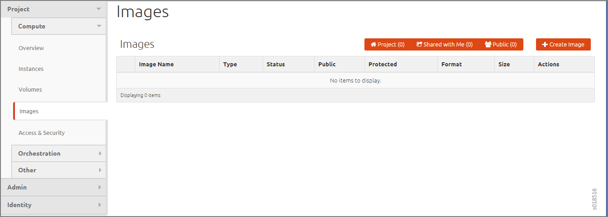

Creating an Image for a Project in OpenStack
============================================

:date: 2018-04-26

To specify an image to upload to the Image Service for a project in your
system by using the OpenStack dashboard:

1. In OpenStack, select :menuselection:`Project > Compute > Images`. The Images
   window is displayed.

   |Figure 1: OpenStack Images Window|

2. Make sure you have selected the correct project to which you are
   associating an image.

3. Click :guilabel:`Create Image`.

   The :guilabel:`Create An Image` window is displayed.

   |Figure 2: OpenStack Create An Image Window|

4. Complete the fields to specify your image.
   Table 1 describes each of the fields on the window.
   
   .. note:: 

      Only images available through an HTTP URL are supported, and the
      image location must be accessible to the Image Service. Compressed
      image binaries are supported (``*.zip`` and ``*.tar.gz``).

   Table 1: Create an Image Fields

   .. list-table:: 
         :header-rows: 1

         * - Field
           - Description
         * - Name
           - Enter a name for this image.
         * - Description
           - Enter a description for the image.
         * - Image Source
           - Select :guilabel:`Image File` or :guilabel:`Image Location`. If you select :guilabel:`Image File`, 
             you are prompted to browse to the local location of the file.      
         * - Image Location
           - Enter an external HTTP URL from which to load the image. 
             The URL must be a valid and direct URL to the image binary. 
             URLs that redirect or serve error pages result in unusable images.      
         * - Format
           - Required field. Select the format of the image from a list:
              - AKI– Amazon Kernel Image
              - AMI– Amazon Machine Image
              - ARI– Amazon Ramdisk Image
              - ISO– Optical Disk Image
              - QCOW2– QEMU Emulator
              - Raw– An unstructured image format
              - VDI– Virtual Disk Imade
              - VHD– Virtual Hard Disk
              - VMDK– Virtual Machine Disk
         * - Architecture
           - Enter the architecture
         * - Minimum Disk (GB)
           - Enter the minimum disk size required to boot the image. 
             If you do not specify a size, the default is 0 (no minimum).
         * - Minimum Ram (MB)
           - Enter the minimum RAM required to boot the image. 
             If you do not specify a size, the default is 0 (no minimum).
         * - Public
           - Select this check box if this is a public image. 
             Leave unselected for a private image.
         * - Protected
           - Select this check box for a protected image.

|

5. When you are finished, click :guilabel:`Create Image`.

.. |Figure 2: OpenStack Create An Image Window| image:: images/s018515.png
