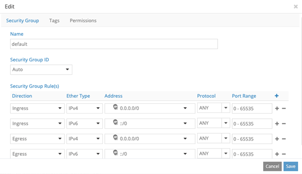

.. _installing-a-nested-red-hat-openshift-container-platform-311-cluster-using-tf-ansible-deployer:

Installing a Nested Red Hat OpenShift Container Platform 3.11 Cluster Using Tungsten Fabric Ansible Deployer
============================================================================================================

You can install a nested Red Hat OpenShift Container Platform 3.11
cluster along with Tungsten Fabric using Tungsten Fabric Ansible Deployer.

Prerequisites

Ensure that the following prerequisites are met for a successful
provisioning of a nested TF-OpenShift cluster.

-  The recommended system requirements are:

.. list-table:: 
   :header-rows: 1

   * - System Requirements
     - Master Node
     - Infrastructure Node
     - Compute Node
   * - CPU/RAM
     - 8 vCPU, 16 GB RAM
     - 16 vCPU, 64 GB RAM
     - As per OpenShift recommendations.
   * - Disk
     - 100 GB
     - 250 GB
     - 

-  A running Red Hat OpenStack Platform Director (RHOSPD) 13 cluster
   with TF. OpenShift TF release must be same as RHOSPD 13
   TF release.

-  RHOSPD environments require that the Tungsten Fabric vRouter, TF
   config and OpenStack keystone are in “internal-api” network. Modify
   the ServiceNetMap parameters in the ``contrail-services.yaml`` file
   to configure in “internal-api” network.

   ::

      parameter_defaults:
        ServiceNetMap:
          ContrailDatabaseNetwork: internal_api
          ContrailAnalyticsNetwork: internal_api
          ContrailAnalyticsAlarmNetwork: internal_api
          ContrailAnalyticsDatabaseNetwork: internal_api
          ContrailAnalyticsSnmpNetwork: internal_api
          ContrailConfigNetwork: internal_api
          ContrailControlNetwork: internal_api
          ContrailWebuiNetwork: internal_api
          ContrailVrouterNetwork: internal_api
          ContrailCertmongerUserNetwork: internal_api
          KeystoneAdminApiNetwork: internal_api

-  Ensure that the vRouter gateway in the ``contrail-services.yaml``
   file is part of “internal-api” network.

   ::

      # Custom TF container configuration settings
        ContrailSettings:
          VROUTER_GATEWAY: 10.1.0.254

-  OpenShift nodes (VMs) must have Internet connectivity.

-  Default security group of the virtual-network where OpenShift nodes
   are launched must be modified to allow all ingress traffic to
   communicate with OpenShift networks provided in the OpenShift
   inventory file.

   |image1|

Provisioning Nested OpenShift Cluster

Provisioning a nested OpenShift cluster is a two-step process.

1. Create link-local services in the TF-OpenStack cluster.

   A nested OpenShift cluster is managed by the same TF controller
   that manages the underlying OpenStack cluster. Hence, the nested
   Openshift cluster needs IP reachability to the TF controller
   and OpenStack keystone service. Since the OpenShift cluster is
   actually an overlay on the OpenStack cluster, we use the Link Local
   Service feature of TF to provide IP reachability to and from
   the overlay OpenShift cluster and OpenStack cluster.

   To configure a Link Local Service, we need a Fabric IP and Service
   IP. Fabric IP is the node IP on which the Tungsten Fabric Controller and
   OpenStack services are running. Service IP is a unique and unused IP
   in the entire OpenStack cluster and is shared with the OpenShift
   cluster to reach Tungsten Fabric Controller and OpenStack services. Service
   IP (along with port number) is used by the data plane to identify the
   fabric IP. For each node of the OpenStack cluster, one service IP
   must be identified.

   You must configure the following Link Local Services in TF.

   +-------------+-------------+-------------+-------------+-------------+
   | TF          | Service IP  | Service     | Fabric IP   | Fabric Port |
   | Controller  |             | Port        |             |             |
   | and         |             |             |             |             |
   | OpenStack   |             |             |             |             |
   | Process     |             |             |             |             |
   +-------------+-------------+-------------+-------------+-------------+
   | TF          | <Service IP | 8082        | <Node IP of | 8082        |
   | Config      | for the     |             | running     |             |
   |             | running     |             | node>       |             |
   |             | node>       |             |             |             |
   +-------------+-------------+-------------+-------------+-------------+
   | TF          | <Service IP | 8086        | <Node IP of | 8086        |
   | Analytics   | for the     |             | running     |             |
   |             | running     |             | node>       |             |
   |             | node>       |             |             |             |
   +-------------+-------------+-------------+-------------+-------------+
   | TF          | <Service IP | 5673        | <Node IP of | 5673        |
   | Msg Queue   | for the     |             | running     |             |
   |             | running     |             | node>       |             |
   |             | node>       |             |             |             |
   +-------------+-------------+-------------+-------------+-------------+
   | TF          | <Service IP | 9161        | <Node IP of | 9161        |
   | VNC DB      | for the     |             | running     |             |
   |             | running     |             | node>       |             |
   |             | node>       |             |             |             |
   +-------------+-------------+-------------+-------------+-------------+
   | Keystone    | <Service IP | 35357       | <Node IP of | 35357       |
   |             | for the     |             | running     |             |
   |             | running     |             | node>       |             |
   |             | node>       |             |             |             |
   +-------------+-------------+-------------+-------------+-------------+
   | K8s-c       | <Service IP | 9091        | <Node IP of | 9091        |
   | ni-to-agent | for the     |             | running     |             |
   |             | running     |             | node>       |             |
   |             | node>       |             |             |             |
   +-------------+-------------+-------------+-------------+-------------+

   For example, consider a sample cluster of seven nodes.

   ::

      Tungsten Fabric Config : 192.168.1.100
      Tungsten Fabric Analytics : 192.168.1.100, 192.168.1.101
      Tungsten Fabric Msg Queue : 192.168.1.100
      Tungsten Fabric VNC DB : 192.168.1.100, 192.168.1.101, 192.168.1.102
      Keystone: 192.168.1.200
      Vrouter: 192.168.1.201, 192.168.1.202, 192.168.1.203

   Allocate seven unused IP addresses for the seven nodes.

   ::

      192.168.1.100  --> 10.10.10.1
      192.168.1.101  --> 10.10.10.2
      192.168.1.102  --> 10.10.10.3
      192.168.1.200  --> 10.10.10.4
      192.168.1.201/192.168.1.202/192.168.1.203  --> 10.10.10.5 

   .. note::

      One Service IP address can represent all vRouter nodes.

   The following link-local services must be created:

   +-------------+------------+-------------+-------------+-------------+
   | TF          | Service IP | Service     | Fabric IP   | Fabric Port |
   | controller  |            | Port        |             |             |
   | and         |            |             |             |             |
   | OpenStack   |            |             |             |             |
   | process     |            |             |             |             |
   +-------------+------------+-------------+-------------+-------------+
   | TF          | 10.10.10.1 | 8082        | 19          | 8082        |
   | Config      |            |             | 2.168.1.100 |             |
   +-------------+------------+-------------+-------------+-------------+
   | TF          | 10.10.10.1 | 8086        | 19          | 8086        |
   | Analytics 1 |            |             | 2.168.1.100 |             |
   +-------------+------------+-------------+-------------+-------------+
   | TF          | 10.10.10.1 | 8086        | 19          | 8086        |
   | Analytics 2 |            |             | 2.168.1.101 |             |
   +-------------+------------+-------------+-------------+-------------+
   | TF          | 10.10.10.2 | 5673        | 19          | 5673        |
   | Msg Queue   |            |             | 2.168.1.100 |             |
   +-------------+------------+-------------+-------------+-------------+
   | TF          | 10.10.10.1 | 9161        | 19          | 9161        |
   | VNC DB 1    |            |             | 2.168.1.100 |             |
   +-------------+------------+-------------+-------------+-------------+
   | TF          | 10.10.10.2 | 9161        | 19          | 9161        |
   | VNC DB 2    |            |             | 2.168.1.101 |             |
   +-------------+------------+-------------+-------------+-------------+
   | TF          | 10.10.10.2 | 9161        | 19          | 9161        |
   | VNC DB 3    |            |             | 2.168.1.102 |             |
   +-------------+------------+-------------+-------------+-------------+
   | Keystone    | 10.10.10.4 | 35357       | 19          | 35357       |
   |             |            |             | 2.168.1.200 |             |
   +-------------+------------+-------------+-------------+-------------+
   | K8s-c       | 10.10.10.5 | 9091        | 127.0.0.1   | 9091        |
   | ni-to-agent |            |             |             |             |
   +-------------+------------+-------------+-------------+-------------+

2. Install OpenShift using OpenShift Ansible deployer.

   Perform the following steps to install the nested OpenShift 3.11
   cluster along with Tungsten Fabric using OpenShift Ansible
   deployer.

   1. 
      Set up environment nodes for RHEL OpenShift enterprise
      installations:

      1. Subscribe to RHEL.

         ``(all-nodes)# subscription-manager register --username <> --password <> --force``

      2. From the list of available subscriptions, find and attach the
         pool ID for the OpenShift Container Platform subscription.

         ``(all-nodes)# subscription-manager attach --pool=pool-ID``

      3. Disable all yum repositories.

         ``(all-nodes)# subscription-manager repos --disable="*"``

      4. Enable only the required repositories.

         ::

             (all-nodes)# subscription-manager repos \
                --enable="rhel-7-server-rpms" \
                --enable="rhel-7-server-extras-rpms" \
                --enable="rhel-7-server-ose-3.11-rpms" \
                --enable=rhel-7-fast-datapath-rpms \
                --enable="rhel-7-server-ansible-2.6-rpms"

      5. Install required packages, such as python-netaddr,
         iptables-services, and so on.

         ``(all-nodes)# yum install -y tcpdump wget git net-tools bind-utils yum-utils iptables-services bridge-utils bash-completion kexec-tools sos psacct python-netaddr openshift-ansible``

      .. note:: 
         
         CentOS OpenShift Origin installations are not supported.
   2. Get the files from the latest tar ball. Download the OpenShift
      Container Platform install package from Juniper software download
      site and modify the contents of the ``openshift-ansible``
      inventory file.

      1. Download Openshift Ansible
         (``contrail-ansible-deployer-release-tag.tgz``) installer from
         the Juniper software download site,
         https://www.juniper.net/support/downloads/?p=contrail#sw. See
         `README Access to Tungsten Fabric Registry
         20xx <https://www.juniper.net/documentation/en_US/contrail20/information-products/topic-collections/release-notes/readme-contrail-20.pdf>`__  
         for appropriate release tags.

      2. Copy the install package to the node from where Ansible is
         deployed. Ensure that the node has password-free access to the
         OpenShift primary and slave nodes.

         ``scp contrail-ansible-deployer-release-tag.tgz openshift-ansible-node:/root/``

      3. Log in to the Ansible node and untar the
         contrail-ansible-deployer-``release-tag``.tgz package.

         ``tar -xzvf  contrail-ansible-deployer-release-tag.tgz -C /root/``

      4. Verify the contents of the ``openshift-ansible`` directory.

         ``cd /root/openshift-ansible/``

      5. Modify the ``inventory/ose-install`` file to match your
         OpenShift environment.

         Populate the ``inventory/ose-install`` file with TF
         configuration parameters specific to your system. The following
         mandatory parameters must be set.

         ::

            contrail_version=1907
            contrail_container_tag=<>
            contrail_registry="hub.juniper.net/contrail"
            contrail_registry_username=<>
            contrail_registry_password=<>
            openshift_use_openshift_sdn=false
            os_sdn_network_plugin_name='cni'
            openshift_use_contrail=true

         .. note::

            The ``contrail_container_tag`` value for this release can be
            found in the `README Access to Tungsten Fabric Registry
            20xx <https://www.juniper.net/documentation/en_US/contrail20/information-products/topic-collections/release-notes/readme-contrail-20.pdf>`__  
            file.

      .. note::

         Juniper Networks recommends that you obtain the Ansible source
         files from the latest release.

         This procedure assumes that there is one primary node, one
         infrastructure node, and one compute node.

      ::

         master : server1 (1x.xx.xx.11)
         infrastructure : server2 (1x.xx.xx.22)
         compute : server3 (1x.xx.xx.33)

   3. Edit ``/etc/hosts`` to include all the nodes information.

      ::

         [root@server1]# cat /etc/hosts
         127.0.0.1   localhost localhost.localdomain localhost4 localhost4.localdomain4
         ::1         localhost localhost.localdomain localhost6 localhost6.localdomain6
         1x.xx.xx.100 puppet
         1x.xx.xx.11 server1.contrail.juniper.net server1
         1x.xx.xx.22 server2.contrail.juniper.net server2
         1x.xx.xx.33 server3.contrail.juniper.net server3

   4. Set up password-free SSH access to the Ansible node and all the
      nodes.

      ::

         ssh-keygen -t rsa
         ssh-copy-id root@1x.xx.xx.11
         ssh-copy-id root@1x.xx.xx.22
         ssh-copy-id root@1x.xx.xx.33

   5. Run Ansible playbook to install OpenShift Container Platform with
      TF. Before you run Ansible playbook, ensure that you have
      edited ``inventory/ose-install`` file.

      ::

         (ansible-node)# cd /root/openshift-ansible
         (ansible-node)# ansible-playbook -i inventory/ose-install playbooks/prerequisites.yml
         (ansible-node)# ansible-playbook -i inventory/ose-install playbooks/deploy_cluster.yml

      For a sample ``inventory/ose-install`` file, see `Sample
      inventory/ose-install
      File <install-nested-openshift-311-using-anible.html#sample_ose_install>`__.

   6. Create a password for the admin user to log in to the UI from the
      primary node.

      ::

         (master-node)# htpasswd /etc/origin/master/htpasswd admin

      .. note::

         If you are using a load balancer, you must manually copy the
         htpasswd file into all your primary nodes.

   7. Assign cluster-admin role to admin user.

      ::

         (master-node)# oc adm policy add-cluster-role-to-user cluster-admin admin
         (master-node)# oc login -u admin

   8. Open a Web browser and type the entire fqdn name of your primary
      node or load balancer node, followed by :8443/console.

      ::

         https://<your host name from your ose-install inventory>:8443/console

      Use the user name and password created in step
      `6 <install-nested-openshift-311-using-anible.html#loginpass>`__
      to log in to the Web console.

      Your DNS should resolve the host name for access. If the host name
      is not resolved, modify the /etc/hosts file to route to the above
      host.

   .. note::

      OpenShift 3.11 cluster upgrades are not supported.

**Sample inventory/ose-install File**

::

   [OSEv3:vars]

   ###########################################################################
   ### OpenShift Nested mode vars
   ###########################################################################
   nested_mode_contrail=true
   rabbitmq_node_port=5673
   contrail_nested_masters_ip="1.1.1.1 2.2.2.2 3.3.3.3"          <---  ips of TF controllers
   auth_mode=keystone
   keystone_auth_host=<w.x.y.z>        <--- This should be the IP where Keystone service is running.
   keystone_auth_admin_tenant=admin
   keystone_auth_admin_user=admin
   keystone_auth_admin_password=MAYffWrX7ZpPrV2AMAa9zAUvG     <-- Keystone admin password.
   keystone_auth_admin_port=35357
   keystone_auth_url_version=/v3
   #k8s_nested_vrouter_vip is a service IP for the running node which we configured above
   k8s_nested_vrouter_vip=10.10.10.5   <-- Service IP configured for CNI to Agent communication.(K8s-cni-to-agent in above examples)
   #k8s_vip is kubernetes api server ip
   k8s_vip=<W.X.Y.Z>                   <-- IP of the Openshift Master Node.
   #cluster_network is the one which vm network belongs to
   cluster_network="{'domain': 'default-domain', 'project': 'admin', 'name': 'net1'}" <-- FQName of the Virtual Network where Virtual Machines are running. The VMs in which Openshift cluster is being installed in nested mode.
   #config_nodes="x.x.x.x,y.y.y.y.y"
   #analytics_nodes="x.x.x.x,y.y.y.y.y"
   #config_api_vip=x.x.x.x
   #analytics_api_vip=x.x.x.x

   ###########################################################################
   ### OpenShift Basic Vars
   ###########################################################################
   openshift_deployment_type=openshift-enterprise
   deployment_type=openshift-enterprise
   containerized=false
   openshift_disable_check=docker_image_availability,memory_availability,package_availability,disk_availability,package_version,docker_storage

   # Default node selectors
   openshift_hosted_infra_selector="node-role.kubernetes.io/infra=true"

   oreg_auth_user=<>
   oreg_auth_password=<>

   ###########################################################################
   ### OpenShift Master Vars
   ###########################################################################

   openshift_master_api_port=8443
   openshift_master_console_port=8443
   openshift_master_cluster_method=native

   # Set this line to enable NFS
   openshift_enable_unsupported_configurations=True

   ###########################################################################
   ### OpenShift Network Vars
   ###########################################################################

   openshift_use_openshift_sdn=false
   os_sdn_network_plugin_name='cni'
   openshift_use_contrail=true

   ###########################################################################
   ### OpenShift Authentication Vars
   ###########################################################################

   # htpasswd Authentication
   openshift_master_identity_providers=[{'name': 'htpasswd_auth', 'login': 'true', 'challenge': 'true', 'kind': 'HTPasswdPasswordIdentityProvider'}]

   ###########################################################################
   ### OpenShift Router and Registry Vars
   ###########################################################################

   openshift_hosted_router_replicas=1
   openshift_hosted_registry_replicas=1

   openshift_hosted_registry_storage_kind=nfs
   openshift_hosted_registry_storage_access_modes=['ReadWriteMany']
   openshift_hosted_registry_storage_nfs_directory=/export
   openshift_hosted_registry_storage_nfs_options='*(rw,root_squash)'
   openshift_hosted_registry_storage_volume_name=registry
   openshift_hosted_registry_storage_volume_size=10Gi
   openshift_hosted_registry_pullthrough=true
   openshift_hosted_registry_acceptschema2=true
   openshift_hosted_registry_enforcequota=true
   openshift_hosted_router_selector="node-role.kubernetes.io/infra=true"
   openshift_hosted_registry_selector="node-role.kubernetes.io/infra=true"

   ###########################################################################
   ### OpenShift Service Catalog Vars
   ###########################################################################

   openshift_enable_service_catalog=True

   template_service_broker_install=True
   openshift_template_service_broker_namespaces=['openshift']

   ansible_service_broker_install=True

   openshift_hosted_etcd_storage_kind=nfs
   openshift_hosted_etcd_storage_nfs_options="*(rw,root_squash,sync,no_wdelay)"
   openshift_hosted_etcd_storage_nfs_directory=/export
   openshift_hosted_etcd_storage_labels={'storage': 'etcd-asb'}
   openshift_hosted_etcd_storage_volume_name=etcd-asb
   openshift_hosted_etcd_storage_access_modes=['ReadWriteOnce']
   openshift_hosted_etcd_storage_volume_size=2G

   ###########################################################################
   ### OpenShift Metrics and Logging Vars
   ###########################################################################
   # Enable cluster metrics
   openshift_metrics_install_metrics=True

   openshift_metrics_storage_kind=nfs
   openshift_metrics_storage_access_modes=['ReadWriteOnce']
   openshift_metrics_storage_nfs_directory=/export
   openshift_metrics_storage_nfs_options='*(rw,root_squash)'
   openshift_metrics_storage_volume_name=metrics
   openshift_metrics_storage_volume_size=2Gi
   openshift_metrics_storage_labels={'storage': 'metrics'}

   openshift_metrics_cassandra_nodeselector={"node-role.kubernetes.io/infra":"true"}
   openshift_metrics_hawkular_nodeselector={"node-role.kubernetes.io/infra":"true"}
   openshift_metrics_heapster_nodeselector={"node-role.kubernetes.io/infra":"true"}

   # Enable cluster logging. (( 
   ####openshift_logging_install_logging=True
   openshift_logging_install_logging=False
   #openshift_logging_storage_kind=nfs
   #openshift_logging_storage_access_modes=['ReadWriteOnce']
   #openshift_logging_storage_nfs_directory=/export
   #openshift_logging_storage_nfs_options='*(rw,root_squash)'
   #openshift_logging_storage_volume_name=logging
   #openshift_logging_storage_volume_size=5Gi
   #openshift_logging_storage_labels={'storage': 'logging'}
   #openshift_logging_es_cluster_size=1
   #openshift_logging_es_nodeselector={"node-role.kubernetes.io/infra":"true"}
   #openshift_logging_kibana_nodeselector={"node-role.kubernetes.io/infra":"true"}
   #openshift_logging_curator_nodeselector={"node-role.kubernetes.io/infra":"true"}

   ###########################################################################
   ### OpenShift Prometheus Vars
   ###########################################################################

   ## Add Prometheus Metrics:
   openshift_hosted_prometheus_deploy=True
   openshift_prometheus_node_selector={"node-role.kubernetes.io/infra":"true"}
   openshift_prometheus_namespace=openshift-metrics

   # Prometheus
   openshift_prometheus_storage_kind=nfs
   openshift_prometheus_storage_access_modes=['ReadWriteOnce']
   openshift_prometheus_storage_nfs_directory=/export
   openshift_prometheus_storage_nfs_options='*(rw,root_squash)'
   openshift_prometheus_storage_volume_name=prometheus
   openshift_prometheus_storage_volume_size=1Gi
   openshift_prometheus_storage_labels={'storage': 'prometheus'}
   openshift_prometheus_storage_type='pvc'

   # For prometheus-alertmanager
   openshift_prometheus_alertmanager_storage_kind=nfs
   openshift_prometheus_alertmanager_storage_access_modes=['ReadWriteOnce']
   openshift_prometheus_alertmanager_storage_nfs_directory=/export
   openshift_prometheus_alertmanager_storage_nfs_options='*(rw,root_squash)'
   openshift_prometheus_alertmanager_storage_volume_name=prometheus-alertmanager
   openshift_prometheus_alertmanager_storage_volume_size=1Gi
   openshift_prometheus_alertmanager_storage_labels={'storage': 'prometheus-alertmanager'}
   openshift_prometheus_alertmanager_storage_type='pvc'

   # For prometheus-alertbuffer
   openshift_prometheus_alertbuffer_storage_kind=nfs
   openshift_prometheus_alertbuffer_storage_access_modes=['ReadWriteOnce']
   openshift_prometheus_alertbuffer_storage_nfs_directory=/export
   openshift_prometheus_alertbuffer_storage_nfs_options='*(rw,root_squash)'
   openshift_prometheus_alertbuffer_storage_volume_name=prometheus-alertbuffer
   openshift_prometheus_alertbuffer_storage_volume_size=1Gi
   openshift_prometheus_alertbuffer_storage_labels={'storage': 'prometheus-alertbuffer'}
   openshift_prometheus_alertbuffer_storage_type='pvc'

   #########################################################################
   ### Openshift HA
   #########################################################################

   # Openshift HA
   openshift_master_cluster_hostname=load-balancer-0-3eba0c20dc494dfc93d5d50d06bbde89
   openshift_master_cluster_public_hostname=load-balancer-0-3eba0c20dc494dfc93d5d50d06bbde89

   #########################################################################
   ### TF Variables
   ########################################################################

   service_subnets="172.30.0.0/16"
   pod_subnets="10.128.0.0/14"

   # Below are TF variables. Comment them out if you don't want to install Contrail through ansible-playbook
   contrail_version=1907
   contrail_container_tag=<>
   contrail_registry=hub.juniper.net/contrail
   contrail_registry_username=<>
   contrail_registry_password=<>
   openshift_docker_insecure_registries=hub.juniper.net/contrail
   contrail_nodes=[10.0.0.5,10.0.0.3,10.0.0.4]
   vrouter_physical_interface=eth0

   ###########################################################################
   ### OpenShift Hosts
   ###########################################################################
   [OSEv3:children]
   masters
   etcd
   nodes
   lb
   nfs
   openshift_ca

   [masters]
   kube-master-2-3eba0c20dc494dfc93d5d50d06bbde89
   kube-master-1-3eba0c20dc494dfc93d5d50d06bbde89
   kube-master-0-3eba0c20dc494dfc93d5d50d06bbde89

   [etcd]
   kube-master-2-3eba0c20dc494dfc93d5d50d06bbde89
   kube-master-1-3eba0c20dc494dfc93d5d50d06bbde89
   kube-master-0-3eba0c20dc494dfc93d5d50d06bbde89

   [lb]
   load-balancer-0-3eba0c20dc494dfc93d5d50d06bbde89

   [nodes]
   kube-master-2-3eba0c20dc494dfc93d5d50d06bbde89 openshift_node_group_name='node-config-master'
   controller-0-3eba0c20dc494dfc93d5d50d06bbde89 openshift_node_group_name='node-config-infra'
   compute-1-3eba0c20dc494dfc93d5d50d06bbde89 openshift_node_group_name='node-config-compute'
   controller-2-3eba0c20dc494dfc93d5d50d06bbde89 openshift_node_group_name='node-config-infra'
   kube-master-1-3eba0c20dc494dfc93d5d50d06bbde89 openshift_node_group_name='node-config-master'
   kube-master-0-3eba0c20dc494dfc93d5d50d06bbde89 openshift_node_group_name='node-config-master'
   compute-0-3eba0c20dc494dfc93d5d50d06bbde89 openshift_node_group_name='node-config-compute'
   controller-1-3eba0c20dc494dfc93d5d50d06bbde89 openshift_node_group_name='node-config-infra'

   [nfs]
   load-balancer-0-3eba0c20dc494dfc93d5d50d06bbde89

   [openshift_ca]
   kube-master-2-3eba0c20dc494dfc93d5d50d06bbde89
   kube-master-1-3eba0c20dc494dfc93d5d50d06bbde89
   kube-master-0-3eba0c20dc494dfc93d5d50d06bbde89

.. note::

   The /etc/resolv.conf must have write permissions.

