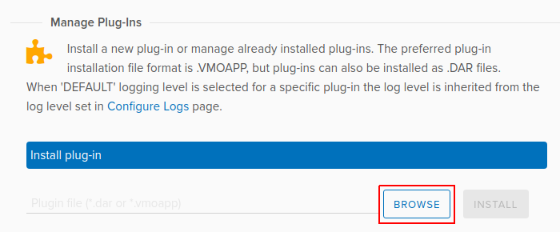

Installing and Provisioning TF VMware vRealize Orchestrator Plugin
==================================================================

:date: 2019-08-09

A dedicated TF plugin is used to connect to VMware vRealize
Orchestrator (vRO). TF Release 5.0 supported a Beta version of the
plugin. Starting with TF Release 5.1, a fully supported version of
the plugin is available.

You must install the TF VMware vRealize Orchestrator (vRO) plugin
to connect to the vRO server.

Before you begin installation, ensure the following:

-  You have administrator-level access to the Control Center of a
   deployed vRO appliance.

-  You know the host name (*{vRO}*) of the deployed vRO Appliance.

-  You have the login credentials of the vCenter SSO service.

-  You have downloaded the vRO plugin package file to your local system.

   You can download the plugin from
   https://www.juniper.net/support/downloads/?p=contrail.

You can deploy the TF plugin in any Java Virtual Machine (JVM)
compatible environment and load it on an active vRO instance.

The following topics describe how to install and provision the TF
vRO plugin.

Accessing vRO Control Center
----------------------------

Follow the steps given below to access and log in to vRO Control Center:

1. To access vRO Control Center through a Web browser, navigate to the
   https://{vRO}:8283/vco-controlcenter URL.

   .. note::

      Replace *{vRO}* given in the URL with the *host name* of the deployed
      vRO Appliance.

      The *host name* is the IP address or the FQDN of the vRO node.

   The :guilabel:`vCenter SSO` service page is displayed.

   |Figure 1: vCenter SSO service page|

2. On the vCenter SSO service page, enter the **User name** and
   **Password** in the respective fields and click :guilabel:`Login`. 

   The :guilabel:`Orchestrator Control Center` home page is displayed.

   |Figure 2: Orchestrator Control Center|

Installing vRO Plugin
---------------------

Perform the following steps to install the vRO plugin:

1. Upload vRO plugin package.

   To upload vRO plugin package:

   -  From the Orchestrator Control Center home page, click :guilabel:`Manage
      Plug-Ins` under the :guilabel:`Plug-Ins` section.

      The :guilabel:`Manage Plug-Ins` page is displayed.

      |Figure 3: Manage Plug-Ins page|

      .. note::

         You can install a new plugin or manage an already installed plugin
         from the Manage Plug-Ins page.

      .. note::

         ``*.vmoapp`` or ``*.dar`` file format can be used. Also, the
         version in this example may be different from the version you have
         downloaded.

   -  Click :guilabel:`Browse` in the :guilabel:`Install plug-in` pane and select the
      downloaded vRO plugin package file on your local system.

   -  After you select vRO plugin package file, click :guilabel:`Install` to
      upload the vRO plugin package to the vRO server.

      The :guilabel:`EULA` page is displayed.

      |Figure 4: EULA page|

2. Install vRO plugin.

   After you upload the vRO plugin package, select :guilabel:`Accept EULA` on
   the :guilabel:`EULA` page and then click :guilabel:`Install`.

   .. Note::

      If you use ``*.vmoapp`` file format, you are directed to the Accept
      EULA page before you proceed with the installation.

      If you use ``*.dar`` file format, you can directly proceed with installation.

   The vRO plugin is installed.

Accessing vRO Desktop Client
----------------------------

After you install the VMware vRealize Orchestrator (vRO) plugin,
download vRealize Orchestrator Client version 7.3.0 to access the vRO
server.

To download and install the vRO desktop client application, click
https://{vRO}:8281/vco/.

.. note::

   Replace *{vRO}* given in the URL with the *host name* of the deployed
   vRO Appliance.

|Figure 5: Getting Started with vRealize Orchestrator|

You can download vRO desktop client applications for Windows, Mac OS X,
and Linux operating systems.

Connecting to vRO using the Desktop Client
------------------------------------------

You connect to the vRO server by using the vRO desktop client.

1. Start the vRO desktop client.

   The :guilabel:`VMware vRealize Orchestrator Login` page is displayed.

   |Figure 6: VMware vRealize Orchestrator Login page|

2. In the VMware vRealize Orchestrator Login page, enter **Host name**,
   **User name**, and **Password**.

   .. note::

      The **Host name** also includes the port number and must be in the
      **{vRO}:8281** format.

3. Click :guilabel:`Login` to connect to the vRO server.

Connecting to Tungsten Fabric Controller
----------------------------------------

To connect TF vRO to the Tungsten Fabric Controller:

1. Navigate to the :menuselection:`Contrail > Configuration` folder in the workflow
   library. 

2. Select :guilabel:`Create TF controller connection`.

   |Figure 7: Workflow Library|

3. Click the :guilabel:`Controller` tab and enter the following information:

   -  **Connection name**—a unique name to identify the connection

   -  **Controller host**—host name of the TF Connector

   -  **Controller port**—port used to access the Tungsten Fabric Controller

   |Figure 8: Controller Tab|

4. Click the :guilabel:`Credentials` tab and enter the following credentials to
   manage the Tungsten Fabric Controller:

   -  **User name**—user name to access the Tungsten Fabric Controller

   -  **User password**—password to access the Tungsten Fabric Controller

   -  **Authentication server**—URL of the authentication server

   |Figure 9: Credentials Tab|

5. Click the :guilabel:`Tenant` tab to define tenant information.

   In the :guilabel:`Tenant` field, enter the name of the TF tenant.

   |Figure 10: Tenant Tab|

6. Click :guilabel:`Submit` to establish connection.

   Once you connect TF vRO to the Tungsten Fabric Controller, you use
   TF workflows to make configuration changes to TF.

Deploying TF vRO plugin
-----------------------

You can deploy the TF plugin in any Java Virtual Machine (JVM)
compatible environment and load it on an active vRO instance.

.. |Figure 1: vCenter SSO service page| image:: images/s007052.png
.. |Figure 2: Orchestrator Control Center| image:: images/s007053.png

.. |Figure 4: EULA page| image:: images/s007055.png
.. |Figure 5: Getting Started with vRealize Orchestrator| image:: images/s007056.png
.. |Figure 6: VMware vRealize Orchestrator Login page| image:: images/s007057.png
.. |Figure 7: Workflow Library| image:: images/s007058.png
.. |Figure 8: Controller Tab| image:: images/s007059.png
.. |Figure 9: Credentials Tab| image:: images/s007060.png
.. |Figure 10: Tenant Tab| image:: images/s007061.png