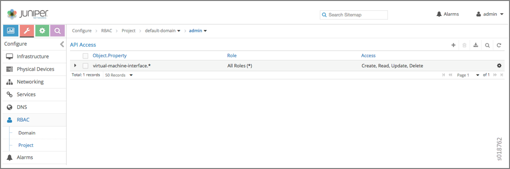

Configuring Role and Resource-Based Access Control
==================================================

Tungsten Fabric Role and Resource-Based Access (RBAC) Overview
--------------------------------------------------------------

Tungsten Fabric supports role and resource-based access control
(RBAC) with API operation-level access control.

The RBAC implementation relies on user credentials obtained from
Keystone from a token present in an API request. Credentials include
user, role, tenant, and domain information.

API-level access is controlled by a list of rules. The attachment points
for the rules include ``global-system-config``, domain, and project.
Resource-level access is controlled by permissions embedded in the
object.

API-Level Access Control
------------------------

If the RBAC feature is enabled, the API server requires a valid token to
be present in the ``X-Auth-Token`` of any incoming request. The API
server trades the token for user credentials (role, domain, project, and
so on) from Keystone.

If a token is missing or is invalid, an HTTP error 401 is returned.

The ``api-access-list`` object holds access rules of the following form:

``<object, field> => list of <role:CRUD>``

Where:

- ``object`` —An API resource such as network or subnet.

- ``field`` —Any property or reference within the resource. The
``field`` option can be multilevel, for example,
``network.ipam.host-routes`` can be used to identify multiple levels.
The ``field`` is optional, so in its absence, the create, read, update,
and delete (CRUD) operation refers to the entire resource.

- ``role`` —The Keystone role name.

Each rule also specifies the list of roles and their corresponding
permissions as a subset of the CRUD operations.

Example: ACL RBAC Object
~~~~~~~~~~~~~~~~~~~~~~~~

The following is an example access control list (ACL) object for a
project in which the admin and any users with the ``Development`` role
can perform CRUD operations on the network in a project. However, only
the ``admin`` role can perform CRUD operations for policy and IP address
management (IPAM) inside a network.

::

   <virtual-network, network-policy> => admin:CRUD

    <virtual-network, network-ipam> => admin:CRUD

    <virtual-network, *>    => admin:CRUD, Development:CRUD

Rule Sets and ACL Objects
~~~~~~~~~~~~~~~~~~~~~~~~~

The following are the features of rule sets for access control objects
in TF.

-  The rule set for validation is the union of rules from the ACL
   attached to:

   -  User project

   -  User domain

   -  Default domain

      It is possible for the project or domain access object to be
      empty.

-  Access is only granted if a rule in the combined rule set allows
   access.

-  There is no explicit deny rule.

-  An ACL object can be shared within a domain. Therefore, multiple
   projects can point to the same ACL object. You can make an ACL object
   the default.

Object Level Access Control
---------------------------

The ``perms2`` permission property of an object allows fine-grained
access control per resource.

The ``perms2`` property has the following fields:

- ``owner`` — This field is populated at the time of creation with the
tenant UUID value extracted from the token.

- ``share list`` — The share list gets built when the object is selected
for sharing with other users. It is a list of tuples with which the
object is shared.

The ``permission`` field has the following options:

-  ``R``—Read object

-  ``W``—Create or update object

-  ``X``—Link (refer to) object

Access is allowed as follows:

-  If the user is the owner and permissions allow (rwx)

-  Or if the user tenant is in a shared list and permissions allow

-  Or if world access is allowed

Configuration
-------------
This section describes the parameters used in TF RBAC.

Parameter: aaa-mode
~~~~~~~~~~~~~~~~~~~

RBAC is controlled by a parameter named ``aaa-mode``. This parameter is
used in place of the multi-tenancy parameter of previous releases.

The ``aaa-mode`` can be set to the following values:

-  ``no-auth``—No authentication is performed and full access is granted
   to all.

-  ``cloud-admin``—Authentication is performed and only the admin role
   has access.

-  ``rbac``—Authentication is performed and access is granted based on
   role.

   If you are using TF Ansible Deployer to provision Tungsten Fabric,
   set the value for AAA_MODE to rbac to enable RBAC by default.

   ::

      contrail_configuration:
        .
        .
        .
        AAA_MODE: rbac

After enabling RBAC, you must restart the neutron server by running the
service neutron-server restart command for the changes to take effect.

.. note::

   The ``multi_tenancy`` parameter is deprecated, starting with Tungsten Fabric
   3.0. The parameter should be removed from the configuration. Instead,
   use the ``aaa_mode`` parameter for RBAC to take effect.

If the ``multi_tenancy`` parameter is not removed, the ``aaa-mode``
setting is ignored.

Parameter: cloud_admin_role
~~~~~~~~~~~~~~~~~~~~~~~~~~~

A user who is assigned the ``cloud_admin_role`` has full access to
everything.

This role name is configured with the ``cloud_admin_role`` parameter in
the API server. The default setting for the parameter is ``admin``. This
role must be configured in Keystone to change the default value.

If a user has the ``cloud_admin_role`` in one tenant, and the user has a
role in other tenants, then the ``cloud_admin_role`` role must be
included in the other tenants. A user with the ``cloud_admin_role``
doesn't need to have a role in all tenants, however, if that user has
any role in another tenant, that tenant must include the
``cloud_admin_role``.

Configuration Files with Cloud Admin Credentials
^^^^^^^^^^^^^^^^^^^^^^^^^^^^^^^^^^^^^^^^^^^^^^^^

The following configuration files contain ``cloud_admin_role``
credentials:

-  ``/etc/contrail/contrail-keystone-auth.conf``

-  ``/etc/neutron/plugins/opencontrail/ContrailPlugin.ini``

-  ``/etc/contrail/contrail-webui-userauth.js``

Changing Cloud Admin Configuration Files
^^^^^^^^^^^^^^^^^^^^^^^^^^^^^^^^^^^^^^^^

Modify the cloud admin credential files if the ``cloud_admin_role`` role
is changed.

1. Change the configuration files with the new information.
2. Restart the following:

   -  API server

      ``service supervisor-config restart``

   -  Neutron server

      ``service neutron-server restart``

   -  WebUI

      ``service supervisor-webui restart``

Global Read-Only Role
~~~~~~~~~~~~~~~~~~~~~

You can configure a global read-only role (``global_read_only_role``).

A ``global_read_only_role`` allows read-only access to all TF
resources. The ``global_read_only_role`` must be configured in Keystone.
The default ``global_read_only_role`` is not set to any value.

A ``global_read_only_role`` user can use the Tungsten Fabric WebUI to view the
global configuration of TF default settings.

Setting the Global Read-Only Role
^^^^^^^^^^^^^^^^^^^^^^^^^^^^^^^^^

To set the global read-only role:

1. The ``cloud_admin`` user sets the ``global_read_only_role`` in the
   Tungsten Fabric API:

   ``/etc/contrail/contrail-api.conf``

   ``global_read_only_role = <new-admin-read-role>``

2. Restart the ``contrail-api``\ service:

   ``service contrail-api restart``

.. _parameter-changes-in-etcneutronapi-pasteini:

Parameter Changes in /etc/neutron/api-paste.ini
~~~~~~~~~~~~~~~~~~~~~~~~~~~~~~~~~~~~~~~~~~~~~~~

TF RBAC operation is based upon a user token received in the
``X-Auth-Token`` header in API requests. The following change must be
made in ``/etc/neutron/api-paste.ini`` to force Neutron to pass the user
token in requests to the Tungsten Fabric API server:
::

   keystone = user_token request_id catch_errors ....
   ...
   ...
   [filter:user_token]
   paste.filter_factory = neutron_plugin_contrail.plugins.opencontrail.neutron_middleware:token_factory
Upgrading from Previous Releases
--------------------------------

The ``multi_tenancy`` parameter is deprecated.. The parameter should be
removed from the configuration. Instead, use the ``aaa_mode`` parameter
for RBAC to take effect.

If the ``multi_tenancy`` parameter is not removed, the ``aaa-mode``
setting is ignored.

Configuring RBAC Using the Tungsten Fabric WebUI
--------------------------------------------------

To use the TF WebUI with RBAC:

1. Set the aaa_mode to no_auth.

   ``/etc/contrail/contrail-analytics-api.conf``

   ``aaa_mode = no-auth``

2. Restart the ``analytics-api`` service.

   ``service contrail-analytics-api restart``

3. Restart services by restarting the container.

You can use the TF WebUI to configure RBAC at both the API level and
the object level. API level access control can be configured at the
global, domain, and project levels. Object level access is available
from most of the create or edit screens in the TF WebUI.

Configuring RBAC at the Global Level
~~~~~~~~~~~~~~~~~~~~~~~~~~~~~~~~~~~~

To configure RBAC at the global level, navigate to :menuselection:`Configure >
Infrastructure > Global Config > RBAC`.

|Figure 1: RBAC Global Level|

Configuring RBAC at the Domain Level
~~~~~~~~~~~~~~~~~~~~~~~~~~~~~~~~~~~~

To configure RBAC at the domain level, navigate to :menuselection:`Configure > RBAC >
Domain`.

|Figure 2: RBAC Domain Level|

Configuring RBAC at the Project Level
~~~~~~~~~~~~~~~~~~~~~~~~~~~~~~~~~~~~~

To configure RBAC at the project level, navigate to :menuselection:`Configure > RBAC >
Project`.

|Figure 3: RBAC Project Level|

Configuring RBAC Details
~~~~~~~~~~~~~~~~~~~~~~~~

Configuring RBAC is similar at all of the levels. To add or edit an API
access list, navigate to the global, domain, or project page, then click
the plus (+) icon to add a list, or click the gear icon to select from
Edit, Insert After, or Delete.

|Figure 4: RBAC Details API Access|

Creating or Editing API Level Access
^^^^^^^^^^^^^^^^^^^^^^^^^^^^^^^^^^^^

Clicking create, edit, or insert after activates the Edit API Access
popup window, where you enter the details for the API Access Rules.
Enter the user type in the Role field, and use the :guilabel:`+` icon in the
Access filed to enter the types of access allowed for the role,
including, Create, Read, Update, Delete, and so on.

|Figure 5: Edit API Access|

Creating or Editing Object Level Access
^^^^^^^^^^^^^^^^^^^^^^^^^^^^^^^^^^^^^^^

You can configure fine-grained access control by resource. A
:guilabel:`Permissions` tab is available on all create or edit popups for
resources. Use the :guilabel:`Permissions` popup to configure owner permissions
and global share permissions. You can also share the resource to other
tenants by configuring it in the :guilabel:`Share List`.

|Figure 6: Edit Object Level Access|

RBAC Resources
--------------

Refer to the OpenStack Administrator Guide for additional information
about RBAC:

-  `Identity API protection with role-based access control
   (RBAC) <http://docs.openstack.org/admin-guide-cloud/content/identity-service-api-protection-with-role-based-access-control.html>`__

 

.. |Figure 1: RBAC Global Level| image:: images/s018760.png
.. |Figure 2: RBAC Domain Level| image:: images/s018761.png

.. |Figure 4: RBAC Details API Access| image:: images/s018763.png
.. |Figure 5: Edit API Access| image:: images/s018764.png
.. |Figure 6: Edit Object Level Access| image:: images/s018765.png
