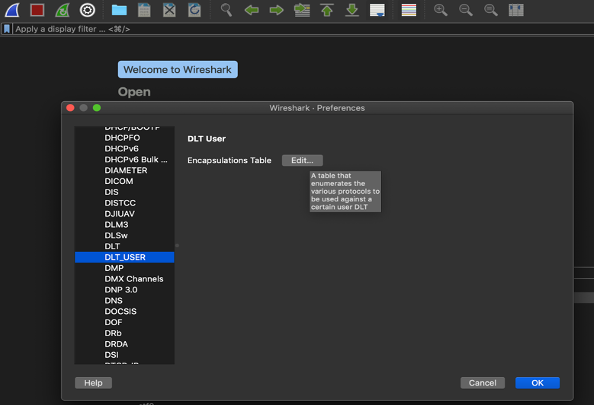
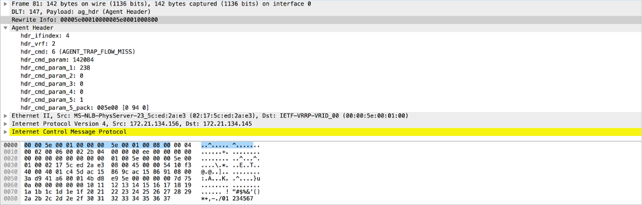

Using the Wireshark Plugin to Analyze Packets Between vRouter and vRouter Agent on pkt0 Interface
=================================================================================================

:data: 2020-12-04 

Wireshark is a an application that analyzes packets from a network and
displays the packet information in detail.

Tungsten Fabric Release 2008 and later supports the Wireshark
``agent_header.lua`` plugin, which enables you to capture and analyze
the packets exchanged between a vRouter data plane and vRouter agent.
You can capture the packets by executing the vifdump -i 2 and the
tcpdump -i pkt0 commands in DPDK mode and kernel mode respectively. In
release 2008, the Wireshark agent_header.lua plugin is supported on
Macintosh OS computers only. .Starting from release 2011, the Wireshark
``agent_header.lua`` plugin is supported on Macintosh OS as well as
Windows OS computers. Wireshark also enables you to add agent header
information to the captured packets.

Before you begin

You must ensure that the Wireshark application is installed on your
computer. You can download Wireshark from the `Download
Wireshark <https://www.wireshark.org/#download>`__ page.

Configuration

Follow these steps to configure the Wireshark plugin and dissect agent
header information in a packet:

1. Download the Wireshark plugin from GitHub:
   https://github.com/tungstenfabric/tf-vrouter/tree/master/utils/agent_hdr_plugin.

2. Copy the plugin in to the following Wireshark directory on your
   Macintosh OS computer:
   ``/Applications/Wireshark.app/Contents/PlugIns/wireshark/``.

3. Verify that the ``agent_hdr.lua`` plugin is loaded successfully in
   Wireshark. Relaunch Wireshark and navigate to :menuselection:`Wireshark > About
   Wireshark > Plugins` to verify that the plugin is loaded in the
   **Plugins** section.

   |Figure 1: The Plugin is Loaded in Wireshark|

4. Pass the pcap file through editcap to add a custom encapsulation type
   for a packet:

   ``editcap -T user0 <pcap-file-to-be-read> <output.pcap>``

5. In Wireshark, navigate to :menuselection:`Wireshark > Preferences >
   Protocols > DLT_USER > Edit Encapsulation Table`. 

   |Figure 2: Edit Encapsulation Table|

6. In the **Edit Encapsulation Table**, add the ``agent_hdr`` as a
   payload protocol for the packet. 

   |Figure 3: Add Agent Header to a Packet|

7. Using Wireshark, open the modified pcap file you generated in step 4.
   Wireshark displays the parsed packets. 

   |Figure 4: Packets Expanded Using the Wireshark Plugin|

Follow these steps to configure the Wireshark plugin in a Windows OS
computer and dissect agent header information in a packet:

1. Download the Wireshark plugin from GitHub:
   https://github.com/tungstenfabric/tf-vrouter/tree/master/utils/agent_hdr_plugin.

2. If you are using Windows 32-bit OS, copy the plugin in to the
   following Wireshark directory on your computer:
   ``C:\Program Files (x86)\Wireshark\``.

   If you are using Windows 64-bit OS, copy the plugin in to the
   following Wireshark directory on your computer:
   ``C:\Program Files\Wireshark\plugins\``.

3. Verify that the ``agent_hdr.lua`` plugin is loaded successfully in
   Wireshark. Relaunch Wireshark and navigate to :menuselection:`Help > About
   Wireshark > Plugins` to verify that the plugin is loaded in the
   **Plugins** section.

4. Open command prompt in Run as administrator mode and navigate to
   ``C:\Program Files\Wireshark`` to use editcap. Pass the pcap file
   through editcap to add a custom encapsulation type for a packet:

   ``editcap -T user0 <pcap-file-to-be-read> <output.pcap>``

5. In Wireshark, navigate to :menuselection:`Edit > Preferences > Protocols
   > DLT_USER > Edit Encapsulation Table`.

6. In the **Edit Encapsulation Table**, add the ``agent_hdr`` as a
   payload protocol for the packet. See .

7. Using Wireshark, open the modified pcap file you generated in step 4.
   Wireshark displays the parsed packets.

The ``agent_header.lua`` plugin is also available in contrail-tools
container. You must perform the following steps to use the plugin from
the contrail-tools container:

1. Log in to vRouter as a root user.

2. Use the following command to view the summary of eachpacket in the
   pcap file:

   tshark3_2 -nr <pcap file> -o "uat:user_dlts:\"User
   0(DLT=147)\",\"ag_hdr\",\"0\",\"\",\"0\",\"\"" -t ad

3. Use the following command to view detailed informationof the packets
   in the pcap file:

   tshark3_2 -nr <pcap file> -o "uat:user_dlts:\"User0
   (DLT=147)\",\"ag_hdr\",\"0\",\"\",\"0\",\"\"" -T pdml

.. list-table:: Release History Table
      :header-rows: 1

      * - Release
        - Description
      * - 2011
        - Starting from release 2011, the Wireshark ``agent_header.lua`` plugin is 
          supported on Macintosh OS as well as Windows OS computers.
      * - 2011
        - Tungsten Fabric Release 2008 and later supports the Wireshark 
          ``agent_header.lua`` plugin, which enables you to capture and analyze
          the packets exchanged between a vRouter data plane and vRouter agent.

.. |Figure 1: The Plugin is Loaded in Wireshark| image:: images/s060265.png

.. |Figure 3: Add Agent Header to a Packet| image:: images/s060267.png

