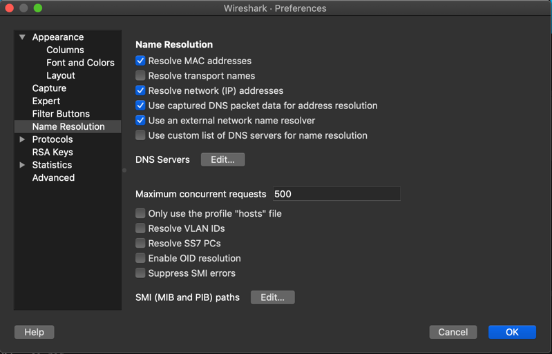

Using Sandump Tool​
===================

:date: 2020-11-10

Starting with Tungsten Fabric Release 2008, *Sandump* tool is
available in contrail-tools container. You can use the *Sandump* tool on
macOS machines.

Sandump tool captures the Sandesh messages from netlink connection
between Agent and vRouter (only DPDK mode) and provides interpretation
of all the captured bytes.​

Starting with Tungsten Fabric Release 2011, you can use *Sandump*
tool on Windows machines.

Sandesh is a southbound interface protocol based on Apache Thrift, to
send analytics data such as system logs, object logs, UVEs, and flow logs.

You can analyze the captured bytes in Wireshark. The Wireshark plugin
parses the hex dumps of all Sandesh objects. You must use Wireshark
Release 3.2 and later.

You must have Wireshark application installed on your machine. You can
download Wireshark from the `Download
Wireshark <https://www.wireshark.org/#download>`__ page.

For more details on Wireshark, see https://www.wireshark.org/docs/.

Follow the procedure to use Sandump tool:

1. Run the ``sandump`` command. It gives summary of each message which
   is being transferred between the agent and the vRouter.​

   ``(vrouter-agent-dpdk)[root]$ ./sandump -h``

   ::

      Sandump - Sandesh dump utility
      Usage:
             ./sandump -w <filename> [filename to write the sandesh packets]
             ./sandump -c <filename> [force cleanup]
      (vrouter-agent-dpdk)[root]$                                 
2. Copy the output into a file.

   ``(vrouter-agent-dpdk)[root]$ ./sandump -w <filename>.pcap``

   ::

      Dumping into <filename>.pcap
      Running as user "root" and group "root". This could be dangerous.
      Capturing on 'lo'
      12 ^C
      ./sandump: closing...
      (vrouter-agent-dpdk)[root]$

   The command generates a file which contains sniffed bytes converted
   in to the pcap format.

3. Analyze the captured packets transferred between the agent and the
   vRouter.

   ``(vrouter-agent-dpdk)[root]$ ./sandump``

   ::

      Running as user "root" and group "root". This could be dangerous.
      Capturing on 'lo'
          1 2020-08-04 09:51:01.233639252        Agent → Vrouter      Vif 790  Operation: Dump  Type: Host  ID: 0 
          2 2020-08-04 09:51:01.251279611      Vrouter → Agent        Response, Vif 3966  Response: 0x0000000, Multiple  vr_interface_req
          3 2020-08-04 09:51:33.290323560        Agent → Vrouter      Mem Stats 869  Operation: Get 
          4 2020-08-04 09:51:33.290964111      Vrouter → Agent        Response, Mem Stats 899  Response: 0x00000000  
          5 2020-08-04 09:51:46.175797696        Agent → Vrouter      Info 137  ID: 0 Operation: Dump 
          6 2020-08-04 09:51:46.176494123      Vrouter → Agent        Response, Info 1949  Response: 0x00000001  ID: 0 
          7 2020-08-04 09:51:58.920197081        Agent → Vrouter      Nexthop 280   Nexthop ID: 0 Operation: Dump 
          8 2020-08-04 09:51:58.920905495      Vrouter → Agent        Response, Nexthop 3898  Response: 0x4000001, Multiple  vr_nexthop_req
          9 2020-08-04 09:51:58.922297667        Agent → Vrouter      Nexthop 280   Nexthop ID: 0 Operation: Dump 
         10 2020-08-04 09:51:58.922425514      Vrouter → Agent        Response, Nexthop 3930  Response: 0x4000001, Multiple  vr_nexthop_req
         11 2020-08-04 09:51:58.923525453        Agent → Vrouter      Nexthop 280   Nexthop ID: 0 Operation: Dump 
         12 2020-08-04 09:51:58.926925821      Vrouter → Agent        Response, Nexthop 792  Response: 0x0000000, Multiple  vr_nexthop_req
      ^C12 packets captured
      ./sandump: closing...
      (vrouter-agent-dpdk)[root]$ 

4. Analyze the pcap file in WireShark.

   -  Follow the procedure to analyze the packets in Wireshark for
      Windows OS.

      1. Download the ``sandump_wireshark_plugin`` folder from the
         https://github.com/tungstenfabric/tf-vrouter/tree/master/utils/sandump
         repository.

      2. Copy the ``sandump_wireshark_plugin/main.lua`` file in
         ``C:\Program Files\Wireshark\plugins\`` folder.

         Create new lua folder in ``C:\Program Files\Wireshark\`` and
         copy the rest of the lua files present in
         ``sandump_wireshark_plugin`` folder to the newly created lua
         folder.

         .. note::

            Wireshark installation directory for 32-bit Windows is present
            in ``C:\Program Files (x86)\Wireshark\``\ and for 64-bit
            Windows is present in ``C:\Program Files\Wireshark\``.

      3. Run Notepad as administrator and open
         ``C:/Windows/System32/drivers/etc/hosts`` file.

      4. ​​​​​​​Add the host names with the following details:

         -  Agent IP address—0.0.0.0

         -  vRouter IP address—1.1.1.1

         Figure 1 shows the host file with the required IP addresses.

         |Figure 1: host file|

      5. Open the pcap file generated from Sandump tool for further
         debugging in Wireshark.

         |Figure 2: File debugging in Wireshark|

   -  Follow the procedure to analyze the packets in Wireshark for
      macOS.

      1. Download the ``sandump_wireshark_plugin`` folder from the
         https://github.com/tungstenfabric/tf-vrouter/tree/master/utils/sandump
         repository.

      2. Copy the ``sandump_wireshark_plugin`` folder in
         ``/Applications/Wireshark.app/Contents/PlugIns/wireshark``
         directory which is also know as *Global Lua Plugins* directory.

      3. Un-comment the ``package.prepend_path(…)`` line in main.lua,
         common.lua and helpers.lua files found in
         ``sandump_wireshark_plugin`` folder.

      4. Navigate to :menuselection:`Wireshark > About Wireshark > Folders >
         Personal configuration` to edit the configuration.

      5. ​​​​​​​Create hosts file in the **Personal configuration**
         directory and add the host names with the following details:

         -  Agent IP address—0.0.0.0

         -  vRouter IP address—1.1.1.1

         Figure 3 shows the host file with the required IP addresses.

         |Figure 3: host file|

      6. Navigate to :menuselection:`Wireshark > Preferences > Name Resolution` and
         check **Resolve network (IP) addresses** option.

         |Figure 4: Wireshark—Preferences|

      7. Open the pcap file generated from Sandump tool for further
         debugging in Wireshark.

         |Figure 5: File debugging in Wireshark|

.. list-table:: Release History Table
      :header-rows: 1

      * - Release
        - Description
      * - 2011
        - Starting with Tungsten Fabric Release 2011, you can use *Sandump*
          tool on Windows machines.
      * - 2008
        - Starting with Tungsten Fabric Release 2008, *Sandump* tool is
          available in contrail-tools container. You can use the *Sandump* tool on
          macOS machines.
 

.. |Figure 1: host file| image:: images/s009683.png
.. |Figure 2: File debugging in Wireshark| image:: images/s060107.png
.. |Figure 3: host file| image:: images/s009683.png

.. |Figure 5: File debugging in Wireshark| image:: images/s060107.png
