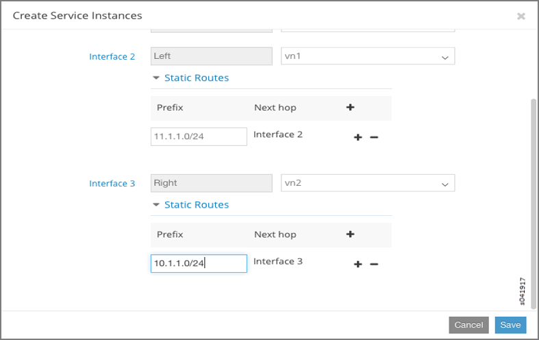

Using Static Routes with Services
=================================

:date: 2016-03-21 

Static Routes for Service Instances
-----------------------------------

Static routes can be configured in a virtual network to direct traffic
to a service virtual machine.

The following figure shows a virtual network with subnet 10.1.1.0/24.
All of the traffic from a virtual machine that is directed to subnet
11.1.1.0/24 can be configured to be routed by means of a service
machine, by using the static route 11.1.1.252 configured on the service
virtual machine interface.

Configuring Static Routes on a Service Instance
-----------------------------------------------

To configure static routes on a service instance, first enable the
static route option in the service template to be used for the service
instance.

To enable the static route option in a service template:

1. Go to :menuselection:`Configure > Services > Service Templates` and click
   :guilabel:`Create`.

2. At :guilabel:`Add Service Template`, complete the fields for **Name**,
   **Service Mode**, and **Image Name**.

3. Select the :guilabel:`Interface Types` to use for the template, then for each
   interface type that might have a static route configured, click the
   check box under the **Static Routes** column to enable the static
   route option for that interface.

   The following figure shows a service template in which the left and
   right interfaces of service instances have the static routes option
   enabled. Now a user can configure a static route on a corresponding
   interface on a service instance that is based on the service template
   shown.

|image1|

Configuring Static Routes on Service Instance Interfaces
--------------------------------------------------------

To configure static routes on a service instance interface:

1. Go to :menuselection:`Configure > Services > Service Instances` and click
   :guilabel:`Create`.

2. At :guilabel:`Create Service Instances`, complete the fields for **Instance
   Name** and **Services Template**.

3. Select the virtual network for each of the interfaces

4. Click the :guilabel:`Static Routes` dropdown menu under each interface field
   for which the static routes option is enabled to open the **Static
   Routes** menu and configure the static routes in the fields
   provided.
   
   .. note:: 

      If the :guilabel:`Auto Configured` option is selected, traffic destined to
      the static route subnet is load balanced across service instances.

The following figure shows a configuration to apply a service instance
between VN1 (10.1.1.0/24) and VN2 (11.1.1.0/24). The left interface of
the service instance is configured with VN1 and the right interface is
configured to be VN2 (11.1.1.0/24). The static route 11.1.1.0/24 is
configured on the left interface, so that all traffic from VN1 that is
destined to VN2 reaches the left interface of the service instance.

|image2|

The following figure shows static route 10.1.1.0/24 configured on the
right interface, so that all traffic from VN2 that is destined to VN1
reaches the right interface of the service virtual machine.

|image3|

When the static routes are configured for both the left and the right
interfaces, all inter-virtual network traffic is forwarded through the
service instance.

Configuring Static Routes as Host Routes
----------------------------------------

You can also use static routes for host routes for a virtual machine, by
using the classless static routes option in the DHCP server response
that is sent to the virtual machine.

The routes to be sent in the DHCP response to the virtual machine can be
configured for each virtual network as it is created.

To configure static routes as host routes:

1. Go to :menuselection:`Configure > Network > Networks` and click :guilabel:`Create`.

2. At :guilabel:`Create Network`, click the **Host Routes** option and add the
   host routes to be sent to the virtual machines.

   An example is shown in the following figure.

|image4|

 

.. |image1| image:: images/s041915.gif
.. |image2| image:: images/s041916.gif

.. |image4| image:: images/s041918.gif
