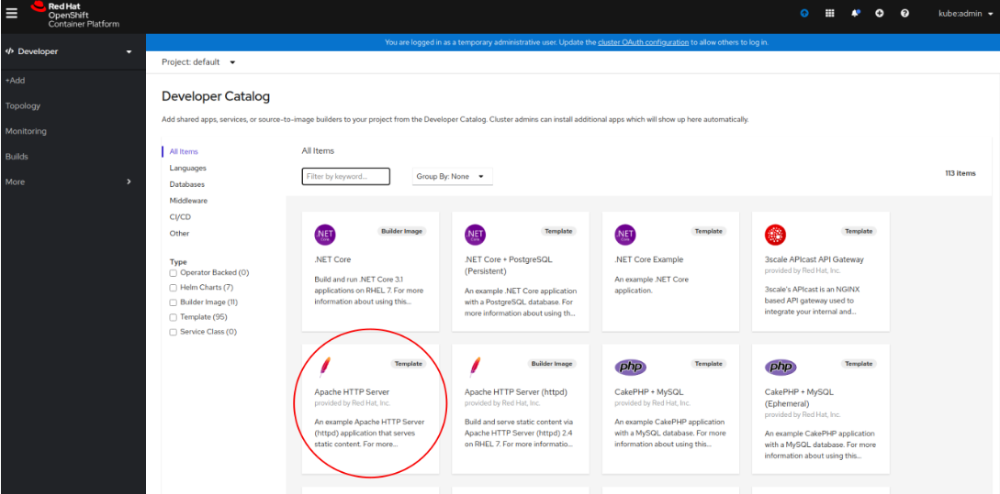

Testing and Debugging TF Operator
==================================

:Date: 2021-02-22

This article describes how to test or debug running cluster with TF Operator applied as CNI plugin.

Pod-to-Pod ping
---------------

Working Tungsten Fabric as CNI plugin on creation of a new Pod is responsile for assigning IP address.
As well as assigning IP address, TF provides networking between Pods.
In default configuration every Pod (both in the same namespace and different namespaces) should be able to ping each other.

Apply below manifest onto cluster:

.. code-block:: YAML

    apiVersion: v1
    kind: Pod
    metadata:
    name: busy1
    spec:
    containers:
    - name: busy1
        image: busybox
        command: ["/bin/sh","-c", "while true; do echo hello; sleep 10;done"]
    nodeSelector:
        node-role.kubernetes.io/master: ""
    tolerations:
    - effect: NoSchedule
        operator: Exists
    ---
    apiVersion: v1
    kind: Pod
    metadata:
    name: busy2
    spec:
    containers:
    - name: busy2
        image: busybox
        command: ["/bin/sh","-c", "while true; do echo hello; sleep 10;done"]

Above manifest will create 2 Pods.
both are running single busybox container with dummy command.

.. note::

    `busy1` Pod has `nodeSelector` set to nodes with ``node-role.kubernetes.io/master: ""`` label.
    Usually all Kubernetes or Openshift clusters has this label automatically applied to master nodes.
    However, depending on environment it is worth checking whether nodes has this label applied, because otherwise Pod will not be created.

Check when Pods will be created and if they have IP addresses assigned with :command:`kubectl get pods -o wide`.
When Pods are created execute into one of them with :command:`kubectl exec -it busy1 sh`.
Now all commands executed in the shell will be executed in `busy1` Pod.
Check whether `busy1` Pod can ping `busy2` Pod with :command:`ping <busy2 IP address>`.
If Tungsten Fabric provides networking properly then all ping request should be successfull.
To ensure two way communication the same procedure may be repeated executing to `busy2` Pod.

The same procedure may be repeated, but with one Pod placed in a different namespace.

Isolated Namespaces ping
------------------------

Tungsten Fabric supports Kubernetes annotations as an easy way to configure basic networking properties of Kubernetes cluster.
One of them is namespace isolation.

In order to create new namespace that will be isolated (it is not necessary to create new namespace. If there is already a namespace that should be isolated it is possible to annotate it) below manifest should be applied in the cluster:

.. code-block:: YAML

    apiVersion: v1
    kind: Namespace
    metadata:
    name: "test-ns"
    annotations: {
    "opencontrail.org/isolation" : "true"
    }

Afterward, similar to Pod-to-Pod ping test two Pods should be created:

.. code-block:: YAML

    apiVersion: v1
    kind: Pod
    metadata:
    name: busy1
    namespace: test-ns
    spec:
    containers:
    - name: busy1
        image: busybox
        command: ["/bin/sh","-c", "while true; do echo hello; sleep 10;done"]
    tolerations:
    - effect: NoSchedule
        operator: Exists
    ---
    apiVersion: v1
    kind: Pod
    metadata:
    name: busy2
    spec:
    containers:
    - name: busy2
        image: busybox
        command: ["/bin/sh","-c", "while true; do echo hello; sleep 10;done"]

Above manifest will create `busy1` Pod in the isolated namespace while `busy2` Pod will be created in default namespace which should not be able to ping `busy1` Pod.
Check when Pods will be created and if they have IP addresses assigned with :command:`kubectl get pods -o wide` and :command:`kubectl get pods -o wide -n test-ns` for `busy1` Pod.
When Pods are created execute into one of them with :command:`kubectl exec -it busy1 sh`.
Now all commands executed in the shell will be executed in `busy1` Pod.
Check whether `busy1` Pod can ping `busy2` Pod with :command:`ping <busy2 IP address>`.
If Tungsten Fabric provides networking properly then all ping request should be dropped as `busy1` Pod is in isolated namespace which should not communicate with other namespaces.
To ensure two way communication the same procedure may be repeated executing to `busy2` Pod.

Compute Node configuration
--------------------------

Every compute node has applied vRouter module which provides Tungsten Fabric networking rules (more on specific Tungsten Fabric architecture `here <https://codilime.com/tungsten-fabric-architecture-an-overview/>`__ or `here <https://wiki.lfnetworking.org/display/LN/2021-02-02+-+TF+Architecture+Overview>`__).

A series of simple checks may be helpful to ensure that specific compute node is working properly or to perform basic debugging of Tungsten Fabric.

Kernel module
~~~~~~~~~~~~~

Usually vRouter is applied as kernel module (except for DPDK deployment).
If your infrastructure runs with kernel module dpeloyment then basic test is to run :command:`modprobe vrouter` and check whether kernel module is loaded.
Also, if kernel module is loaded then :command:`vif` CLI tool should be present.

vhost0 Interface
~~~~~~~~~~~~~~~~

vRouter operates via vhost0 interface which is virtual interface that applies Tungsten Fabric rules to a traffic that goes throught the node.
Every node should have vhost0 interface with IP address assigned from physical interface (the one that receives the traffic).
To check whether vhost0 interface exists run :command:`ip address`.
In list of interfaces there should be vhost0 interface with IP address assigned.
It is worth also checking the physical interface to see whether there is no IP address (because vhost0 took it over).

.. code-block:: console

    1:  p1p1 Link encap:Ethernet HWaddr b0:ob:ab:ba:0a:a0
        UP BROADCAST RUNNING MULTICAST MTU:9000 Metric:1
        RX packets:194126327 errors:0 dropped:0 overruns:0 frame:0
        TX packets:125130748 errors:0 dropped:0 overruns:0 carrier:0
        collisions:0 txqueuelen:1000
        RX bytes:286638778868 (286.6 GB) TX bytes:94956347917 (94.9 GB)
        Interrupt:40 Memory:f3000000-f37fffff
    2:  vhost0 Link encap:Ethernet HWaddr b0:ob:ab:ba:0a:a0
        inet addr:172.20.0.23 Bcast:172.20.0.31 Mask:255.255.255.240
        UP BROADCAST RUNNING MULTICAST MTU:9000 Metric:1
        RX packets:84487487 errors:0 dropped:182627 overruns:0 frame:0
        TX packets:82063519 errors:0 dropped:0 overruns:0 carrier:0
        collisions:0 txqueuelen:1000
        RX bytes:253984497954 (253.9 GB) TX bytes:67502412941 (67.5 GB)

Also vhost0 and physical interface shoul dhave the same MAC address.
If you do not know which interface is pysical interface for vhost0 then by default it is `eth0` interface.
However, it may be checked using `vif` CLI tool that comes together with vRouter module.

Command :command:`vif --list` shows all interfaces recognised by Tungsten Fabric.
Here it is also possible to recongise physical interface by comparing MAC address of vhost0 interface with any other interface.

If you need specific information regarding name of the physical interface then vRouter confgiuration contains it written in `ini` format easy to parse with any programming language.
File `/etc/contrail/contrail-vrouter-agent.conf` under section `[VIRTUAL-HOST-INTERFACE]` has field `physical_interface` with value of the interface name.

.. code-block:: console

    cmpt001:~# cat /etc/contrail/contrail-vrouter-agent.conf | grep -A13 -i virtual-host-interface
    [VIRTUAL-HOST-INTERFACE]
    # Everything in this section is mandatory

    # name of virtual host interface
    name=vhost0

    # IP address and prefix in ip/prefix_len format
    ip=172.20.0.23/32

    # Gateway IP address for virtual host
    gateway=172.20.0.1

    # Physical interface name to which virtual host interface maps to
    physical_interface=p1p1

Another test may be to check whether node has additional interfaces created for Pods running on the node.
Every Pod should have interface named `tap<number of the interface>` created on the node.

Node Routing
~~~~~~~~~~~~

By default all traffic on a node should go through vhost0 interface which decides what to do with the traffic.
So by running command :command:`ip route` routing table should has default set to vhost0 device.

.. code-block:: console

    vm1$ ip route
    default via 10.0.0.1 dev vhost0

Synchronised resolv.conf
~~~~~~~~~~~~~~~~~~~~~~~~~

DNS configuration is provided by vRouter Agent running on the node.
vRouter Agent  is a containerized application that communicates between TF Control and compute node and more specific vRouter Forwarder (more information about architecture `here <https://codilime.com/tungsten-fabric-architecture-an-overview/>`__ or `here <https://wiki.lfnetworking.org/display/LN/2021-02-02+-+TF+Architecture+Overview>`__).
Some system confgiuration files are shared across the node system and vRouter Agent container.
One of these files is `/etc/resolv.conf` which specifies DNS resolution.

First test would be to check content of `resolv.conf` file whether it is not empty or overwritten by other network application (e.g. NetworkManager).
If `resolv.conf` is not empty then check whether both files (system and container) have the same inode number.
To do that run `ls -i /etc/resolv.conf` on both node console and then container console and compare the number.
If the inode number is the same then `resolv.conf` file is shared across the system.

DHClient configured for vhost0
~~~~~~~~~~~~~~~~~~~~~~~~~~~~~~

On vRouter installation if there's dhclient running for physical interface then it is killed and new process of dhclient is started for vhost0 interface.
To check whether it has been properly configured run :command:`ps aux | grep dhclient` and check whether running process is configured for vhost0 interface and not for physical interface.

Openshift Features Tests
------------------------

If Tungsten Fabric is run on Openshift cluster then there are some additional tests that may be run in order to check Openshift specific features.
Openshift provides alternative CLI tool sto kubectl called ``oc``.
Use it in order to access Openshift specific commands.

Deploy App using CLI
~~~~~~~~~~~~~~~~~~~~

Deploy an app using openshift CLI and expose it outside the cluster
Instructions are based on an example from `here <https://docs.openshift.com/container-platform/4.3/applications/application_life_cycle_management/creating-applications-using-cli.html#remote>`__

Execute these commands using the openshift ``oc`` CLI:

.. code-block:: console

    oc new-app https://github.com/sclorg/cakephp-ex
    oc expose svc/cakephp-ex
    oc logs -f bc/cakephp-ex
    oc status

``oc`` status command should return an output similar to this:

.. code-block:: console

    oc status
    In project default on server https://api.usercluster.myuser.mydomain.com:6443

    http://cakephp-ex-default.apps.usercluster.myuser.mydomain.com to pod port 8080-tcp (svc/cakephp-ex)
    dc/cakephp-ex deploys istag/cakephp-ex:latest <-
        bc/cakephp-ex source builds https://github.com/sclorg/cakephp-ex on openshift/php:7.2
        deployment #1 deployed about a minute ago - 1 pod

    svc/openshift - kubernetes.default.svc.cluster.local
    svc/kubernetes - 172.30.0.1:443 -> 6443

From a web browser, access the exposed cakephp app url, e.g. ``http://cakephp-ex-default.apps.usercluster.myuser.mydomain.com``
Verify that the page successfully loaded.

Deploy App using Web Console
~~~~~~~~~~~~~~~~~~~~~~~~~~~~

Open web browser and enter URL returned from install process. (e.g. ``https://console-openshift-console.apps.usercluster.myuser.mydomain.com/``)
Login into kubeadmin account with PIN returned from install process. (PIN may be found also under `<install dir>/auth/kubeadmin-password`)

As developer go to application catalog (+Add > From Catalog) and Initialize Template of Apache HTTP Server application.

Go with defaults in template and create application.
Wait for indicator that application is running:

.. image:: figures/openshift-deployed-apache-server.png
    :alt: Successfully Deployed Apache HTTP Server

Access the application by clicking the top right icon.
Verify that the page successfully loaded.

Scale Cluster Nodes
~~~~~~~~~~~~~~~~~~~

Openshift allows to easily scale up or down cluster nodes using `machinesets`.
Usually, when deployed on AWS or any other cloud, `machinesets` are grouped into availability zone where nodes are spawned.

.. code-block:: console

    $ kubectl get machinesets -A
    NAMESPACE               NAME                                DESIRED   CURRENT   READY   AVAILABLE   AGE
    openshift-machine-api   userXY-hknrs-worker-eu-central-1a   1         1         1       1           71m
    openshift-machine-api   userXY-hknrs-worker-eu-central-1b   1         1         1       1           71m
    openshift-machine-api   userXY-hknrs-worker-eu-central-1c   1         1         1       1           71m

Number of replicas may be easily scaled using `kubectl` or `oc` CLI tool.

To scale up nodes in availability zone ``eu-central-1a`` use :command:`kubectl scale --replicas=3 machinesets -n openshift-machine-api   userXY-hknrs-worker-eu-central-1a` command.

After few minutes new nodes should appear in the list of nodes:

.. code-block:: console

$ kubectl get node
    NAME                                            STATUS   ROLES    AGE     VERSION
    ip-10-0-130-116.eu-central-1.compute.internal   Ready    master   84m     v1.17.1
    ip-10-0-137-37.eu-central-1.compute.internal    Ready    worker   66m     v1.17.1
    ip-10-0-138-121.eu-central-1.compute.internal   Ready    worker   2m52s   v1.17.1
    ip-10-0-141-218.eu-central-1.compute.internal   Ready    worker   3m7s    v1.17.1
    ip-10-0-152-65.eu-central-1.compute.internal    Ready    worker   66m     v1.17.1
    ip-10-0-154-104.eu-central-1.compute.internal   Ready    master   84m     v1.17.1
    ip-10-0-171-126.eu-central-1.compute.internal   Ready    worker   66m     v1.17.1

Scaling down may be done in the same way.

.. code-block:: console

    $ kubectl get machinesets -A
    NAMESPACE               NAME                                DESIRED   CURRENT   READY   AVAILABLE   AGE
    openshift-machine-api   userXY-hknrs-worker-eu-central-1a   3         3         3       3           71m
    openshift-machine-api   userXY-hknrs-worker-eu-central-1b   1         1         1       1           71m
    openshift-machine-api   userXY-hknrs-worker-eu-central-1c   1         1         1       1           71m

.. code-block:: console

    $ kubectl scale --replicas=2 machinesets -n openshift-machine-api   userXY-hknrs-worker-eu-central-1a

    machineset.machine.openshift.io/userXY-hknrs-worker-eu-central-1a scaled

and after a while one of the nodes will be removed from the list of nodes.

.. code-block:: console

    $ kubectl get node
    NAME                                            STATUS   ROLES    AGE     VERSION
    ip-10-0-130-116.eu-central-1.compute.internal   Ready    master   84m     v1.17.1
    ip-10-0-137-37.eu-central-1.compute.internal    Ready    worker   66m     v1.17.1
    ip-10-0-141-218.eu-central-1.compute.internal   Ready    worker   3m7s    v1.17.1
    ip-10-0-152-65.eu-central-1.compute.internal    Ready    worker   66m     v1.17.1
    ip-10-0-154-104.eu-central-1.compute.internal   Ready    master   84m     v1.17.1
    ip-10-0-171-126.eu-central-1.compute.internal   Ready    worker   66m     v1.17.1

