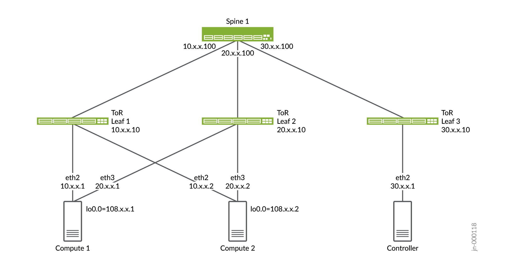

Layer 3 Multihoming
===================
Traditionally, Multichassis Link Aggregation Group(MC-LAG) has been leveraged to achieve redundancy from the top of rack(TOR) switch.

Starting with Tungsten Fabric 21.12 we are adding high availability support with Layer 3 multihoming without the need for MC-LAG or bond interfaces.

Layer 3 multihoming allows vRouter to recognize multiple uplink connections. vRouter supports multihoming up to three top-of-rack (TOR) leaf switches. Static routes are used between the compute node and the TOR switches to access the vRouter's loopback interface (lo0).

Layer 3 Multihoming Topology

Figure 1 shows the sample topology where vRouter is multihomed to two physical interfaces on two ToR leaf switches.

|Figure 1: Sample Layer 3 Multihoming Topology|

Layer 3 Multihoming Ansible Based Openstack Deployment
------------------------------------------------------

Here are the high-level steps for Layer 3 multihoming on Ansible based Openstack deployment:

1. Add Equal Cost Multiple Path (ECMP) route on each of the compute’s control node to provide reachability to control nodes.
The provisioning script looks up IP routes and selects physical interfaces from the ECMP route. Physical interface name list, IP address list, and gateway address list for the interfaces gets populated in contrail-vrouter-agent.conf on every compute node.

2. Create a loopback interface (lo0) on the computes.
Contrail vRouter uses the lo0 IP address to initiate and terminate vRouter services (Extensible Messaging and Presence Protocol (XMPP) and overlay traffic).

Note: Contrail provisioning does not change the underlay network configuration.

3. Assign a /32 IP address to the lo0 interface from a predefined address pool and manage the lo0 interface IP address.
To ensure connectivity between computes, ToR leaf must be configured to use loopback addresses on compute nodes through multihomed physical interfaces. Loopback IP address gets populated in contrail-vrouter-agent.conf on every compute node.

4. Use gateway IP addresses (leaf switches) for external connectivity and controller connectivity.

5. Contrail vRouter retains the vhost0 interface (without an IP address) to process vhost packets from the Linux stack to controller or the lo interface of the other computes (for example, XMPP, VR-VR traffic, or Linklocal).

6. Contrail vRouter uses netfilter hooks to capture packets sent using the lo0 interface source IP address and then processes the packets using vhost. This ensures that XMPP traffic is load balanced too.

Note: Netfilter hooks are used when the vRouter is multihomed in Kernel mode. When the vRouter is in Data Plane Development Kit (DPDK) mode, a source routing technique is used for multihoming.

7. Contrail vRouter creates a new type of ECMP nexthop that contains the encapsulation nexthops to the ToR switches. The overlay routes will point to this ECMP nexthop, which allows traffic to be load balanced across the ToR switches.

8. Contrail vRouter Agent monitors reachability through ARP requests for the encapsulated nexthop of the TOR switch. In case of ARP failure (either due to a connection or a network issue), the nexthop is marked unreachable and traffic is naturally routed to the other nexthops.

Layer 3 Multihoming Configuration
~~~~~~~~~~~~~~~~~~~~~~~~~~~~~~~~~

Sample instance.yaml

::
    
    global_configuration:
    CONTAINER_REGISTRY: svl-artifactory.juniper.net/contrail-nightly
    REGISTRY_PRIVATE_INSECURE: True

    provider_config:
    bms:
        ssh_pwd: <password>
        ssh_user: username
        ntpserver: <IP NTP server>
        domainsuffix: <domain-suffix>
    instances:
    controller:
        provider: bms
        ip: 192.xx.xx.23
        roles:
        openstack:
        config_database:
        config:
        control:
        analytics:
        webui:
    compute1:
        provider: bms
        ip: 192.xx.xx.21
        roles:
        openstack_compute:
        vrouter:
            VROUTER_HOSTNAME: compute1
    compute2:
        provider: bms
        ip: 192.xx.xx.22
        roles:
        openstack_compute:
        vrouter:
            VROUTER_HOSTNAME: compute2
    contrail_configuration:
    CONTRAIL_VERSION: master.latest
    CLOUD_ORCHESTRATOR: openstack
    CONTROLLER_NODES: 192.xx.xx.23
    CONTROL_NODES: 30.xx.xx.1
    KEYSTONE_AUTH_ADMIN_PASSWORD: <password>
    RABBITMQ_NODE_PORT: 5673
    KEYSTONE_AUTH_URL_VERSION: /v3
    L3MH_CIDR: 108.xx.xx.0/24
    kolla_config:
    kolla_globals:
        kolla_internal_vip_address: 192.xx.xx.23
        contrail_api_interface_address: 192.xx.xx.23
        keepalived_virtual_router_id: "111"
        enable_haproxy: "no"
        enable_ironic: "no"
        enable_swift: "no"
    kolla_passwords:
        keystone_admin_password: <password>

Layer 3 Multihoming Deployment for RHOSP16.2
---------------------------------------------
Before you begin, ensure that Layer 3 connectivity is established across the fabric.

Here are the high-level steps for Layer 3 multihoming on vRouter deployment for Red Hat Openstack version 16.2 (RHOSP16.2):

1. Checkout stable/train branch from https://github.com/tungstenfabric/tf-tripleo-heat-templates.

2. Make the following changes in contrail-controller ctrl-data section of the environments/contrail/contrail-net.yaml file.

* Change the contrail-controller ctrl-data ip details:

::
    TenantNetCidr: 30.X.X.0/24
    TenantAllocationPools: [{'start': '30.X.X.10', 'end': '30.X.X.200'}]

* Add Layer 3 multihoming details for computes:

::
    # L3MH options
    L3mhNetCidr: '108.X.X.0/24'
    Tenant1L3mhNetCidr: '10.X.X.0/24'
    Tenant2L3mhNetCidr: '20.X.X.0/24'

After the deployment, a comp0 interface appears. This interface obtains its IP address from L3mhNetCidr.

3. Set L3MH_CIDR, VROUTER_GATEWAY, and rp_filter fields for each of the ComputeParameters, ComputeL3mhParameters, and ContrailDpdkParameters roles in the environments/contrail/contrail-services.yaml file. For example:

.. code-block:: shell

    ContrailDpdkParameters:
    KernelArgs: "intel_iommu=on iommu=pt default_hugepagesz=1GB hugepagesz=1G hugepages=16 hugepagesz=2M hugepages=1024"
    ExtraSysctlSettings:
        # must be equal to value from 1G kernel args: hugepages=4
        vm.nr_hugepages:
            value: 16
        vm.max_map_count:
            value: 128960
        net.ipv4.conf.all.rp_filter:
            value: 0
    # Tuned-d profile configuration
    #   TunedProfileName -  Name of tuned profile
    #   IsolCpusList     -  Logical CPUs list to be isolated from the host process (applied via cpu-partitioning tuned).
    #                       It is mandatory to provide isolated cpus for tuned to achive optimal performance.
    #                       Example: "3-8,12-15,18"
    # TunedProfileName: "cpu-partitioning"
    # IsolCpusList: "3-20"
    ContrailSettings:
      L3MH_CIDR: "108.X.X.0/24"
      DPDK_UIO_DRIVER: vfio-pci
      VROUTER_ENCRYPTION: false
      BGP_ASN: 64512
      BGP_AUTO_MESH: true
      LACP_RATE: 0
      VROUTER_GATEWAY: "10.X.X.1,20.X.X.1"
      # NIC_OFFLOAD_ENABLE: true
      # SERVICE_CORE_MASK: '0x03'
      # DPDK_CTRL_THREAD_MASK: '0x03'

4. Add ValidateControllersIcmp: false in environments/contrail/contrail-services.yaml to disable controller-compute connectivity check during the deployment.

5. Assign specific static IP addresses to compute physical interfaces in the environments/contrail/ips-from-pool-l3mh.yaml file.
For example, if there is one Kernel compute and two DPDK computes:

.. code-block:: shell

    parameter_defaults:
        ComputeL3mhIPs:
            l3mh:
            - 108.X.X.5
            tenant1_l3mh:
            - 10.X.X.50
            tenant2_l3mh:
            - 20.X.X.50
        ContrailDpdkIPs:
            l3mh:
            - 108.X.X.6
            - 108.X.X.7
            tenant1_l3mh:
            - 10.X.X.60
            - 10.X.X.70
            tenant2_l3mh:
            - 20.X.X.60
            - 20.X.X.70

6. Add computes l3mh_cidr and physical interface subnet details in the network_data_l3mh.yaml file.
For example:

::
    # l3MH network - compute addresses (must be routeable)
    - name: L3mh
    enabled: true
    vip: false
    name_lower: l3mh
    ip_subnet: '108.X.X.0/24'
    allocation_pools: [{'start': '108.X.X.4', 'end': '108.X.X.100'}]
    mtu: 1500
    - name: Tenant1L3mh
    enabled: true
    vip: false
    name_lower: tenant1_l3mh
    # vlan: 100
    ip_subnet: '10.X.X.0/24'
    allocation_pools: [{'start': '10.X.X.10', 'end': '10.X.X.100'}]
    gateway_ip: 10.X.X.1
    mtu: 1500
    - name: Tenant2L3mh
    enabled: true
    vip: false
    name_lower: tenant2_l3mh
    # vlan: 200
    ip_subnet: '20.X.X.0/24'
    allocation_pools: [{'start': '20.X.X.10', 'end': '20.X.X.100'}]
    gateway_ip: 20.X.X.1
    mtu: 1500

7. Add static routes in contrail-controller to reach compute l3mh_cidr in the network/config/contrail/contrail-controller-nic-config.yaml file.
For example:

.. code-block:: shell

    - type: interface
      name: nic2
      use_dhcp: false
      addresses:
    - ip_netmask:
      get_param: TenantIpSubnet
    # add below lines with correct cidr and gw #
    routes:
    - ip_netmask: <l3mhcidr>
      next_hop:
      get_param: 
      get_param: <gw>

